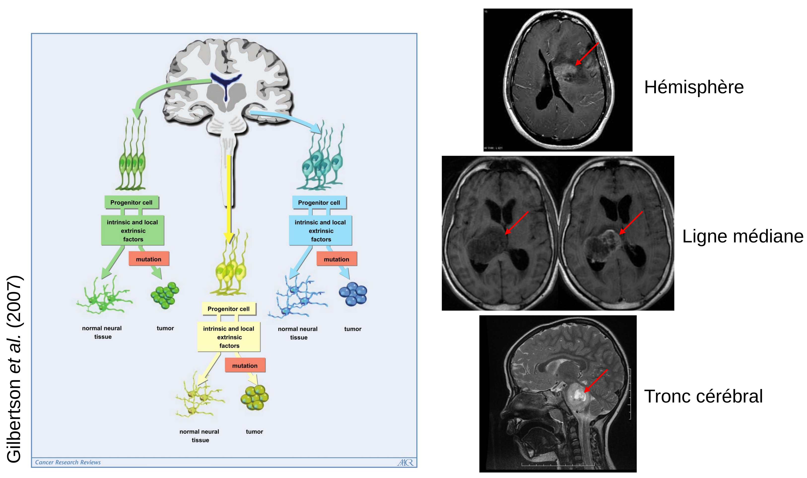
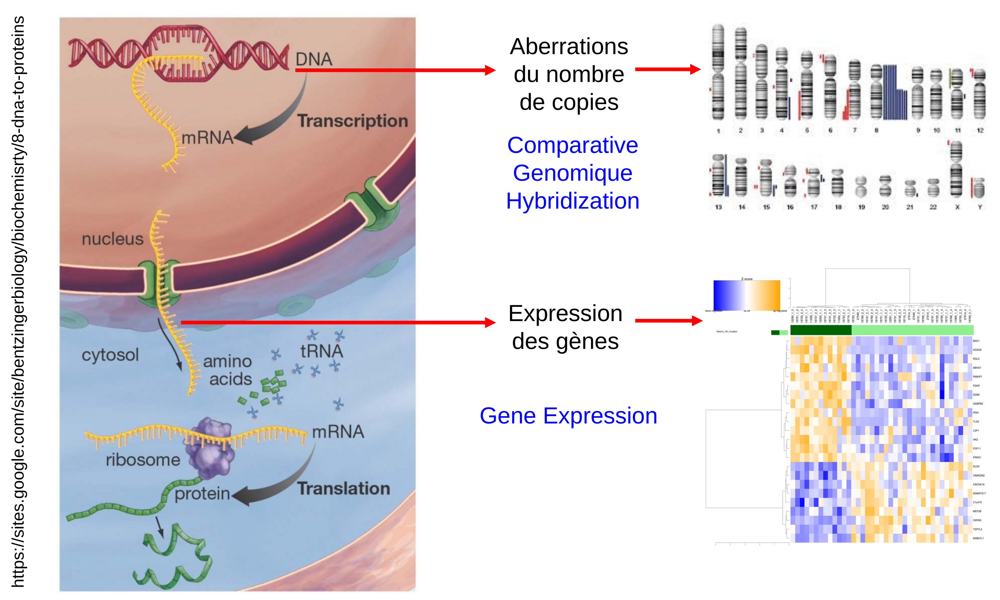
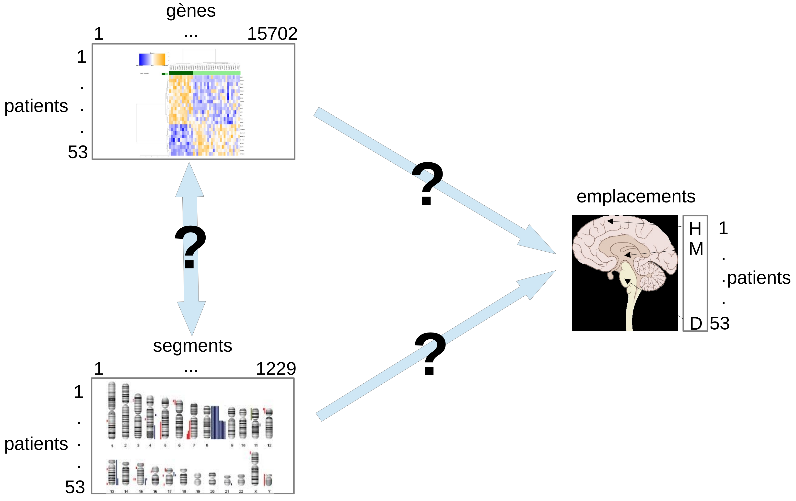

# Rappels sur les méthodes factorielles

comment on les utilise en pratique. Répondre aux questions des méthodes factorielles : combien de composantes choisir ? Comment interpréter une carte des individus et un cercle de corrélation ?

------------------------------------------------------------------------

# Présentation des données GliomaData

## La localisation des gliomes malins pédiatriques

::: r-stack

:::

------------------------------------------------------------------------

## Les données omiques disponibles

## 

------------------------------------------------------------------------

## Le design d'intégration 

------------------------------------------------------------------------

## Questions

### Emplacement de la tumeur (hémisphères, ligne médiane, tronc cérébral)

-   Quels sont les gènes et les segments caractéristiques de chaque localisation, qui pourraient nous renseigner sur la cellule d'origine des tumeurs ?

### Survie globale

-   L'expression des gènes et les aberrations du nombre de copies ont-elles une influence sur la survie globale ? si oui, laquelle ?

### Améliorer la classification des gliomes malins pédiatriques, notamment son pouvoir pronostique.

------------------------------------------------------------------------

## Qu'est-ce qu'une méthode factorielle et surtout à quoi ça sert ?

Lesquelles connaissez-vous ou avez-vous déjà utilisées ? UMAP, t-SNE, MDS, PCoA, ICA etc. Sondage (wooclap)

------------------------------------------------------------------------

## Le package gliomaData

-   Téléchargez le package gliomaData : http://biodev.cea.fr/sgcca
-   Installer le package avec la commande :

`$ R CMD INSTALL gliomaData_0.4.tar.gz`

```{r, echo=TRUE}
library(tidyverse)
library(gliomaData)
data("ge_cgh_locIGR")
ge <- ge_cgh_locIGR$multiblocks$GE
dim(ge)
cgh <- ge_cgh_locIGR$multiblocks$CGH
dim(cgh)
```

------------------------------------------------------------------------

## Analyse en composantes principales de l'expression des gènes

### La fonction prcomp de R-base

```{r, echo=TRUE}

res.pca <- prcomp(ge, scale. = FALSE)
names(res.pca)

 
```

------------------------------------------------------------------------

#### sdev

les écarts types des composantes principales, c'est-à-dire les racines carrées des valeurs propres de la matrice de covariance/corrélation.

```{r, echo=TRUE}
head(res.pca$sdev)
```

------------------------------------------------------------------------

#### rotation

La matrice des charges factorielles des variables (càd une matrice dont les colonnes contiennent les vecteurs propres).

Ce sont les corrélations entre les variables observées (originales) et les facteurs (ou composantes).

Elles indiquent à quel point chaque variable contribue à un facteur : + la charge est élevée, + la variable est fortement liée au facteur.

👉 En ACP, les charges sont les cosinus des angles entre les axes des variables et les composantes principales.

```{r, echo=TRUE}
head(res.pca$rotation)
```

------------------------------------------------------------------------

#### center

La moyenne de chaque variable.

```{r, echo=TRUE}
head(res.pca$center)
```

------------------------------------------------------------------------

#### scale

La variance de chaque variable.

```{r, echo=TRUE}
head(res.pca$scale)
```

------------------------------------------------------------------------

#### x

la valeur des données rotatées : les données centrées (et éventuellement réduites) multipliées par la matrice de rotation.

```{r, echo=TRUE}
head(res.pca$x, n = 6)
```

------------------------------------------------------------------------

### Visualisation de l'ACP

```{r, echo=TRUE}
library(factoextra)

loc <- factor(c("cort", "dipg", "midl")[ge_cgh_locIGR$ylabel])


```

------------------------------------------------------------------------

#### Le screeplot

```{r, echo=TRUE}
fviz_screeplot(res.pca)
```

#### 

------------------------------------------------------------------------

#### Les observations

```{r, echo=TRUE}
fviz_pca_ind(res.pca, geom = "point", col.ind = loc, invisible = "quali")
```

------------------------------------------------------------------------

#### Le cercle des corrélations (variables)

```{r, echo=TRUE}

res.pca.scale <- prcomp(ge, scale. = TRUE)

fviz_pca_var(res.pca.scale, select.var = list(contrib = 7), repel = TRUE)

```

------------------------------------------------------------------------

## Exercice pratique "puzzle"

associer les graphes de l'ACP des données d'expression de gliomaData avec leur définition

1.  Correspondances (wooclap)

2.  Graphe des pourcentages de variance expliquée (pour sélectionner le nombre de composantes principales optimal)

3.  Carte des individus (pour en déduire des clusters de patients)

4.  Cercle des corrélations (pour en déduire le lien entre gènes et groupes de patients). Oh non, on ne voit rien !!
