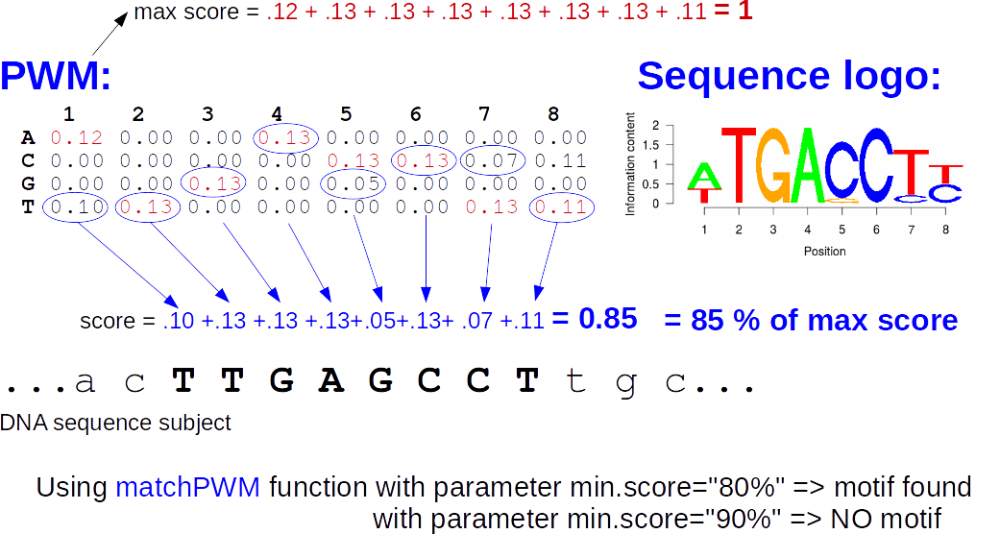
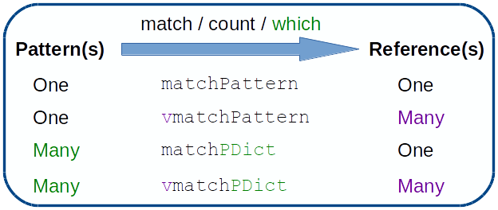

```{r setup, include=FALSE}
knitr::opts_chunk$set(echo = TRUE, root.dir="/DATA/WORK/Enseignement/2025_EBAII_ChIPseq/EBIII_N2/chip-seq/")
```


```{r, echo=FALSE, warning=FALSE, message=FALSE}
library(Biostrings)
```

# Introduction  

The [Biostrings](https://www.bioconductor.org/packages/release/bioc/html/Biostrings.html) package
is the core package to manipulate sequence files in R.  
Here, we will see some basic usage of this package.  

# Containers and accessors  

## XString and XStringSet containers

First, let's see how to import a [fasta](http://en.wikipedia.org/wiki/FASTA_format) file.
For this, we will use a file provided with the Biostrings package that contains
the sequences 2000 upstream of the annotated transcription start sites (TSS)
for the Drosophila melanogaster genome.  

Get the file path:
```{r dm3_upstream_filepath, cache=TRUE}
dm3_upstream_filepath = system.file("extdata", "dm3_upstream2000.fa.gz", package="Biostrings")
```

This file contains DNA sequences so we use the `readDNAStringSet` function to import it:
```{r dm3_upstream, cache=TRUE}
dm3_upstream = readDNAStringSet(dm3_upstream_filepath)
dm3_upstream
```

The sequences are imported as a `DNAStringSet` object.  
There are similar functions and containers to work with:  

 - RNA sequences (T becomes U): `readRNAStringSet` gives an `RNAStringSet`  
 - Protein sequences : `readAAStringSet` gives an `AAStringSet`    
 - Or any type of character strings (e.g. ASCII-encoded sequence quality): `readBStringSet` gives a `BStringSet`    
 
The `DNAStringSet` object can be considered as a list of `DNAString` objects.  
We can thus extract the 3rd sequence using:
```{r, results=3}
dm3_upstream[[3]]
# or, if we know the name of the sequence:
dm3_upstream[["NM_001201795_up_2000_chr2L_8382455_f chr2L:8382455-8384454"]]
```

Here are 2 different ways to extract a subsequence from a `DNAString`:
```{r subseq, cache=TRUE}
dm3_upstream[[3]][2:30]
subseq(dm3_upstream[[3]], start=2, end=30)
```

But only the `subseq` command would work on a `DNAStringSet`:
```{r subset_DNAStringSet, cache=TRUE}
subseq(dm3_upstream[1:3], start=2, end=12)
```

It is also possible to extract multiple subsequences from a `DNAString` using `Views`:
```{r Views, cache=TRUE}
Views(dm3_upstream[[3]],start=c(1,11,21),end=c(10,20,30))
```
`Views` objects actually store the original sequence (or `subject`) and the intervals or `ranges` on this sequence.  
Because we were working on a `DNAString` object, the `Views` function returned an `XStringViews` object (See `?XStringViews` for details and methods).  

To convert a `DNAString` to a character string:
```{r toString, cache=TRUE}
toString(dm3_upstream[[3]][1:10])
# as.character also works but toString works on DNAStringSt objects too:
toString(subseq(dm3_upstream[1:2], start=1, end=10))
```


## Working with whole genome sequences: BSgenome
Whole genome sequences are stored into `BSgenome` objects.  
Many genomes are available in [Bioconductor](https://www.bioconductor.org/packages/release/BiocViews.html#___BSgenome).  
But you can also build your own using the [BSgenomeForge](https://www.bioconductor.org/packages/release/bioc/html/BSgenomeForge.html) package.

Let's load and check the dm3 BSgenome package:
```{r, message = FALSE, warning=FALSE}
library(BSgenome.Dmelanogaster.UCSC.dm3)
```
What is a bit confusing at the beginning is that loading this package creates an object named `Dmelanogaster`:
```{r Dmelanogaster}
Dmelanogaster
names(Dmelanogaster)
Dmelanogaster[["chr2L"]] #or: Dmelanogaster$chr2L
```

## Working with large fasta files: Rsamtools
The [Rsamtools](https://www.bioconductor.org/packages/release/bioc/html/Rsamtools.html) also provides interesting functions to work on large indexed FASTA files (e.g. containing a whole genome sequence).  
The short example below illustrates how to extract from a FASTA file a set of sequences defined by a `GRanges`:
```{r Rsamtools, cache=TRUE}
library(Rsamtools)

indFaEx_path=system.file("extdata","ce2dict1.fa",package="Rsamtools")
indFaEx=FaFile(indFaEx_path) #the whole sequence is actually not imported at this step
getSeq(indFaEx,GRanges(seqnames=Rle(c("pattern01","pattern04")),
                       ranges=IRanges(start=c(3,10),end=c(10,24)),
                       strand="*"))
```

Note that the [Biostrings](https://www.bioconductor.org/packages/release/bioc/html/Biostrings.html) package also has useful functions to extract some information from fasta/fastq files without loading the file in memory. See `help(fasta.seqlengths, package = "Biostrings")` for the corresponding help page.  
  

## Some useful functions
Reverse complement:
```{r revcom, cache=TRUE}
reverseComplement(dm3_upstream[1:2])
```

Count the occurence of each nucleotide:
```{r alphabetFrequency, cache=TRUE}
alphabetFrequency(dm3_upstream[1:2],
                  baseOnly=TRUE,
                  as.prob=TRUE)
```

Get the GC content of a sequence:
```{r letterFrequency, cache=TRUE}
letterFrequency(Dmelanogaster$chr2L, "CG", as.prob=TRUE)
```

We will not go into the details but there are also functions to perform sequence alignment in R ([pwalign](https://bioconductor.org/packages/release/bioc/html/pwalign.html) package):  
```{r pwalign, cache=TRUE}
pwalign::pairwiseAlignment(dm3_upstream[[1]][1:30],
                           dm3_upstream[[2]][1:30],
                           type = 'global')
```


# Motifs and pattern matching

[Sequence motifs](http://en.wikipedia.org/wiki/Sequence_motif) or patterns are typically used to represent the DNA regions bound by transcription factors (TFs) and other regulatory proteins.  
We distinguish a **pattern** which is a sequence, possibly using the [IUPAC code](http://www.bioinformatics.org/sms/iupac.html) when there is an ambiguity between nucleotides, from a **motif** which is a matrix basically indicating what is the probablity to find a given nucleotide at a given position in the sequence.  
There are several packages in [Bioconductor](https://www.bioconductor.org/) to search for and identify such patterns in strings and sequences. Pattern matching is frequently used in ChIP-seq experiments to search e.g. for binding sites of transcription factors.  
A complete [Bioconductor workflow](http://bioconductor.org/help/workflows/generegulation/) illustrates the use of pattern matching for the identification of transcription factor binding sites.

Here, we illustrate the use of the following packages:  

  - [MotifDb](https://master.bioconductor.org/packages/release/bioc/html/MotifDb.html)  
  - [seqLogo](https://master.bioconductor.org/packages/release/bioc/html/seqLogo.html)  
  - [motifStack](https://master.bioconductor.org/packages/release/bioc/html/motifStack.html)  
  - [TFBSTools](https://master.bioconductor.org/packages/release/bioc/html/TFBSTools.html)  


Other packages of interest include:  

  - [rGADEM](https://master.bioconductor.org/packages/release/bioc/html/rGADEM.html) and [BCRANK](https://master.bioconductor.org/packages/release/bioc/html/BCRANK.html) for *de novo* motif discovery  
  - [motifmatchr](https://master.bioconductor.org/packages/release/bioc/html/motifmatchr.html) for matching motifs from databases such as [JASPAR](https://jaspar.elixir.no/) to a set of sequences
  - [universalmotif](https://master.bioconductor.org/packages/release/bioc/html/universalmotif.html) for import/export and comparison of motifs
  - [motifbreakR](https://master.bioconductor.org/packages/release/bioc/html/motifbreakR.html) to evaluate the impact of SNPs on TF binding sites.

You can search the [MotifDiscovery](https://master.bioconductor.org/packages/release/BiocViews.html#___MotifDiscovery) and [MotifAnnotation](https://master.bioconductor.org/packages/release/BiocViews.html#___MotifAnnotation) BioCViews to find other useful packages.

## Searching and plotting motifs

The [MotifDb](https://master.bioconductor.org/packages/release/bioc/html/MotifDb.html) package allows to query a collection of DNA motifs aggregated from different databases.
```{r MotifDb_lib, eval=TRUE, echo=FALSE, message=FALSE, warning=FALSE}
library(MotifDb)
```

We search these databases for the response element of the ecdysone receptor (EcR):
```{r EcRmotif_query, cache=TRUE}
EcRMotifs=MotifDb::query(MotifDb,"EcR")
EcRMotifs
EcRMotifs[[1]]
```
The motif is given as a Position Frequency Matrix (PFM), which, can be converted to a [Position-weight matrix](http://en.wikipedia.org/wiki/Position_weight_matrix) using the information present in the metadata of the object (number of sequences used to define the motif: see `elementMetadata(EcRMotifs)`).  

The package [seqLogo](https://master.bioconductor.org/packages/release/bioc/html/seqLogo.html) allows to easily plot [sequence logos](http://en.wikipedia.org/wiki/Sequence_logo):
```{r seqLogo_lib, eval=TRUE, echo=FALSE}
require(seqLogo, warn.conflicts = FALSE, quietly = TRUE)
require(motifStack)
```

Here is the logo of the first motif:
```{r SeqLogo_Ecr,fig.cap="Sequence logo for EcR motif",fig.align="center"}
seqLogo::seqLogo(EcRMotifs[[1]])
```
Or its reverse complement:
```{r SeqLogo_Ecr_revcomp,fig.cap="Sequence logo for EcR motif reverse complement",fig.align="center"}
seqLogo::seqLogo(reverseComplement(EcRMotifs[[1]]))
```

And the logo of the EcR motif retrieved from JASPAR 2022:
```{r SeqLogo_EcrUsp,fig.cap="Sequence logo for EcR:Usp heterodimer",fig.align="center"}
seqLogo::seqLogo(EcRMotifs[[4]])
```
The second motif (from [JASPAR](https://jaspar.elixir.no/)) represented above is a binding site for the heterodimer composed of the ecdysone receptor (EcR) and its binding partner Ultraspiracle protein (Usp). This imperfect palindromic ecdysone response element is an inverted repeat of the consensus motif AGGTCA (or AGTTCA) separated by 1 nucleotide (IR1 for "inverted repeat separated by 1 nucleotide").  

The package [motifStack](https://master.bioconductor.org/packages/release/bioc/html/motifStack.html) provides additional plotting functionalities to plot multiple sequence logos, as illustrated below:
```{r motifStack_Ecr,fig.cap="Sequence logos for EcR motifs using motifStack",fig.align="center"}
#Format the PFMs:
pfms <- as.list(EcRMotifs)
names(pfms) <- gsub("Dmelanogaster-", "", names(pfms))
pfms <- lapply(names(pfms),
               function(x) {new("pfm",
                                mat=pfms[[x]],
                                name = x)})

#Plot
motifStack(pfms, layout="tree")
```

For those using [ggplot2](https://ggplot2.tidyverse.org/) for plotting, there is also the excellent [ggseqlogo](https://cran.r-project.org/web/packages/ggseqlogo/index.html) package.  
  

## Scanning a sequence with a Position-weight matrix
A Position weight matrix (PWM) can be used to scan one or multiple "subject" sequences to search the location of the corresponding motif.  
At each position, the "subject" sequence is given a score based on the values present in the PWM.



We select the JASPAR2014 motif:
```{r EcrJASP, cache=TRUE}
EcrJASP <- EcRMotifs[[4]]
```

[MotifDb](https://master.bioconductor.org/packages/release/bioc/html/MotifDb.html) returns a PFM with columns summing to 1. The number of sequences used to build the PFM are available in the `elementMetadata` or `mcols` of the object. We use this information to obtain a PWM:
```{r EcRJASP_2PWM, cache=TRUE}
nseq <- as.integer(mcols(EcRMotifs[4])$sequenceCount)
ecrpfm <- apply(round(nseq * EcrJASP,0), 2, as.integer)
rownames(ecrpfm) <- rownames(EcrJASP)
EcrJASP <- PWM(ecrpfm)
```
Here, we use the default background nucleotide frequencies (25% for each A, T, G and C) but this should be adapted depending on the genome studied.

Search for this motif on both strands of chromosome 2L:
```{r matchPWM_EcR_on2L, cache=TRUE, message = FALSE, warning=FALSE}
EcRJASP_2L=matchPWM(EcrJASP,
                    Dmelanogaster$chr2L,
                    min.score='90%')
EcRJASP_2L_rev=matchPWM(reverseComplement(EcrJASP),
                        Dmelanogaster$chr2L,
                        min.score='90%')
#One way to merge the results:
EcRJASP_2L_all <- Views(Dmelanogaster$chr2L,
                        union(ranges(EcRJASP_2L),
                              ranges(EcRJASP_2L_rev)))
```

We can use the `matchPWM` function to search a motif directly in a [BSgenome](https://master.bioconductor.org/packages/release/bioc/html/BSgenome.html) object.  
In this case, the search is automatically done on both strands and the function returns a convenient *GRanges* object.
```{r matchPWM_EcR_all, cache=TRUE, warning=FALSE}
EcRJASP_all <- matchPWM(EcrJASP, Dmelanogaster, min.score="90%")
EcRJASP_all
```
  
  
## TFBSTools  
*TFBS* stands for Transcription Factor Binding Site.  
The [TFBSTools](https://master.bioconductor.org/packages/release/bioc/html/TFBSTools.html) package [@pmid26794315] includes several features to manipulate and analyze sequence motifs or potential TFBS:  

  - Containers for motifs (`XMatrix`), collections of motifs (`XMatrixList`), sets of motifs obtained with [MEME](https://meme-suite.org/meme/) (`MotifSet`) or from a motifSearch on a sequence (`SiteSet`)  
  - Containers and graphical representations of [TFFM](https://github.com/wassermanlab/TFFM) (Transcription Factor Flexible Model), another type of motif representation [@pmid24039567]   
  - Functions to convert between PWM (position-weight matrix), PFM (position frequency matrix) and ICM (information content matrix)  
  - Functions to compare motifs as matrices (PFMs/PWMs) or with IUPAC strings  
  - Functions to scan sequences or whole genome (`searchSeq`) and to scan aligned sequences (`searchAln`) or genomes (`searchPairBSgenome`)  
  - Functions to query the [JASPAR](https://jaspar.elixir.no/) database, using [Bioconductor](https://www.bioconductor.org/) packages such as [JASPAR2024](https://master.bioconductor.org/packages/release/data/annotation/html/JASPAR2024.html)  
  - Wrapper function for the *de novo* motif dicovery tool [MEME](https://meme-suite.org/meme/)  
  
![Common workflow and classes in TFBSTools [@pmid26794315]](images/TFBSTools_package.png)  
  
  
We search for the EcR:Usp binding motif in JASPAR2018 database:
```{r TFBSTools_JASPAR2018_lib, eval=TRUE, echo=FALSE, warning=FALSE, message=FALSE}
library(TFBSTools)
library(JASPAR2018)
```

```{r EcR2024_fromJASPAR, cache=TRUE}
EcR2018 <- TFBSTools::getMatrixByID(JASPAR2018, "MA0534")
```

Here is its sequence logo:
```{r SeqLogo_Ecr2018,fig.cap="Sequence logo for EcR motif (JASPAR2018)",fig.align="center"}
TFBSTools::seqLogo(toICM(EcR2018))
```

Compare EcR PWM with the PWM for a human nuclear receptor ESR1, the Drosophila CTCF or a randomly permuted PWM:
```{r ComparaisonEcR, cache=TRUE}
#hESR1:
ESR1 <- TFBSTools::getMatrixByID(JASPAR2018, "MA0112")
PWMSimilarity(toPWM(EcR2018), toPWM(ESR1), method = "Pearson")
#dCTCF
CTCF <- TFBSTools::getMatrixByID(JASPAR2018, "MA0531")
PWMSimilarity(toPWM(EcR2018), toPWM(CTCF), method = "Pearson")
#random permutation:
PWMSimilarity(toPWM(EcR2018), toPWM(permuteMatrix(EcR2018)), method = "Pearson")
```

Search for EcR motif on chr2L:
```{r Ecr2018_on2L, warning=FALSE, cache=TRUE}
EcR2018_on2L <- searchSeq(toPWM(EcR2018), Dmelanogaster$chr2L, min.score="90%")
```
`searchPairBSgenome` is another interesting function that searches for a motif in regions that are conserved between 2 genomes given as *BSgenome* objects.  
  
  
## Scanning sequences with strings  
Depending on how many patterns/motif we have and how many sequences we want to search these patterns in, different functions are available in the [Biostrings](https://www.bioconductor.org/packages/release/bioc/html/Biostrings.html) package:  




### Scanning multiple sequences with one string
A pattern or motif can also be represented as a character string possibly using the [IUPAC ambiguity code](http://www.bioinformatics.org/sms/iupac.html).  
Here, for simplicity, we will represent ambiguities as 'N'.  

To perform pattern matching, we define a consensus sequence for the IR1 ecdysone response element:
```{r EcR_IR1_cons, cache=TRUE}
EcR_IR1_cons = consensusString(EcRMotifs[[4]], ambiguityMap="N")
EcR_IR1_cons
EcR_IR1_cons=substring(EcR_IR1_cons, first = 2) # remove the first N that is useless here
EcR_IR1_cons
```

Similarly, we can build consensus sequences for the EcR itself or for its binding partner Ultraspiracle (Usp):  
```{r Ecr_Usp_cons, cache = TRUE}
EcR_cons=substring(consensusString(reverseComplement(EcRMotifs[[1]]),
                                   ambiguityMap="N"),
                   first=2)
Usp_cons=substring(consensusString(MotifDb::query(MotifDb,"Usp")[[143]],
                                   ambiguityMap="N"),
                   first=1,
                   last=9)
```

Now, we search for the EcR consensus in chromosome 2L:  
```{r matchPattern_EcR_on2L, cache=TRUE}
EcR_on_2L = matchPattern(EcR_cons, Dmelanogaster$chr2L)
EcR_on_2L_rev = matchPattern(reverseComplement(DNAString(EcR_cons)),
                             Dmelanogaster$chr2L)
EcR_on_2L_all = Views(Dmelanogaster$chr2L,
                      union(ranges(EcR_on_2L),
                            ranges(EcR_on_2L_rev)))
```

Note that we have found a perfect palindrome (IR0):  
```{r Perfect_palindrome_on2L, cache=TRUE}
EcR_on_2L_all[width(EcR_on_2L_all)!=7]
```
  
  
### Scanning multiple sequences with one string.
It is also possible to search for a single pattern in several subject sequences using the `vmatchPattern` function.  
A typical example is searching for a pattern in promoters or ChIP-seq peaks.  
  
Search for the EcR pattern in TSS upstream sequences: 
```{r vmatchPattern_EcR_dmUp, cache=TRUE}
EcR_on_up=vmatchPattern(EcR_cons, dm3_upstream)
```

Get the number of matches per subject element:
```{r nmatch_per_seq, cache=TRUE}
nmatch_per_seq = elementNROWS(EcR_on_up) #or lengths(EcR_on_up)
table(nmatch_per_seq)
```

Let's take look at one of the upstream sequence with the maximum number of matches:
```{r max_matches, cache=TRUE}
i0=which.max(nmatch_per_seq)
Views(dm3_upstream[[i0]], EcR_on_up[[i0]])
```

### Scanning one sequence with multiple strings.
One may also search for multiple patterns in a single subject sequence using `matchPDict`  
Get all PWM matrices available for Drosophila melanogaster:
```{r dm_matrices, cache=TRUE}
dm_matrices = MotifDb::query(MotifDb,"dmelanogaster")
```
We obtain `r length(dm_matrices)` motifs.  

Keep only the motifs that are 8bp-long and get their consensus sequences:
```{r dm_motifs, cache=TRUE}
motif_ln = sapply(dm_matrices,ncol)
dm_matrices = dm_matrices[motif_ln==8]
dm_motifs = DNAStringSet(sapply(dm_matrices, consensusString, ambiguityMap="N"))
```
We obtain `r length(dm_motifs)` motifs that are 8-bp long.

Search for all these motifs in chromosome 2L:
```{r matchPDict_on2L, cache=TRUE}
mot8_on_2L=matchPDict(dm_motifs,Dmelanogaster$chr2L,fixed=FALSE)
summary(lengths(mot8_on_2L)) #Number of matches
head(unlist(mot8_on_2L)) #first 6 matches
```

The motif most frequently found on chromosome 2L:  
```{r Frequent_motif, cache=TRUE}
names(dm_motifs[which.max(lengths(mot8_on_2L))])
toString(dm_motifs[[which.max(lengths(mot8_on_2L))]])
```

The motif less frequently found on chromosome 2L:  
```{r Rare_motif, cache=TRUE}
names(dm_motifs[which.min(lengths(mot8_on_2L))])
toString(dm_motifs[[which.min(lengths(mot8_on_2L))]])

```
  
  
### Scanning multiple sequences with multiple strings
Finally, some functions are available to search for multiple patterns in multiple sequences.  

Remove the motifs containing N bases and create a dictionary of motifs (the motifs must have the same length):
```{r dm_mot8_dict, cache=TRUE}
dm_mot8_dict=PDict(dm_motifs[sapply(dm_motifs, hasOnlyBaseLetters)])
```

Search for the motifs in TSS upstream sequences:
```{r vcountPDict, cache=TRUE}
mot8_count_upstream=vcountPDict(dm_mot8_dict,dm3_upstream)
```

Number of motifs found:
```{r Number_of_motifs_found, cache=TRUE}
apply(mot8_count_upstream, 1, sum)
```

Number of motif1 per upstream sequence:
```{r Number_of_motif1_per_seq,cache=TRUE}
table(mot8_count_upstream[1,])
```

Number of motifs per upstream sequence:
```{r nMot8_perUpSeq, cache=TRUE}
nMot8_perSeq = colSums(mot8_count_upstream)
names(nMot8_perSeq) = names(dm3_upstream)
```


Plot the number of upstream sequences as a function of the number of motifs:
```{r fig_Mot8PerUpSeq, fig.align="center", fig.cap='Motifs per upstream sequence.'}
nMot8_perSeq = nMot8_perSeq[nMot8_perSeq >= 1]
plot(as.integer(names(table(nMot8_perSeq))),
  	 as.integer(table(nMot8_perSeq)),
		 pch = 15, type = "b", log = "y", col = "blue",
		 xlab = "Number of 8bp-long motifs",
		 ylab = "Number of upstream sequences")
```
  
  
# Exporting as fasta
Often, we need to export some of the sequences as fasta files, for example to analyze them in an external software.  
Let's say that we want to extract the promoter sequences that have at least forty 8bp-long motifs. 
Get the name of these promoters:
```{r myprom40, cache=TRUE}
myprom40 = names(nMot8_perSeq[nMot8_perSeq >= 40])
```
We have `r length(myprom40)` such promoter sequences.    
  
Now let's export them as a fasta file:
```{r writeXStringSet, echo=TRUE, eval=FALSE}
writeXStringSet(dm3_upstream[myprom40], "myfastafile.fa")
```
So the `writeXStringSet` function is the only function you need to remember to export your `DNAStringSet` or any `XStringSet` object  

**Enjoy your sequence analyses in R !**  

# References