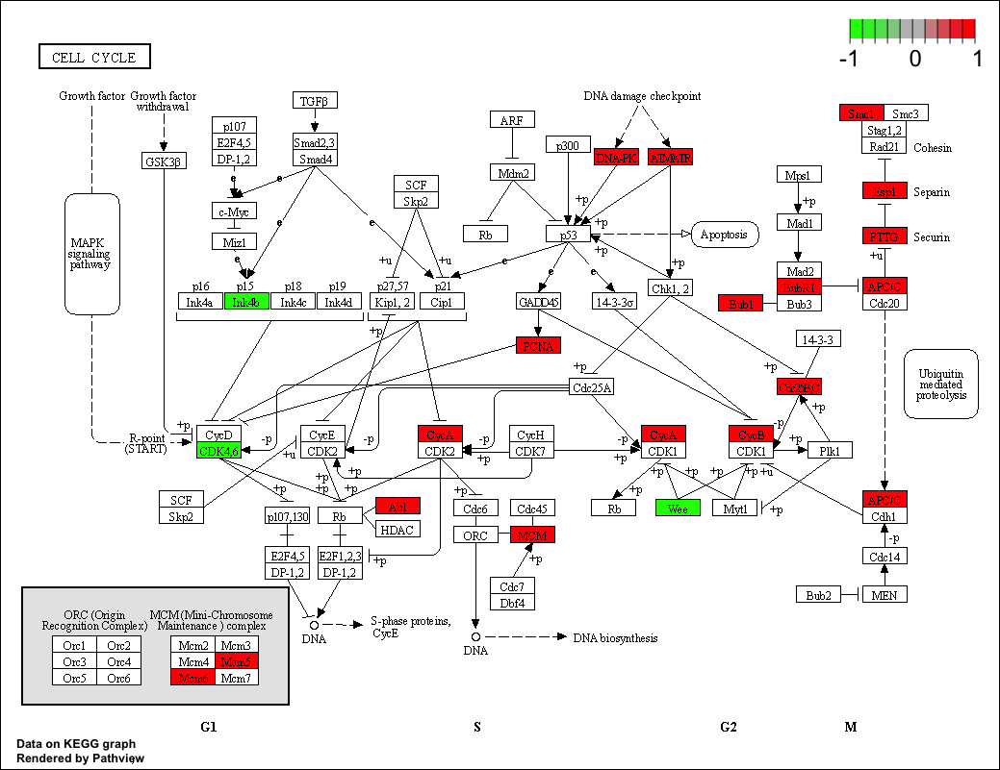

```{r setup, include=FALSE}
#knitr::opts_knit$set(echo = TRUE,  root.dir="~/Documents/EBIII_N2/chip-seq/", fig.path = "images/")
knitr::opts_knit$set(echo = TRUE,  root.dir="/DATA/WORK/Enseignement/2025_EBAII_ChIPseq/EBIII_N2/chip-seq/", fig.path = "images/")
```


```{r libLoad, echo=FALSE, warning=FALSE, message=FALSE}
library(ChIPseeker)
library(genomation)
library(ChIPpeakAnno)
library(ggplot2)
library(RColorBrewer)
library(ggsci) #https://cran.r-project.org/web/packages/ggsci/vignettes/ggsci.html
library(GenomicRanges)
library(skimr)
library(reshape2)
library(UpSetR)
library(rtracklayer)
library(EnrichedHeatmap)
library(circlize)
library(TxDb.Hsapiens.UCSC.hg38.knownGene)
txdb <- TxDb.Hsapiens.UCSC.hg38.knownGene
library(org.Hs.eg.db)

```

```{r SetParamsHidden, eval=FALSE, echo=FALSE}
params <- list(workdir = "/DATA/WORK/Enseignement/2025_EBAII_ChIPseq/EBIII_N2/chip-seq",
              mapping.chipseq= "stats_mappingChIPseq.tsv",
              peakcalling.chipseq="stats_peakCalling.tsv",
              brg1= "BRG1siCTRL_CHIP-seq_peaks.narrowPeak",
              mitf= "MITF_CHIP-seq_peaks.narrowPeak",
              sox10= "SOX10_CHIP-seq_peaks.narrowPeak",
              brg1.bw= "BRG1siCTRL_CHIP-seq.bw",
              mitf.bw= "MITF_CHIP-seq.bw",
              sox10.bw= "SOX10_CHIP-seq.bw",
              rnaseq= "RNAseq_diff_norm.rds",
              annot="annot.rds"
              )
```

# Introduction

During this training session, we are going to use ChIP-seq and RNA-seq
data from Laurette et al. [@laurette_transcription_2015] which are
available in GEO as
[GSE61967](https://www.ncbi.nlm.nih.gov/geo/query/acc.cgi?acc=GSE61967).
Data have already been processed.

## Processing of RNA-seq data

### Preprocessing

Reads were preprocessed in order to remove adapter, polyA and
low-quality sequences (Phred quality score below 20). After this
preprocessing, reads shorter than 40 bases were discarded for further
analysis. These preprocessing steps were performed using cutadapt
[@martin_cutadapt_2011] version 1.10.

### Mapping

Reads were mapped onto the hg38 assembly of Homo sapiens genome using
STAR [@dobin_star:_2013] version 2.5.3a.

### Quantification

Gene expression quantification was performed from uniquely aligned reads
using htseq-count version 0.6.1.p1 [@anders_htseqpython_2015], with
annotations from Ensembl version 103 and "union" mode. Only
non-ambiguously assigned reads have been retained for further analyses.

### Normalization

Read counts have been normalized across samples with the
median-of-ratios method proposed by Anders and Huber [@AND2010], to make
these counts comparable between samples.

### Differential expression analysis

Differential expressed genes between wild type ans shBRG1 cells was
performed using the `edgeR` R package [@Robinson2010]. We called
significant changes when FDR \< 0.01, absolute log fold change over 1
and minimum average log normalized count over 5.

## Processing of ChIP-seq data

### Mapping

Reads were mapped to `r params$organism` genome (assembly
`r params$assembly`) using Bowtie [@langmead_ultrafast_2009] v1.0.0 with
default parameters except for "-p 3 -m 1 --strata --best --chunkmbs
128". The following table shows the number of reads aligned to the
`r params$organism` genome.

```{r stats.chipseq, echo=FALSE}
align.stat <- read.table(file.path(params$workdir, "data", "ChIPseq", params$mapping.chipseq), 
                         sep="\t", quote="", header=T, check.names = F)
library(knitr)
align.stat = align.stat[order(align.stat$"Sample ID"),]
kable(align.stat, caption = "Mapping statistics of ChIP-seq data analyzed during this training session. Column \"Raw reads\" corresponds to the number of input reads. Column \"Aligned reads\" corresponds to the number of reads aligned exactly 1 time. Column \"Multimapped\" corresponds to the number of reads aligned > 1 times. Column \"Unmapped\" corresponds to the number of reads aligned 0 time.", row.names = FALSE)
```

### Peak Calling

Prior to peak calling, reads falling into Encode blacklisted regions
[@anshulkundaje_2014] were removed using bedtools intersect v2.26.0
[@quinlan_bedtools:_2010]. Then peak calling was done with Macs2 v2.1.1
with default parameters.

```{r peakcalling, echo=FALSE}
peak.stat <- read.table(file.path(params$workdir, "data", "ChIPseq", params$peakcalling.chipseq), 
                        sep="\t", quote="", header=T, check.names = F)
peak.stat = peak.stat[order(peak.stat$"IP sample"),]
kable(peak.stat, caption = "Number of peaks detected", row.names = FALSE)
```

### Generation of BigWig files

Normalized BigWig files were generated using Homer [@heinz_simple_2010]
makeUCSCfile v4.11.0 with the following parameter '-norm 1e7' meaning
that data were normalized to 10M reads.

## Start a project and define the paths to the data

Before starting any project, it is a good idea to setup the path to the project
as a variable. For example, we could use:
```{r set_projPath, eval=FALSE, echo=TRUE}
projPath <- "/shared/projects/2514_ebiii_n2/chipseq"
setwd(projPath)
```

If you use an Rmd file and RStudio, when you open the file, your working
directory should already be set as the folder where this Rmd file is located.
You can check it with:
```{r getworkdir, eval=FALSE, echo=TRUE}
getwd()
```

Here, we will use different files for our analyses. We can create a list
containing the absolute paths or names to the different files and folders
that we will use during the practice session.

```{r setParams, eval=FALSE, echo=TRUE}
params <- list(
  workdir= "/shared/projects/2514_ebiii_n2/ChIPseq",
  mapping.chipseq= "stats_mappingChIPseq.tsv",
  peakcalling.chipseq="stats_peakCalling.tsv",
  brg1= "BRG1siCTRL_CHIP-seq_peaks.narrowPeak",
  mitf= "MITF_CHIP-seq_peaks.narrowPeak",
  sox10= "SOX10_CHIP-seq_peaks.narrowPeak",
  brg1.bw= "BRG1siCTRL_CHIP-seq.bw",
  mitf.bw= "MITF_CHIP-seq.bw",
  sox10.bw= "SOX10_CHIP-seq.bw",
  rnaseq= "RNAseq_diff_norm.rds",
  annot="annot.rds"
  )
```


# Importing the peaks and obtaining some basic statistics

## Importing peak data

Peak files are in 
[narrowPeak format](https://genome.ucsc.edu/FAQ/FAQformat.html#format12) 
which is of the form:

  1.  chrom - Name of the chromosome (or contig, scaffold, etc.).  
  2.  chromStart - The starting position of the feature in the chromosome
  or scaffold. The first base in a chromosome is numbered 0 (i.e. 0-based).  
  3.  chromEnd - The ending position of the feature in the chromosome or
  scaffold. The chromEnd base is not included in the display of the
  feature. For example, the first 100 bases of a chromosome are
  defined as chromStart=0, chromEnd=100, and span the bases numbered 0-99.  
  4.  name - Name given to a region (preferably unique). Use "." if noname 
  is assigned.  
  5.  score - Indicates how dark the peak will be displayed in the browser
  (0-1000). If all scores were "'0"' when the data were submitted to
  the DCC, the DCC assigned scores 1-1000 based on signal value.
  Ideally the average signalValue per base spread is between 100-1000.  
  6.  strand - +/- to denote strand or orientation (whenever applicable). 
  Use "." if no orientation is assigned.  
  7.  signalValue - Measurement of overall (usually, average) enrichment for 
  the region.  
  8.  pValue - Measurement of statistical significance (-log10). Use -1 if 
  no pValue is assigned.  
  9.  qValue - Measurement of statistical significance using false discovery 
  rate (-log10). Use -1 if no qValue is assigned.  
  10. peak - Point-source called for this peak; 0-based offset from chromStart. 
  Use -1 if no point-source called.  

There are different ways to import such data. We could use a simple `read.table`
function but we know that it would not convert the 0-based coordinates to the
1-based coordinates used in R/Bioconductor.
  
The [ChIPseeker](https://www.bioconductor.org/packages/release/bioc/html/ChIPseeker.html)
package provides a `readPeakFile` function that we could use like this:
```{r loadData_ChIPseeker, eval=FALSE, echo=TRUE}
##NOT RUN
library(ChIPseeker)
peaks <- list()
peaks[["BRG1"]] <- readPeakFile(file.path(params$workdir,"data", "ChIPseq", params$brg1), 
                                as="GRanges")
```

However, the function is essentially a wrapper to the `read.delim` function and
does not assign useful column names to the imported data. So instead we will use
the `readNarrowPeak` function from the
[genomation](https://www.bioconductor.org/packages/release/bioc/html/genomation.html)
package to import the *narrowPeak* files obtained for the 3 factors (BRG1, MITF and SOX10):
```{r loadData_genomation, eval=TRUE, cache=TRUE}
library(genomation)
peaks <- list()
peaks[["BRG1"]] <- genomation::readNarrowPeak(file.path(params$workdir,"data", "ChIPseq", params$brg1))
peaks[["MITF"]] <- readNarrowPeak(file.path(params$workdir,"data", "ChIPseq", params$mitf))
peaks[["SOX10"]] <- readNarrowPeak(file.path(params$workdir,"data", "ChIPseq", params$sox10))
```

The package also provides a `readGeneric` function that can adapt to different
peak file formats. For example, the following command is equivalent to what we
did above for BRG1:
```{r loadData_readGeneric, eval=FALSE}
## NOT RUN
peaks[["BRG1"]] <- readGeneric(file.path(params$workdir,"data", "ChIPseq", params$mitf),
                               meta.cols = list(name = 4, score = 5, signalValue = 7,
                                                pValue = 8, qValue = 9, peak = 10),
                               zero.based = TRUE)
```

Let's take a look at how the data was imported:
```{r lookAtImportedPeaks}
peaks[["BRG1"]]
```

Peaks are stored as **GenomicRanges** (or **GRanges**) objects; this is an R
format which looks like the bed format, but is optimized in terms of memory
requirements and speed of execution.

> **_NOTE:_**: when using *GRanges* it is always a good idea to set the `seqinfo`
> metadata (info about chromosome names and length essentially). We will do that
> later below.

We can start by computing some basic statistics on the peak sets.

## How many peaks were called?

Compute the number of peaks per dataset. We use here a function from the
`apply` family which help to apply recursively a given function on
elements of the object. We will often use these functions along the
course.  

The `sapply()` function typically takes a list or vector as input and
applies the same function (here length) to each element:
```{r peaksNumber1, include=TRUE}
sapply(peaks,length)
```

Note that in this specific case, base R provides a `lengths` function (length**s**
with an **s** at the end) that does the same, i.e. gives the length of each
element of a list object:
```{r peaksNumber2, include = TRUE, eval = FALSE}
lengths(peaks)
```


Make a simple `barplot` showing the number of BRG1 peaks.

<details>

<summary style="color: DarkCyan">

Show code: barplot

</summary>

```{r simplebarplot, include=TRUE, out.width="50%", fig.align = 'center'}

barplot(lengths(peaks), ylab = "Number of peaks")
# or:
# barplot(lengths(peaks), ylab = "Number of peaks", log="y")
```

</details>

Let's create a barplot with ggplot2 out of this data.\
Step by step:\
*Do not forget to load the ggplot2 library*

<details>

<summary style="color: DarkCyan">

Show code: load ggplot2

</summary>

```{r loadggplot, include=TRUE}
# Load ggplot2 library
library(ggplot2)
```

</details>

-   Create a data.frame with two columns: IP contains names of the
    chipped TFs and NbPeaks contains the number of peaks.

<details>

<summary style="color: DarkCyan">

Show code: create the data.frame

</summary>

```{r peakLengths, include=TRUE}
# create a table with the data to display
peak.lengths <- data.frame(IP = names(peaks),
                           NbPeaks = lengths(peaks))
```

</details>

-   use ggplot2 with the appropriate geometric object `geom_*`

<details>

<summary style="color: DarkCyan">

Show code: barplot with ggplot2

</summary>

```{r enhancedbarplot, include=TRUE, out.width="50%",fig.align = 'center'}
# make the barplot
ggplot(peak.lengths, aes(x=IP, y=NbPeaks)) +
         geom_col()
```

</details>


-   Improve the barplot by changing axis labels and the theme

<details>

<summary style="color: DarkCyan">

Show code: modify axes labels and theme

</summary>

```{r enhancedbarplot2, include=TRUE, out.width="50%",fig.align = 'center'}
#make the barplot a bit nicer:
ggplot(peak.lengths, aes(x = IP, y = NbPeaks)) +
  geom_col() +
  labs(x = "ChIP", y = "Number of peaks") +
  theme_bw()
```

</details>


We can customize the plots by adding colors.

There are a number of color palettes that you can use in R and different ways
to specify colors. For example, the [Rcolorbrewer](https://cran.r-project.org/web/packages/RColorBrewer/index.html)
package is widely used and offers several color palettes:
```{r RcolorBrewer, include=TRUE}
# See:
library(RColorBrewer)
par(mar=c(3,4,2,2))
display.brewer.all()
```

The [ggsci](https://cran.r-project.org/web/packages/ggsci/index.html) package
offers color palettes based on scientific journals.  

If you are searching for a specific color, take a look at
[this site](https://www.w3schools.com/cssref/css_colors.php).  

Now lets add colors to the barplot.\
Step by step:\
- Add the new information fill=IP to let ggplot know that colors change
based on chipped protein

<details>

<summary style="color: DarkCyan">

Show code: color according to the chipped TF (column IP)

</summary>

```{r enhancedbarplotfollow1, include=TRUE, fig.show="hold", out.width="50%", fig.align = 'center'}
ggplot(peak.lengths, aes(x=IP, y=NbPeaks, fill=IP)) +
         geom_col() +
         labs(x = "ChIP", y = "Number of peaks") +
         theme_bw()
```

</details>

We want to use colors from `RColorBrewer` library with the "Set1" color
palette. To set your own colors to fill the plot, several functions are
available (`scale_fill_*`), here we use `scale_fill_brewer`.

<details>

<summary style="color: DarkCyan">

Show code: color according to the chipped TF (column IP) and set
RColorBrewer palette to Set1

</summary>

```{r enhancedbarplotfollow2, include=TRUE, fig.show="hold", out.width="50%", fig.align = 'center'}
ggplot(peak.lengths, aes(x=IP, y=NbPeaks, fill=IP)) +
         geom_col()+
         scale_fill_brewer(palette="Set1") +
         labs(x = "ChIP", y = "Number of peaks") +
         theme_bw()
```

</details>

And now use one of the `ggsci` palette.

<details>

<summary style="color: DarkCyan">

Show code: use a ggsci palette

</summary>

```{r enhancedbarplotfollow3, include=TRUE, fig.show="hold", out.width="50%", fig.align = 'center'}
ggplot(peak.lengths, aes(x=IP, y=NbPeaks, fill=IP)) +
         geom_col()+
         scale_fill_npg() +
         labs(x = "ChIP", y = "Number of peaks") +
         theme_bw()
```

</details>


## How large are these peaks?

The peaks were loaded as a `GRanges` objects.\
- To manipulate them we load the `GenomicRanges` library. Then we use the
appropriate function to retrieve the **width** of the peaks from the
`GRanges` and use a function to summarize the peak length (display the
statistics like minimum, maximum, quartiles, etc.)

<details>

<summary style="color: DarkCyan">

Show code: Display peak length statistics for BRG1 only

</summary>

```{r peakWidth_BRG1, message=FALSE, include=TRUE}
## we use the function width() from GenomicRanges
library(GenomicRanges)
summary(width(peaks$BRG1))
# you can also try with the skim function from the skimr package:
# skimr::skim(width(peaks$BRG1))
```

</details>

Create a simple `boxplot` of the peak sizes.

<details>

<summary style="color: DarkCyan">

Show code: Display peak length statistics as a boxplot

</summary>

```{r simpleboxplot, message=FALSE, include=TRUE, out.width="50%", fig.align = 'center'}
# use a log scale on the y axis to facilitate the comparisons
peak.width <- lapply(peaks, width)
boxplot(peak.width, ylab = "peak width", log = "y")
```

</details>

Now, create a nice looking boxplot with `ggplot2`. `ggplot` takes a data
frame as input. We can either create a date frame, this is what we have
done when we created the barplot. Here, we are going to use the package
`reshape2` which, among all its features, can create a data frame from
other types of data:

```{r reshape2, message=FALSE, include=TRUE}
# Load the package
library(reshape2)
peak.width.table <- melt(peak.width)
head(peak.width.table)
```

Create a ggplot object with correct aesthetics to display a boxplot
according the chipped TF (x-axis) and their width (y-axis). Then use
appropriate geometric object `geom_*`.

<details>

<summary style="color: DarkCyan">

Show code: Display peak length statistics with ggplot2

</summary>

```{r boxplot, message=FALSE, include=TRUE, out.width="50%", fig.align = 'center'}
# create boxplot
ggplot(peak.width.table, aes(x=L1, y=value)) +
         geom_boxplot()
```

</details>

By default, the background color is grey and often does not allow to
highlight properly the graphs. Many `theme` are available defining
different graphics parameters, they are often added with a function
`theme_*()`, the function `theme()` allows to tune your plot parameter
by parameter. We propose here to use `theme_classic()` that changes a
grey background to white background. Some peaks are very long and
squeeze the distribution, one way to make the distribution easier to
visualize is to transform the y axis to log scale. Finally, we want to
remove the x label, change the y label to 'Peak widths' and the legend
relative to the fill color from "L1" to "TF".\
Using the ggplot2 documentation 
(*e.g.* [tidyverse](https://ggplot2.tidyverse.org/) 
or [google it](https://www.letmegooglethat.com/?q=ggplot+change+label),
try to enhance the boxplot.

<details>

<summary style="color: DarkCyan">

Enhance it !

</summary>

```{r enhancedboxplot2, message=FALSE, include=TRUE, out.width="50%", fig.align = 'center'}

# - theme_classic() change grey background to white background
# - fill=L1 and scale_fill_brewer(palette="Set1") colors boxplots
# based on chipped protein and with colors from RColorBrewer Set1 palette
# - labs changes x and y axis labels and legend title
# - scale_y_log10() set y axis to a log scale so that we can have a nice
# view of the data in small values
ggplot(peak.width.table, aes(x=L1, y=value, fill=L1)) +
         geom_boxplot()+
         theme_classic()+
         scale_fill_brewer(palette="Set1")+
         labs(x = "", y = "Peak sizes", fill = "TF")+
         scale_y_log10()
```

</details>

## Peak filtering

To make sure we keep only high quality data. We are going to select
those peaks having a qvalue \>= 4. In the *GRanges* metadata columns (`mcols`)
one of them is the qvalue. So, we are going to set a threshold on this column.
How many peaks are selected ?

<details>

<summary style="color: DarkCyan">

Show the code: select high quality peaks for BRG1 and count them

</summary>

```{r peakFilteringBRG1, message=FALSE, include=TRUE}
## Select BRG1 peaks with qvalue>=4 and count them
length( peaks$BRG1[peaks$BRG1$qvalue >= 4] )
```

</details>

Now we want to apply this function to all IPs.  

<details>

<summary style="color: DarkCyan">

Show the code: filter the peaks for all IPs

</summary>

```{r peakFiltering, message=FALSE, include=TRUE}
## Select BRG1 peaks with qvalue>=4 and count them
peakfilt <- lapply(peaks,
                   function(x) {
                     x[x$qvalue >= 4]
                   })
lengths(peakfilt)
```

</details>


# Peak annotation relative to genomic features and peak overlaps

## Where are the peaks located across the whole genome?

Sometime, peaks may occur more on some chromosomes than others or there can
be regions where peaks are absent (example: repetitive regions that have been
filtered out). We can display the genomic distribution of peaks along the
chromosomes, using the `covplot` function from `ChIPSeeker`.
Height of peaks is drawn based on the peak scores.  
Let's use this function on *SOX10* for example:
```{r peakGenomeDistribution, cache=TRUE, include=FALSE, fig.align = 'center'}
# genome wide distribution of SOX10 peaks
covplot(peakfilt$SOX10, weightCol="score")
# chromosome wide distribution of SOX10 peaks
covplot(peakfilt$SOX10, chrs=c("chr1", "chr2"), weightCol="score")
```

## Where are the peaks located relative to genomic features?

Here, the aim is to identify where the peaks tend to be located relative to
typical genome annotations such as promoters, exons, introns, intergenic
regions, etc.  
We will assign peaks to genomic features (genes, introns,
exons, promoters, distal regions, etc.) by checking if they overlap with these
features.  
We will illustrate this task using functions from the *ChIPseeker* package.  
But first we need to retrieve the annotations

### Retrieve genome annotation (genes, transcripts, exons, etc.)
We load ready-to-use annotation objects from Bioconductor:  

  - a OrgDB object: `org.Hs.eg.db` and
  - a TxDB object: `TxDb.Hsapiens.UCSC.hg38.knownGene`

```{r LoadOrgDbTxDb, eval=TRUE, message=FALSE, include=TRUE}
## org.Hs.eg.db is an R object that contains mappings between Entrez Gene identifiers and GenBank accession numbers.
library(org.Hs.eg.db)
## Load transcript-oriented annotations
library(TxDb.Hsapiens.UCSC.hg38.knownGene)
txdb <- TxDb.Hsapiens.UCSC.hg38.knownGene
```

Since we now have a *TxDb* object that contains the `seqinfo` metadata, we take
the opportunity to transfer this metadata to our peaks.

```{r seqinfo_peaks, include = TRUE, eval=TRUE}
peaks <- lapply(peaks, function(x) {seqinfo(x) <- seqinfo(txdb); return(x)})
peakfilt <- lapply(peakfilt, function(x) {seqinfo(x) <- seqinfo(txdb); return(x)})
```


### Annotate the peaks relative to genomic features
This is done using the function `annotatePeak` which compares peak
positions with the coordinates of genomic features on the same reference genome.  
This function returns a complex object which contains all this
information.  
As we did for the peaks coordinates, we store the peak annotations
in a list that we first initialize as an empty list
`peakAnno <- list()`.  
Here, we define the TSS regions -1000 bp to +100 bp from the TSS itself.  
Using the help of the function and annotation objects
we have loaded, try to write the correct command line to annotate BRG1
peaks.

<details>

<summary style="color: DarkCyan">

Show code: annotate BRG1 peaks

</summary>

```{r annotatePeaksBRG1, eval=TRUE, message=FALSE, include=TRUE, cache=TRUE}
## Annotate peaks for all datasets and store it in a list
## Here TSS regions are regions -1000Kb/+100b arount TSS positions
## Peak annotations are stored in a list
peakAnno <- list()
peakAnno[["BRG1"]] = annotatePeak(peakfilt$BRG1, 
                                  tssRegion=c(-1000, 100), 
                                  TxDb=txdb, 
                                  annoDb="org.Hs.eg.db")
class(peakAnno$BRG1)
## Visualize and export annotation as a data table
# as.data.frame(peakAnno$BRG1)
head(as.data.frame(peakAnno$BRG1))
```

</details>

All peak information contained in the peak list is retained in the
output of `annotatePeak`. Positions and strand information of the nearest
genes are reported. The distance from the peak to the TSS of its **nearest
gene** is also reported. The genomic region where the peak lies is reported in
the *annotation* column. Since some annotation may overlap (e.g. a 5' UTR is
always located in an exon), ChIPseeker adopted the following priority in
genomic annotations:

-   Promoter
-   5' UTR
-   3' UTR
-   Exon
-   Intron
-   Downstream
-   Intergenic
-   Downstream (i.e. downstream of the gene 3' end).

This hierachy can be customized using the parameter
*genomicAnnotationPriority*.

The annotatePeak function reports detailed information when the
annotation is Exon or Intron, for instance 
*"Intron (ENST00000624697.4/9636, intron 1 of 2)"* 
means that the peak is overlapping with the first intron of transcript 
*ENST00000624697.4*, whose corresponding Entrez gene ID is *9636*
(Transcripts that belong to the same gene ID may differ in splice events).

The "annoDb" parameter is optional. If it is provided, some extra
columns including *SYMBOL*, *GENENAME*, *ENSEMBL/ENTREZID* are be added.

--

Reminder: The TxDb class is a container for storing transcript
annotations.

-   Bioconductor provides several packages containing *TxDb* objects for
    model organisms sur as Human and mouse. For instance,
    `TxDb.Hsapiens.UCSC.hg38.knownGene`, `TxDb.Hsapiens.UCSC.hg19.knownGene`
    for human genome hg38 and hg19, `TxDb.Mmusculus.UCSC.mm10.knownGene`
    and `TxDb.Mmusculus.UCSC.mm9.knownGene` for mouse genome mm10 and mm9,
    etc.

-   The user can also prepare their own *TxDb* by retrieving information from
    UCSC Genome Bioinformatics and BioMart data resources using the R functions
    `makeTxDbFromBiomart` and `makeTxDbFromUCSC` that are now in the 
    [txdbmaker](https://bioconductor.org/packages/release//bioc/html/txdbmaker.html)
    package.

-   One can also create a *TxDb* objects for any organism using
    an annotation file in GTF/GFF format using the function
    `makeTxDbFromGFF` of the *txdbmaker* package 
    (*GenomicFeatures* package in older R versions).

<details>

<summary style="color: DarkCyan">

Expand to find *Coturnix japonica* example

</summary>

```{r createTxDbGTF, eval=FALSE}
## download GTF file
download.file("https://ftp.ncbi.nlm.nih.gov/genomes/all/annotation_releases/93934/101/GCF_001577835.2_Coturnix_japonica_2.1/GCF_001577835.2_Coturnix_japonica_2.1_genomic.gtf.gz", "Coturnix_japonica_2.1.annotation.gtf.gz")
## Build TxDb object
library(GenomicFeatures)
txdb = makeTxDbFromGFF("Coturnix_japonica_2.1.annotation.gtf.gz")
## To save the txdb database
library(AnnotationDbi)
saveDb(txdb, 'txdb.Coturnix_japonica_2.1.sqlite')
## load it when needed
library(AnnotationDbi)
txdb = loadDb(file = 'txdb.Coturnix_japonica_2.1.sqlite')
```

</details>

--

### Plot the results of peak annotation

We can vizualize the way our peaks have been annotated relative to genomic 
features (introns, exons, promoters, distal regions,...)
using a pie chart with `plotAnnoPie` or as a bar chart `plotAnnoBar` which 
facilitates the comparison between different sets of peaks.

<details>

<summary style="color: DarkCyan">

Show code: Display peak annotations of BRG1 peaks using a pie chart

</summary>

```{r plotAnnoPie_BRG1, include=TRUE, eval=TRUE, fig.align = 'center'}
## distribution of genomic features for BRG1 peaks
# as a pie chart - which is the most widely used representation in publication
plotAnnoPie(peakAnno$BRG1)
```

</details>

Now we generate annotations for SOX10 and MITF peaks.

<details>

<summary style="color: DarkCyan">

Show code: Generate annotations for SOX10 and MITF peaks

</summary>

```{r annotatePeak_SOX10_MITF, include=TRUE, eval=TRUE, warning=FALSE, message=FALSE, cache=TRUE}
## Use the annotatePeak function
peakAnno[["SOX10"]] <- annotatePeak(peakfilt$SOX10, tssRegion=c(-1000, 100), TxDb=txdb, annoDb="org.Hs.eg.db")
peakAnno[["MITF"]] <- annotatePeak(peakfilt$MITF, tssRegion=c(-1000, 100), TxDb=txdb, annoDb="org.Hs.eg.db")

## We could also have generated annotations for all factors at the same time using:
# peakAnno <- lapply(peakfilt, annotatePeak,  tssRegion=c(-1000, 100), TxDb=txdb, annoDb="org.Hs.eg.db")
```

</details>
  

Now display the results as a stacked barplot using `peakAnnoBar`.

<details>

<summary style="color: DarkCyan">

Show code: Generate stacked barplot of peak annotations

</summary>

```{r plotAnnoBar, include=TRUE, eval=TRUE}
## Use the plotAnnoBar function
plotAnnoBar(peakAnno)
```

</details>


However since some annotation overlap, ChIPseeker also provides functions
that help evaluate full annotation overlaps.  
For example, the `upsetplot` function which produces an 
[UpSet plot](https://en.wikipedia.org/wiki/UpSet_plot) similar to those
produced by the `library(UpSetR)` package.

```{r upsetplot, include=TRUE, eval=TRUE, warning=FALSE, fig.align = 'center', cache=TRUE}
upsetplot(peakAnno$BRG1)
```


## Do the peaks of the different factors overlap?

### Venn Diagram

We see that the peaks for the 3 factors SOX10, MITF and BRG1 are present to
a certain extent in similar regions (although this could be due to the
proportions of these regions in the genome). But this doesn't tell us if the
peaks actually overlap.
An overlap between the peaks may mean that the factors co-localize, although we
won't know if it's the case in single cells.  

Overlaps between peak datasets can be evaluated using a Venn diagram.
Such an approach is implemented in the 
[ChIPpeakAnno](https://www.bioconductor.org/packages/release/bioc/html/ChIPpeakAnno.html) 
package.  

After loading the library, we start by computing the overlap between peak sets, 
keeping the information of all peaks overlapping in each set 
(see `?findOverlapsOfPeaks` for help).

```{r ovlPeaks, include=TRUE, eval=TRUE, warning=FALSE, message=FALSE, cache=TRUE}
library(ChIPpeakAnno)
ovl <- findOverlapsOfPeaks(peakfilt, connectedPeaks="keepAll")
```

*ChIPpeakAnno* imposes, while plotting the Venn diagram, to compute the
significance of the pairwise associations using a hypergeometric test.
To this end, we need to estimate the number of all potential binding
events which is used by the `makeVennDiagram` function through the
`totalTest` number. It is used for the hypergeometric sampling that is
used to determine if the overlap between two datasets is more than would
be expected by chance. This is not a trivial question, the answer is
driven by what you know about the binding properties of your factors
(eg. sequence specific, mainly intergenic etc). You can find an
interesting discussion
[here](https://stat.ethz.ch/pipermail/bioconductor/2010-November/036540.html).
In our case we can refer to the genomic distribution of the peaks that
we have plotted previously. We can assume that our TFs have a gene body
binding preference. Genes cover roughly 10% of the genome.

```{r defineHyperTot, include=TRUE, eval=TRUE, warning=FALSE, message=FALSE}
# Estimate the average size of the peaks ...
averagePeakWidth <- mean(width(unlist(GRangesList(ovl$peaklist))))
# ... to count how many potential sites could have been bound in coding regions.
tot <- ceiling(3.3e+9 * 0.1 / averagePeakWidth)
```

**TIPS**: We can define the colors attributed to each set using the
`colours()` function. Whenever you want to set a color you can use this function.  
Here are some useful pages about colors in R and elsewhere:  

  - [colorchart](https://github.com/EarlGlynn/colorchart/wiki/Color-Chart-in-R)  
  - [color palettes](https://www.nceas.ucsb.edu/sites/default/files/2020-04/colorPaletteCheatsheet.pdf)  
  - [viridis palette](https://cran.r-project.org/web/packages/viridis/vignettes/intro-to-viridis.html)  
  - [CSS colors](https://www.w3schools.com/cssref/css_colors.php)  


Now we can plot the overlap of the peaks as a Venn Diagram:  
```{r VennAnno, include=TRUE, fig.width=7, fig.height=7, warning=FALSE, message=FALSE, results='hide', fig.align = 'center', cache=TRUE}
makeVennDiagram(ovl, totalTest = tot, connectedPeaks="keepAll",
                fill = brewer.pal(3, "Set1"), # circle fill color
                col = brewer.pal(3, "Set1"), #circle border color
                cat.col = brewer.pal(3, "Set1"))
```

According to the hypergeometric test p-values all pairwise comparisons
are highly significant. This has to be taken very carefully as it
largely depends on the background estimation that we may have
over-estimated. If you are not sure about your estimation, you can use a 
non-parametric approach based on your peak genomic
distribution to estimate randomness. To this end the
`TxDb.Hsapiens.UCSC.hg38.knownGene` is used.

#### Are the overlaps significant?

ChIPpeakAnno provides the `preparePool` and `peakPermTest` functions to
compute this test. These tests are made by pair, we will look at
SOX10/MITF overlap significance as an example.

```{r permPeaks, include=TRUE, warning=FALSE, message=FALSE, cache=TRUE, fig.align = 'center', cache=TRUE}
# Prepare a pool of random peaks following the characteristics of our peak sets
pool <- preparePool(txdb, peaks$SOX10,
                    bindingType = "TSS",
                    featureType = "transcript",
                    seqn = paste0("chr",c(1:22, "X", "Y")))

# Create the permPool object needed for peakPermTest
pool <- new("permPool", grs=pool$grs[1], N=length(peaks$SOX10))
SOX10.MITF <- peakPermTest(peaks$SOX10, peaks$MITF, 
                           pool = pool, 
                           seed = 123, 
                           force.parallel = FALSE)
SOX10.MITF
plot(SOX10.MITF)
```

Venn diagrams are widely used to represent overlaps, intersections.
However, in ChIP-seq analysis, the definition of the peaks is dependent
on the peak caller, the FDR thresholds (what about peaks just below the
threshold?). The overlap is also difficult to assess, indeed do we call
an overlap of 1 nucleotide an intersection ? It is one of the numerous
parameters that can be tuned...

Another way to explore the results is to evaluate if different combinations of
the factors are associated to specific genomic features. We can use again the
`annotatePeak` function to evaluate this:

```{r annotPeakVennSets, include=TRUE, message = FALSE, warning=FALSE, cache=TRUE}
coocs <- as(ovl$peaklist, "GRangesList")
# apply annotatePeak to each set of peaks in the list coocs
peakAnnoList <- lapply(coocs, annotatePeak, 
                       TxDb=txdb, annoDb="org.Hs.eg.db",
                       tssRegion=c(-1000, 100),
                       verbose=FALSE)
```

And then plot the results:
```{r plotannotPeakVennSets, include=TRUE, cache=TRUE, fig.align='center'}
# Plot peak distribution relative to gene features
plotAnnoBar(peakAnnoList)
# Plot peak distribution relatively to their distance to the TSS
plotDistToTSS(peakAnnoList)
```


# Heatmaps and average profiles

Heatmaps and average profiles are widely used representations of ChIP-seq data
as they allow simultaneous visualization of read enrichment at various
locations. For instance, one may want to represent reads related to a
chipped protein in regions spanning +/-5Kb around all TSS of the
reference genome. Another objective could be to compare read enrichment
at the same locations in many chip-seq datasets.

<!-- illustration heatmap / average profiles -->


## Distribution of BRG1 peaks

We want to know if BRG1 is binding large and/or narrow regions, unique
and/or tandem etc. So we will study the distribution of the BRG1 peaks that 
have been called in a region spanning +/-2Kb around the peak centers.
  
First of all, for calculating the profile of ChIP peaks around the
BRG1 peak center, we need to define BRG1 peak centers and extend them 2Kb 
on each side. We will then select the 10000 best peaks using the q-value to get 
a lighter matrix. Then, we need to "align" the peaks that are mapped to these
regions, and thus generate a matrix with the different regions in row and the
position around the peak centers in columns. The resulting matrix will be
2000\*2+1 columns and 10000 rows.  


Step by step:\
- Compute the centers of BRG1 peaks using the GenomicRanges `resize`` function.

<details>

<summary style="color: DarkCyan">

Show code: compute the peak centers for BRG1

</summary>

```{r BRG1peakcenters, message=FALSE, eval=TRUE, cache=TRUE}
# Compute the centers of BRG1 peaks
peak_centers_BRG1 <- resize(peakfilt$BRG1, width = 1, fix = "center")
```
Note that the `mid` function applied to a *GRanges* object returns the centers
of the ranges but as an integer vector, not a *GRanges* object.

</details>


-   Now select the BRG1 peak centers that correspond to the 10,000 most 
significant BRG1 peaks (based on qvalue)

<details>

<summary style="color: DarkCyan">

Show code: Select peak centers for the top 10k peaks

</summary>

```{r BRG1peaktop10K, message=FALSE, eval=TRUE, cache=TRUE}
# For computation and memory efficiency reasons,
# we subset the top 10K peaks according to the qvalue
top10k_BRG1 <- peak_centers_BRG1[order(peak_centers_BRG1$qvalue, decreasing = TRUE)][1:10000]
```

</details>

-   Create a `GRanges` object with the regions corresponding to +/-2kb around
    these peak centers.

<details>

<summary style="color: DarkCyan">

Show code: Create GRanges with +/-2kb around top10k BRG1 peak centers

</summary>

```{r BRG1peakcenterGR, message=FALSE, eval=TRUE, cache=TRUE}
# Generate GRanges of peak centers +/-2kb for the 10K top peaks
top10k_BRG1_extend2kb <- top10k_BRG1 + 2000
# Note that we could have obtained this GRanges for all peaks directly using:
# BRG1_extend2kb <- resize(peakfilt$BRG1, width = 4001, fix = "center"))
```

</details>


### BRG1 heatmap and average profile with ChIPseeker

First, we will use the functions available in the *ChIPseeker* package to
generate the heatmap. Later, we will compare the results to those obtained with
the *genomation* package.


-   *ChIPseeker* actually requires that we generate the regions of interest 
    (top10k BRG1 peak centers +/-2kb) using the `makeBioRegionFromGranges`.

<details>

<summary style="color: DarkCyan">

Show code: prepare the "BioRegions" using ChIPseeker function

</summary>

```{r top10kBRG1BioRegions, message=FALSE, eval=TRUE, cache=TRUE}
BRG1_extend_2kb <- makeBioRegionFromGranges(top10k_BRG1,
                                            by="peaks",
                                            type= "start_site",
                                            upstream = 2000,
                                            downstream = 2000)
```

</details>

-   We now have the regions that we need to map the peaks to. Create the
    matrix using the `getTagMatrix` function and the parameter
    `windows`.

<details>

<summary style="color: DarkCyan">

Show code: Create the matrix

</summary>

```{r tagMatrixAroundBRG1center, message=FALSE, warning=FALSE, eval=TRUE, fig.align='center', cache=TRUE}
## compute the coverage of peaks in these regions
BRG1_tagmat <- getTagMatrix(peakfilt$BRG1, windows = BRG1_extend_2kb)
```

</details>

-   Now display the matrix with `tagHeatmap`.

<details>

<summary style="color: DarkCyan">

Show code: Display the heatmap

</summary>

```{r tagHeatmap_BRG1, warning = FALSE, message=FALSE, eval=TRUE, fig.align='center', cache=TRUE}
## plot the heatmap
tagHeatmap(BRG1_tagmat)
```

</details>

We will see below that the rows have been reordered by their average signal
(i.e. what you would get by using `rowMeans` on the tagMatrix).  
  
Here we used the centers of BRG1 peaks to define the regions of interest,
so it is not surprising that peaks are nicely aligned on these centers and,
because of the sorting applied to the rows, that wide peaks are at the top
and narrower peaks at the bottom of the heatmap.

-   Now let's see how the distribution of peaks look around the TSS.
    *ChIPseeker* provides an easy function to do this: `peakHeatmap`
    that uses directly the *TxDb* object that we used previously.

<details>

<summary style="color: DarkCyan">

Show code: Plot BRG1 peak distribution around the TSS

</summary>

```{r plotHeatmap_BRG1_TSS, warning=FALSE, message=FALSE, eval=TRUE, fig.align='center', cache=TRUE}
## plot the heatmap of BRG1 peaks around the TSS
peakHeatmap(peakfilt$BRG1, TxDb=txdb, upstream=2000, downstream=2000)
```

</details>
  
  
We can also display the average profile of BRG1 peaks across these regions.
This corresponds to calculating the `mean` signal of each column of the
matrix and plotting the result. So these "average profiles" are sometimes
plotted above the heatmap.  

In *ChIPseeker* we can do this on the *tagMatrix* object using the
`plotAvgProf` function.

<details>

<summary style="color: DarkCyan">

Show code: Plot the average profile of BRG1 peaks around their centers

</summary>

```{r plotAvgProf_BRG1, message=FALSE, eval=TRUE, fig.align = 'center', cache=TRUE}
## compute the coverage of peaks in these regions
plotAvgProf(BRG1_tagmat,
            xlim=c(-2000, 2000),
            xlab="Distance to peak center",
            ylab = "Peak Count Frequency")
```

> **_NOTE:_**: this is especially useful when groups of regions have been
> defined on the matrix, for example representing different binding profiles
> of the factor.

</details>


### BRG1 heatmap with genomation

Now let's see how to obtain similar results with the *genomation* package.

Step by step:\
- The equivalent of the `tagMatrix` function is `SignalMatrix`, but the latter
  directly accepts a regular *GRanges* object to specify the windows / regions
  of interest.

<details>

<summary style="color: DarkCyan">

Show code: Prepare the matrix

</summary>

```{r ScoreMatrix_BRG1_peaks, warning=FALSE, message=FALSE, eval=TRUE, cache=TRUE}
## Prepare the matrix of BRG1 peaks across BRG1 peak centers +/-2kb
sm_BRG1 <- ScoreMatrix(target = peakfilt$BRG1, windows = top10k_BRG1_extend2kb)
```

</details>

- Plot the heatmap with `heatMatrix`.

<details>

<summary style="color: DarkCyan">

Show code: Plot the heatmap

</summary>

```{r heatMatrix_BRG1, warning=FALSE, message=FALSE, eval=TRUE, fig.align='center', cache=TRUE}
## Plot the heatmap
heatMatrix(sm_BRG1, xcoords = c(-2000, 2000))
```

</details>

You notice that the heatmap doesn't look like the one generated by the
*ChIPseeker* function `tagHeatmap`. This is because by default, the
`heatMatrix` function does not reorder the rows. Since we have sorted the
rows by decreasing qvalue, we can verify this by using the qvalue as a weight 
when calculating the coverage of BRG1 peaks over the regions. This is done by
using the `weight.col` argument in `ScoreMatrix`.

- Color the coverage by qvalue using the `weight.col` argument in `ScoreMatrix`.

<details>

<summary style="color: DarkCyan">

Show code: Plot the heatmap with qvalue as weight

</summary>

```{r heatMatrix_BRG1_qval, warning=FALSE, message=FALSE, eval=TRUE, fig.align='center', cache=TRUE}
## Plot the heatmap using qvalue as weight
heatMatrix(ScoreMatrix(target = peakfilt$BRG1, 
                       windows = top10k_BRG1_extend2kb, 
                       weight.col="qvalue"), 
           xcoords = c(-2000, 2000))
```

</details>


- Now use the `order` argument in `heatMatrix` to reorder the rows

<details>

<summary style="color: DarkCyan">

Show code: Plot the heatmap reordering the rows

</summary>

```{r heatMatrix_BRG1_order, warning=FALSE, message=FALSE, eval=TRUE, fig.align='center', cache=TRUE}
## Plot the heatmap with reordered rows
heatMatrix(sm_BRG1, xcoords = c(-2000, 2000), order = TRUE)
```

</details>

Take a look at `?heatMatrix` and at the *genomation* vignette, there are other 
useful arguments, for example to make groups or cluster rows.


- Now let's plot the distribution of BRG1 peaks around the TSS using 
  *genomation*. To do this, we will use the `gene` and `promoters` functions
  on the *TxDb* object to extract the coordinates of the regions around the TSS.

<details>

<summary style="color: DarkCyan">

Show code: Heatmap of BRG1 peaks around the TSS with *genomation*

</summary>

```{r heatMatrix_BRG1_TSS, warning=FALSE, message=FALSE, eval=TRUE, fig.align='center', cache=TRUE}
## we also add a confidence interval around the mean
heatMatrix(ScoreMatrix(target = peakfilt$BRG1, 
                       windows = promoters(genes(txdb),
                                           upstream = 2000,
                                           downstream = 2001)), 
           xcoords = c(-2000, 2000),
           order = TRUE)
```
Again, we notice that *ChIPseeker* function had filtered out all rows with 
zero coverage around the TSS, while *genomation* function does not.

</details>

- *genomation* has the `plotMeta` function to create average profiles

<details>

<summary style="color: DarkCyan">

Show code: Make an average profile with genomation

</summary>

```{r plotMeta_BRG1, warning=FALSE, message=FALSE, eval=TRUE, fig.align='center', cache=TRUE}
## Average profile with genomation
## we also add a confidence interval around the mean
plotMeta(sm_BRG1, xcoords = c(-2000, 2000), dispersion = "se")
```

</details>


### Multiple heatmaps: comparing factors across identical regions

Heatmaps are useful to compare the profiles obtained from different factors
on the same regions. For examples, we could ask: How is the signal for BRG1
and MITF distributed around SOX10 peaks. *genomation* has useful functions
to analyse a list of several ChIP-seq results, provided as *GRanges* or
*RleList* objects.

Step by step:\
- Get the +/-2kb regions around SOX10 peak centers.

<details>

<summary style="color: DarkCyan">

Show code: Get +/-2kb regions around SOX10 peak centers

</summary>

```{r SOX10_extend2kb, warning=FALSE, message=FALSE, eval=TRUE, cache=TRUE}
## Obtain regions of interest (SOX10 peak centers +/- 2kb)
SOX10_extend2kb <- resize(peakfilt$SOX10, width = 4001, fix = "center")
```

</details>

- Use the `ScoreMatrixList` function to obtain the profiles of all factors in
  these regions.

<details>

<summary style="color: DarkCyan">

Show code: Get the ScoreMatrix for each factors

</summary>

```{r ScoreMatrixList_SOX10_centers, warning=FALSE, message=FALSE, eval=TRUE, cache=TRUE}
## Get the coverage of peaks for all factors around SOX10 peak centers
sm_sox10peaks <-  ScoreMatrixList(target = peakfilt[c("SOX10", "BRG1", "MITF")], 
                                  windows = SOX10_extend2kb)
```

</details>

- Plot the heatmaps side by side using `multiHeatMatrix`.

<details>

<summary style="color: DarkCyan">

Show code: Plot the 3 heatmaps side by side

</summary>

```{r multiHeatMatrix_SOX10_centers, warning=FALSE, message=FALSE, eval=TRUE, cache=TRUE}
## Get the coverage of peaks for all factors around SOX10 peak centers
## We order the rows by the average signal across all matrices and use a common color scale for all heatmaps
multiHeatMatrix(sm_sox10peaks, 
                xcoords = c(-2000, 2000),
                 order = TRUE,
                common.scale = TRUE)
```

</details>
  
There seems to be little link between SOX10 and MITF binding but there is some
link between BRG1 binding and SOX10


## Read enrichment in regions of interest
So far, we're only looking at heatmaps of peak presence/absence. Even if we 
sort the regions by their intensity or by qvalue, this gives little 
quantitative information on the actual links between the factors.  
To dig into this, we will look at the coverage of reads, instead of peaks, 
in specific regions.  
  
### Heatmap of BRG1 read coverage
We will first look at the enrichment of reads from the BRG1 ChIP in regions 
covering +/-5kb around BRG1 peak centers. Because this represent ~10kb regions
we will create bins and summarize peak density within these bins.

Step by step:\
- Get the +/-5kb regions around BRG1 peak centers (only the top10K peaks).

<details>

<summary style="color: DarkCyan">

Show code: Get +/-5kb regions around BRG1 peak centers

</summary>

```{r extended.5K.BRG1, warning=FALSE, message=FALSE, eval=TRUE, cache=TRUE}
## Obtain regions of interest (BRG1 peak centers +/- 5kb)
extended.5K.BRG1 <- top10k_BRG1 + 5000
```

</details>

- Import the read coverage for BRG1 ChIP.

<details>

<summary style="color: DarkCyan">

Show code: Import the bigwig file for BRG1 using *rtracklayer* `import` function

</summary>

```{r cvg.BRG1, warning=FALSE, message=FALSE, eval=TRUE, cache=TRUE}
## Import BRG1 bigwig file as an RleList
cvg.BRG1 <- import(file.path(params$workdir, "data", "ChIPseq", params$brg1.bw),
                      format = "BigWig",
                      which = extended.5K.BRG1,
                      as = "RleList")
cvg.BRG1
```
The read coverage is imported as an `RleList` where each element represents a
chromosome and is a long vector of coverage values along this chromosome, 
represented as a read-length encoded (`Rle`) vector.  
Here, we used the *rtracklayer* `import` function but below we will also
illustrate the `readBigWig` function from the *genomation* package.

</details>

- Summarize the coverage in 200 bins.

<details>

<summary style="color: DarkCyan">

Show code: Use the `SocreMatrixBin` function from *genomation* tu summarize the
           coverage in 200 bins

</summary>

```{r smr_BRG1, warning=FALSE, message=FALSE, eval=TRUE, cache=TRUE}
## Obtain the matrix with 200 bins
smr_BRG1 <- ScoreMatrixBin(target = cvg.BRG1, 
                           windows = extended.5K.BRG1, 
                           bin.num=200)
```

</details>

- Plot the heatmap.

<details>

<summary style="color: DarkCyan">

Show code: Use the `heatMatrix` function to plot the heatmap

</summary>

```{r smr_BRG1_heatMatrix, warning=FALSE, message=FALSE, eval=TRUE, fig.align='center', cache=TRUE}
## Plot the heatmap, ordering the regions by their average intensity
heatMatrix(smr_BRG1, 
           xcoords = c(-5000, 5000),
           order = TRUE) 
```

</details>

- A few extreme values in the matrix are generating a color scale that doesn't
  allow us to visualize the majority of the data. Use the `winsorize` argument
  in `heatMatrix` to correct the color scale.

<details>

<summary style="color: DarkCyan">

Show code: Use the `winsorize` argument in `heatMatrix` to adjust the color scale

</summary>

```{r smr_BRG1_heatMatrix_winsorized, warning=FALSE, message=FALSE, eval=TRUE, fig.align='center', cache=TRUE}
## Plot the heatmap, ordering the regions by their average intensity
heatMatrix(smr_BRG1, 
           xcoords = c(-5000, 5000),
           winsorize = c(0, 99.9),
           order = TRUE) 
```

</details>


- Try the `scaleScoreMatrix` function from *genomation* to see the effect on
  the heatmap

<details>

<summary style="color: DarkCyan">

Show code: Plot the heatmap of a scaled matrix

</summary>

```{r smr_BRG1_heatMatrix_scaled, warning=FALSE, message=FALSE, eval=TRUE, fig.align='center', cache=TRUE}
## Plot the heatmap for the scaled matrix
heatMatrix(scaleScoreMatrix(smr_BRG1), 
           xcoords = c(-5000, 5000), 
           order = TRUE) 
```

</details>

- Identify different patterns of read coverage using the `clustfun`argument

<details>

<summary style="color: DarkCyan">

Show code: Use the `clustfun` argument to group the peaks based on their
           patterns of read coverage by using k-means clustering (e.g. 5 groups)

</summary>

```{r smr_BRG1_heatMatrix_kmeans, warning=FALSE, message=FALSE, eval=TRUE, fig.align='center', cache=TRUE}
## Make 5 groups of peaks based on the pattern of read coverage around the peaks
set.seed(123) # for reproducibility since we're using k-means clustering
heatMatrix(smr_BRG1, 
           xcoords = c(-5000, 5000), 
           winsorize = c(0, 99.9),
           clustfun = function(x) kmeans(x, centers=5)$cluster) 
```
In practice we would probably prefer to perform the clustering outside of the
call to the `heatMatrix` function. But when the `clustfun` argument is used,
the function returns the clustering result so that we can reuse it for other
analysis.  

</details>

### MultiHeatmap to compare read coverage of the 3 factors

Now let's investigate the read coverage of the 3 factors around SOX10 peaks.
We will choose a window of +/-3kb around SOX10 peaks and sort them by decreasing
qvalue. We will also summarize the coverages across these regions using 300 bins.

Step by step:\
- Get the +/-3kb regions around SOX10 peak centers sorted by decreasing qvalues.

<details>

<summary style="color: DarkCyan">

Show code: Get +/-3kb regions around sorted SOX10 peak centers

</summary>

```{r SOX10_extend3kb_sorted, warning=FALSE, message=FALSE, eval=TRUE, cache=TRUE}
## Obtain regions of interest (SOX10 peak centers +/- 2kb)
SOX10_extend3kb_sorted <- resize(peakfilt$SOX10[order(peakfilt$SOX10$qvalue, decreasing = TRUE)],
                                 width = 6001,
                                 fix = "center")
```

</details>

- Import the bigwig files for the 3 factors using the `readBigWig` function from
  the *genomation* package.

<details>

<summary style="color: DarkCyan">

Show code: Import read coverage for the 3 factors

</summary>

```{r import_readBigWig, warning=FALSE, message=FALSE, eval=TRUE, cache=TRUE}
## Import read coverage for the 3 factors
cvg <- list()
cvg[["SOX10"]] <- readBigWig(file.path(params$workdir, "data", "ChIPseq", params$sox10.bw),
                             windows = SOX10_extend3kb_sorted)
cvg[["BRG1"]] <- readBigWig(file.path(params$workdir, "data", "ChIPseq", params$brg1.bw),
                            windows = SOX10_extend3kb_sorted)
cvg[["MITF"]] <- readBigWig(file.path(params$workdir, "data", "ChIPseq", params$mitf.bw),
                            windows = SOX10_extend3kb_sorted)
```

</details>

- Get the ScoreMatrices using the `ScoreMatrixList`

<details>

<summary style="color: DarkCyan">

Show code: Compute score matrices for the 3 factors using 300 bins

</summary>

```{r smr_at_SOX10peaks, warning=FALSE, message=FALSE, eval=TRUE, cache=TRUE}
## Obtain the score matrices
smr_at_SOX10peaks <- ScoreMatrixList(target = cvg, 
                                     windows = SOX10_extend3kb_sorted, 
                                     bin.num = 300)
```

</details>

- Plot the heatmaps (use winsorization to adjust the color scale)

<details>

<summary style="color: DarkCyan">

Show code: Plot the heatmaps using `multiHeatMatrix`

</summary>

```{r multiHeatMatrix_SOX10peaks, warning=FALSE, message=FALSE, eval=TRUE, fig.align='center', cache=TRUE}
## Plot the heatmaps side-by-side
multiHeatMatrix(smr_at_SOX10peaks, 
                xcoords = c(-3000, 3000), 
                winsorize = c(0, 99.9))
```
Note that if you use the argument `order = TRUE`, the rows will be sorted by
the average of the signal across the 3 matrices, which is why it is important to
sort the regions of interest before plotting the heatmaps and to use a function
that keeps this row order.

</details>

### Customized heatmaps with the EnrichedHeatmap package
So far, we have used functions from *ChIPseeker* and *genomation* to plot the
heatmaps. While these functions offer some level of customization, you may need
further customization in certain cases. The 
[EnrichedHeatmap](https://github.com/jokergoo/EnrichedHeatmap)
package offers an almost complete level of customization to plot heatmaps and
heatmap annotations from functional genomic experiments.  
The package is built on the 
[ComplexHeatmap](https://github.com/jokergoo/ComplexHeatmap) package, which
has an extensive documentation and examples.  
  
As an example, let's plot the enrichment of SOX10 and BRG1 reads
around SOX10 peaks.  

Step by step:\
- First convert the *ScoreMatrix* objects to *normalizedMatrix* objects that
  are used by *EnrichedHeatmap*. You can create a normalizedMatrix using the
  `normalizeToMatrix` function but since we already computed the matrices, we
  will instead convert them using `as.normalizedMatrix`

<details>

<summary style="color: DarkCyan">

Show code: Convert a ScoreMatrix to a normalizedMatrix

</summary>

```{r normalizedMatrix, warning=FALSE, message=FALSE, eval=TRUE, cache=TRUE}
## Convert signal matrices to normalizedMatrix objects
normat <- list()

## For BRG1 signal:
normat[["BRG1"]] <- as.normalizedMatrix(
  as(smr_at_SOX10peaks[["BRG1"]], "matrix"),
  k_upstream = 150,
  k_downstream = 150,
  k_target = 0,
  extend = c(3000, 3000),
  signal_name = "BRG1",
  target_name = "SOX10 peak centers"
)

## For SOX10 signal:
normat[["SOX10"]] <- as.normalizedMatrix(
  as(smr_at_SOX10peaks[["SOX10"]], "matrix"),
  k_upstream = 150,
  k_downstream = 150,
  k_target = 0,
  extend = c(3000, 3000),
  signal_name = "SOX10",
  target_name = "SOX10 peak centers"
)

```

</details>

- Plot BRG1 heatmap using default parameters

<details>

<summary style="color: DarkCyan">

Show code: Plot BRG1 EnrichedHeatmap

</summary>

```{r EnrichedHetmap_defaults_BRG1, warning=FALSE, message=FALSE, eval=TRUE, fig.align='center', cache=TRUE}
## BRG1 EnrichedHeatmap
EnrichedHeatmap(normat$BRG1, name = "BRG1")
```
We notice that the heatmap is sorted by increasing average signal across the
regions.
</details>

- Now use the syntax of *EnrichedHeatmap* to plot both SOX10 and BRG1 heatmaps

<details>

<summary style="color: DarkCyan">

Show code: Plot SOX10 + BRG1 EnrichedHeatmaps

</summary>

```{r EnrichedHetmap_defaults_SOX10_BRG1, warning=FALSE, message=FALSE, eval=TRUE, fig.align='center', cache=TRUE}
## SOX10 + BRG1 EnrichedHeatmap
EnrichedHeatmap(normat$SOX10, name = "SOX10") +
  EnrichedHeatmap(normat$BRG1, name = "BRG1")
```
The first heatmap (SOX10) is ordered by increasing average signal and the second
heatmap (BRG1) follows the same order as the first one so that we can compare 
the signal of the 2 factors in the same regions.

</details>

- Now let's cluster the BRG1 signal into 5 groups using kmeans

<details>

<summary style="color: DarkCyan">

Show code: cluster BRG1 signal into 8 groups

</summary>

```{r kmeans_BRG1, warning=FALSE, message=FALSE, eval=TRUE, cache=TRUE}
## make 5 clusters of row using kmeans
set.seed(1234) #for reproducibility
km5 <- kmeans(as.matrix(normat$BRG1),
              centers=5)
# keep the asignment of the rows to clusters
part5clust = km5$cluster
```

</details>

- Take a look at the quantiles of the 2 signal matrices to choose the color scales

<details>

<summary style="color: DarkCyan">

Show code: Based on the quantiles of the signal matrices create color scales for
           the heatmaps. The color scales are created with the `colorRamp2` 
           function from the [circlize](https://github.com/jokergoo/circlize)
           package which linearly interpolates colors according to break values.

</summary>

```{r colorRamp2_BRG1 and SOX10, warning=FALSE, message=FALSE, eval=TRUE, cache=TRUE}
## Look at the quantiles of the BRG1 matrix
quantile(as(smr_at_SOX10peaks[["BRG1"]], "matrix"), seq(0.95,1,0.01))

## and for SOX10
quantile(as(smr_at_SOX10peaks[["SOX10"]], "matrix"), seq(0.95,1,0.01))

## We pick 15 as the max color value (~99th quantile of the matrix) for BRG1
col_brg1 <- colorRamp2(breaks = c(0,10,15), 
                       colors = c("white", "blue","black"))
## and 8 for SOX10
col_sox10 <- colorRamp2(breaks = c(0,4,8), 
                        colors = c("white", "orange","red"))
```

</details>

- Plot the heatmaps of the partitioned SOX10 and BRG1 signals at SOX10 binding
  sites using EnrichedHeatmap

<details>

<summary style="color: DarkCyan">

Show code: EnrichedHeatmaps of SOX10 and BRG1

</summary>

```{r SOX10_BRG1_kmeans_Hmap, warning=FALSE, message=FALSE, eval=TRUE, fig.align='center', cache=TRUE}
## Create a vector of the colors that will be used for the clusters
clustcolors <- brewer.pal(5,"Set1")
names(clustcolors) <- 1:5

## Create a legend object for the partition
lgd <- Legend(at = paste0("cluster", 1:5),
              title = "Clusters",
              type = "lines", legend_gp = gpar(col = clustcolors))


## In the plot we want:
## 1) the partition in cluster 1 to 8
## 2) the heatmap of BRG1 with the average profiles for the different clusters
## 3) the heatmap of SOX10 with the average profiles for the different clusters
## Define the heatmap list with these 3 objects:
ht_list <- Heatmap(part5clust, 
                   col = clustcolors, 
                   cluster_rows = FALSE,
                   name = " ", 
                   width = unit(3, "mm"),
                   show_heatmap_legend = FALSE) +
  EnrichedHeatmap(normat$BRG1, 
                  name = "BRG1", 
                  col=col_brg1,
                  top_annotation = HeatmapAnnotation(lines = anno_enriched(gp = gpar(col = clustcolors))),
                  column_title = "BRG1",
                  axis_name = c("-3kb", "SOX10\npeak center", "+3kb")) +
  EnrichedHeatmap(normat$SOX10, 
                  name = "SOX10", 
                  col=col_sox10,
                  top_annotation = HeatmapAnnotation(lines = anno_enriched(gp = gpar(col = clustcolors))),
                  column_title = "SOX10",
                  axis_name = c("-3kb", "SOX10\npeak center", "+3kb"))

## Draw the heatmap while spliting the rows based on the clusters:
draw(ht_list, 
     split = part5clust,
     annotation_legend_list = list(lgd),
     ht_gap = unit(c(2, 8, 8), "mm"))
```

</details>


# Analyzing ChIP-seq data together with RNA-seq data

In this paragraph, we will include gene expression data from RNA-seq in our
analyses.  
Let's import the processed data.

```{r loadRNaseq_results, include=TRUE, eval=TRUE, cache=TRUE}
# load RNA-seq normalized expression data
RNAseq <- readRDS(file.path(params$workdir, "data", "RNAseq", params$rnaseq)) # RNAseq
head(RNAseq)
```

RNA-seq columns:  

  - Ensembl.Gene.ID: Gene idenfier from ensEMBL (ENSG\*\*\*\*\*)  
  - WT.norm: normalized expression for wild type cell lines  
  - shBGR1.norm: normalized expression for shBRG1 cell lines  
  - logCPM: average log transformed overall expression  
  - logFC: log fold-change between the two conditions  
  - FDR: multiple-testing corrected p-value from edgeR statistical test  
  - signif (up, down, stable): significance was set as: FDR \< 0.01, 
    logCPM \> 5, abs(logFC) \> 1  
  
Reads from RNA-seq were assigned to genes annotated in ensEMBL and thus
are identified with ensEMBL ID. However, in the TxDb package that we loaded,
the genes are annotated with ENTREZ IDs. Thus, we need to map the identifiers
to each other.  

> **_NOTE:_**: it is generally a good idea to stick to a single annotation file
> to analyze all your data. But sometimes, you get data from other sources (a
> colleague, a public database, etc.) so you don't have the choice.  

We use the `OrgDB` object for the human genome to do this.
The available information are displayed using `columns()`.

```{r, include=FALSE, eval=FALSE}
columns(org.Hs.eg.db)
```

We then use the function `mapIds` from the `AnnotationDbi` package with the
keys `ENSEMBL` and `ENTREZID`. You can see that other identifiers are
available from this object (e.g: SYMBOL, REFSEQ, UNIPROT etc).

<details>

<summary style="color: DarkCyan">

Show code: map ENSEMBL IDs to ENTREZ IDs

</summary>

```{r mapENSEMBLid2ENTREZid, include=TRUE, eval=TRUE, cache=TRUE}
conv <- mapIds(x = org.Hs.eg.db,
              keys = RNAseq$Ensembl.Gene.ID, # what we want to map
              keytype = "ENSEMBL", # what type of IDs are the keys
              column = "ENTREZID") # which type of ID we want
head(conv)
# names of the vector are ENSEMBL IDs and elements are ENTREZ IDs
```

The warning indicates that there is not a perfect one-to-one match between
ENSEMBL ids and ENTREZ ids. 

</details>

Let's take a closer look at the mappings.

<details>

<summary style="color: DarkCyan">

Show code: Explore the conv object

</summary>

```{r checkIDmappings, eval=TRUE, cache=TRUE}
length(conv) #number of ENSEMBL ids that were mapped (all the rows of RNAseq)
sum(is.na(conv)) #number of ENSEMBL ids that could not be mapped to an ENTREZ ID
length(conv[!is.na(conv)]) # Number of ENSEMBL ids that were mapped to an ENTREZ ID
length(unique(conv[!is.na(conv)])) # Number of unique ENTREZ IDs that corresponded to at least one ENSEMBL ID
table(conv[!is.na(conv)])[table(conv[!is.na(conv)]) > 1] # ENTREZ IDs that were mapped to more than one ENSEMBL IDS
```
</details>


The names of the `conv` object should be in the same order as in the column
`Ensembl.Gene.ID` of the `RNAsseq` table. We verify it and then assign the
`conv` vector as a new `ENTREZID` column in the `RNAseq` dataset

</details>

Let's take a closer look at the mappings.

<details>

<summary style="color: DarkCyan">

Show code: Create an *ENTREZID* column in the *RNASeq* data frame

</summary>

```{r AddENTREZIDcolumn, eval=TRUE, cache=TRUE}
identical(names(conv), RNAseq$Ensembl.Gene.ID)
RNAseq$ENTREZID <- conv
```
</details>

We will now focus on the TSS of the genes and take a look at the binding of the
factors around the TSS.  

First, we extract a `GRanges` object with all the TSS.

<details>

<summary style="color: DarkCyan">

Show code: Create a *GRanges* object with the TSS for all genes

</summary>

```{r extractTSS, eval=TRUE, cache=TRUE}
tss <- promoters(genes(txdb), upstream = 0, downstream = 1)
```
</details>

Then, we filter this `tss` object to keep only the TSS for which we have gene 
expression data.

```{r filter TSS, eval=TRUE, cache=TRUE}
tss <- tss[names(tss) %in% RNAseq$ENTREZID[!is.na(RNAseq$ENTREZID)]]
```

Let's sort the TSS by average gene expression in the cell lines (`logCPM` column).
We use the `match` function to find a match between the names of `tss` and the
corresponding row in the `RNAseq` dataset

```{r addlogCPM_to_TSS, eval=TRUE, cache=TRUE}
## Add a metadata column with the logCPM from the RNAseq dataset
mcols(tss)$logCPM <- RNAseq$logCPM[match(names(tss), RNAseq$ENTREZID)]
## sort tss by decreasing logCPM
tss <- tss[order(tss$logCPM, decreasing = TRUE)]
```

Import the read coverage for the 3 factors at the TSS

<details>

<summary style="color: DarkCyan">

Show code: Import the read coverage for SOX10, BRG1 and MITF at the TSS

</summary>

```{r cvg_tss, eval=TRUE, cache=TRUE}
cvg_tss <- list()
cvg_tss[["SOX10"]] <- readBigWig(file.path(params$workdir, "data", "ChIPseq", params$sox10.bw),
                                 windows = tss + 4000)
cvg_tss[["BRG1"]] <- readBigWig(file.path(params$workdir, "data", "ChIPseq", params$brg1.bw),
                                windows = tss + 4000)
cvg_tss[["MITF"]] <- readBigWig(file.path(params$workdir, "data", "ChIPseq", params$mitf.bw),
                                windows = tss + 4000)
```
</details>


Now, we use *genomation* to produce the heatmaps of the different factors in
regions covering +/-4kb around the TSS

<details>

<summary style="color: DarkCyan">

Show code: Plot a heatmap of the signal for the 3 factors at the TSS

</summary>

```{r getTSSscoreMatrices, eval=TRUE, warning=FALSE, message=FALSE, fig.align='center', cache=TRUE}
#Get the score matrices around the TSS
smr_at_TSS <- ScoreMatrixList(target = cvg_tss,
                              windows = tss + 4000, 
                              bin.num = 400)

#plot the heatmap
multiHeatMatrix(smr_at_TSS, 
                xcoords = c(-4000, 4000),
                winsorize = c(0, 99.95))

```
</details>


There doesn't seem to be a very clear association between the binding of the
3 factors and the gene expression level as measured by `logCPM`. Note that
`logCPM` is an imperfect measure of the relative gene expression when comparing
different genes because it doesn't take into account the length of the
transcripts.  
Anyway, there also seems to be different patterns of BRG1 binding around the
TSS. So we are going to use kmeans to cluster the patterns of BRG1 signal
into 4 groups.

<details>

<summary style="color: DarkCyan">

Show code: Partition de TSS into 4 groups based on BRG1 signal

</summary>

```{r km5_brg1_tss, eval=TRUE, cache=TRUE}
set.seed(123)
km4_tss <- kmeans(as(smr_at_TSS[["BRG1"]], "matrix"),
                  centers = 4)
part_km4_tss <- km4_tss$cluster
```
</details>


Take a look at the partition that was made.

<details>

<summary style="color: DarkCyan">

Show code: Plot a heatmap of the signal for the 3 factors for the partitioned TSS

</summary>

```{r multiHeatmap_TSS_km4, eval=TRUE, cache=TRUE, fig.align='center'}
#plot the heatmap
multiHeatMatrix(smr_at_TSS, 
                xcoords = c(-4000, 4000),
                winsorize = c(0, 99.95),
                group = factor(part_km4_tss))

```
</details>


The 4 groups roughly correspond to  

  1. high and focused BRG1 binding at the TSS  
  2. diffuse binding around the TSS  
  3. focused binding at the TSS  
  4. no binding at the TSS  

We would like to know if there is some link between gene expression in WT
controls and shBRG1 cells and this partition of the BRG1 binding at the TSS.
To do this, we can add the `WT.norm` and `shBRG1` columns to the metadata of
the `tss` object. We will also add the `signif` columns that we will need
later.

```{r addcols_to_tss, eval=TRUE, cache=TRUE}
## first get the match between the names of tss and the ENTREZIDs in the RNAseq table
mm <- match(names(tss), RNAseq$ENTREZID)

## then add the columns to the metadata of tss
mcols(tss)$WT.norm <- RNAseq$WT.norm[mm]
mcols(tss)$shBGR1.norm <- RNAseq$shBGR1.norm[mm]
mcols(tss)$signif <- RNAseq$signif[mm]

## also add the info about the clusters
mcols(tss)$clusters <- paste0("cluster", part_km4_tss)
```

Now we can extract a data frame from the `tss` object and reformat it to make 
a boxplot with ggplot2.

<details>

<summary style="color: DarkCyan">

Show code: Reformat the `mcols` of the *tss* object to prepare it for ggplot2

</summary>

```{r boxplot_expr, eval=TRUE, cache=TRUE}
exprdf <- tidyr::pivot_longer(as.data.frame(mcols(tss))[, c("WT.norm", "shBGR1.norm", "clusters")],
                              cols = c("WT.norm", "shBGR1.norm"),
                              names_to = "condition",
                              values_to = "expression")
head(exprdf)
```
</details>


And make the boxplot with ggplot2.

<details>

<summary style="color: DarkCyan">

Show code: Make a boxplot with ggplot2

</summary>

```{r boxplot_exprdf, eval=TRUE, cache=TRUE, fig.align='center'}
ggplot(exprdf, aes(x = clusters, y = log2(expression+1), color = condition)) +
  geom_boxplot() +
  scale_color_npg() +
  theme_bw() +
  theme(legend.position = "top")
```
</details>


We see that:  

  - cluster 3, which has low or no BRG1 binding corresponds to genes with 
    low expression
  - genes in cluster 2 which have diffused BRG1 binding at the TSS tend to have 
    slightly higher expression upon BRG1 knockdown

Let's see if the distribution of "significantly" differentially expressed genes
differs among clusters.

<details>

<summary style="color: DarkCyan">

Show code: Make a barplot for the `signif` variable for each cluster

</summary>

```{r barplot_exprdf, eval=TRUE, cache=TRUE, fig.align='center'}
ggplot(as.data.frame(mcols(tss)), aes(x = clusters, fill = signif)) +
  geom_bar(position = "fill", color="black") +
  scale_fill_manual(values=c(up="red",down="blue",stable="white")) +
  theme_bw()
```
</details>

We confirm that cluster2 has more significantly upregulated genes than the 
other clusters.


# Enrichment of functional categories and pathway analyses

## Are there particular biological function associated with the differentially expressed genes having different BRG1 binding patterns ?

To answer this question, we use the R package `clusterProfiler` to
compute hypergeometric enrichment of biological function in each cluster
using KEGG annotation database.\
`clusterProfiler` provide the function `compareCluster` that allows to
analyze and compare enrichment in different group of genes. This
function recognize ENTREZ identifiers.

\


```{r funcEnr, include=FALSE, eval=FALSE, message=F,warning=F}
# load the library
library(clusterProfiler)
# Select genes whose gene expression is significantly changing
# between conditions
geneList <- RNAseq[RNAseq$signif!="stable",]
# The function split help at splitting a vector to a list following categories
# in an other vector.
geneList <- split(geneList$ENTREZID,geneList$cluster)
names(geneList)
head(geneList$cluster1)
compKEGG <- compareCluster(geneCluster   = geneList,
                           fun           = "enrichKEGG",
                           pvalueCutoff  = 0.05,
                           pAdjustMethod = "BH")
dotplot(compKEGG, showCategory = 15, title = "KEGG Pathway Enrichment Analysis")
```

Let's focus on cluster 4 and visualize which genes of the the KEGG
pathway "Cell cycle" (hsa04110) are both differentially expressed and
bound by BRG1 and MITF. We use the `pathview` package which maps
differential gene expression values to KEGG maps and create a PNG file
in your current directory that you get with `getwd()`.

```{r funcEnrcl4, include=FALSE, eval=FALSE, message=F,warning=F}
# load the library
library(pathview)
# Retrieve gene id from cluster 4
geneList.cl4 <- geneList$cluster4
# use match function to select correspondant logFC from RNA-seq data
m <- match(geneList.cl4,RNAseq$ENTREZID)
logFC.cl4 <- RNAseq$logFC[m]
names(logFC.cl4) <- geneList.cl4
# call the function
pathview(logFC.cl4, pathway.id = "hsa04110", species = "hsa")
```



### Are there published data I could use to enrich my analysis ?

-   Data Mining with ChIP seq data deposited in GEO with `ChIPSeeker`

There are many ChIP seq data sets that have been published and deposited
in GEO database. We can compare our own dataset to those deposited in
GEO to search for significant overlap data. Significant overlap of ChIP
seq data by different binding proteins may be used to infer cooperative
regulation and thus can be used to generate hypotheses.

We collect about 17,000 bed files deposited in GEO, user can use
getGEOspecies to get a summary based on spieces.

```{r geospecies, include=FALSE, eval=FALSE, message=F,warning=F}
getGEOspecies()[1:25,]
```

User can access the detail information by getGEOInfo, for each genome
version.

```{r, include=FALSE, eval=FALSE}
hg38 <- getGEOInfo(genome="hg38", simplify=TRUE)
head(hg38)
```

ChIPseeker provides the function `downloadGEObedFiles` to download all
the bed files of a particular genome.

```{r, include=FALSE, eval=FALSE}
downloadGEObedFiles(genome="hg38", destDir="hg38")
```

Or a vector of GSM accession number by `downloadGSMbedFiles`.

```{r, include=FALSE, eval=FALSE}
gsm <- hg38$gsm[sample(nrow(hg38), 10)]
downloadGSMbedFiles(gsm, destDir="hg38")
```

After the download of bed files from GEO, we can pass them to
`enrichPeakOverlap` for testing the significant of overlap. Parameter
targetPeak can be the folder, e.g. hg19, that containing bed files.
`enrichPeakOverlap` will parse the folder and compare all the bed files.
It is possible to test the overlap with bed files that are mapped to
different genome or different genome versions: `enrichPeakOverlap`
provides a parameter `chainFile` that can pass a chain file and liftOver
the `targetPeak` to the genome version consistent with `queryPeak.`
Signifcant overlap can be used to generate hypothesis of cooperative
regulation. By mining the data deposited in GEO, we can identify some
putative complex or interacted regulators in gene expression regulation
or chromosome remodelling for further validation.

-   The (mod)ENCODE project
    [link](https://www.encodeproject.org/chip-seq-matrix/?type=Experiment&replicates.library.biosample.donor.organism.scientific_name=Homo%20sapiens&assay_title=TF%20ChIP-seq&status=released)

-   The UCSC genome browser
    [link](https://genome-euro.ucsc.edu/cgi-bin/hgGateway?redirect=manual&source=genome.ucsc.edu)

# Importance of the annotation databases

In previous annotation steps, we have annotated peaks using annotation
from UCSC's knownGene. The database chosen for annotation can have an
impact on subsequent results including data integration such as
comparison between genes associated to peaks and gene expression using
RNA-seq data for instance.

Let's look at the overlap between genes expressed in RNA-seq data with
genes associated to peaks (let's remind that peaks are associated to
closest genes if no other evidences are used).

```{r compareAnnot, eval=FALSE, fig.align = 'center', message=FALSE, include=FALSE}
## Download GTF files
library(GenomicFeatures)

## Import BRG1 peaks annotated with Ensembl and Refseq annotation
annot <- readRDS(file.path(params$workdir, "data", params$annot))

## Here is how annotation data were downloaded
# txdb.ensembl = makeTxDbFromGFF("data/ChIPseq/Homo_sapiens.GRCh38.103_UCSC_chr.gtf.gz")
# txdb.refseq = makeTxDbFromUCSC(genome="hg38", tablename="refGene")

## Here is how annotation was performed
# annot <- list()
# annot[["ensembl"]] <- annotatePeak(peaks$BRG1, tssRegion=c(-1000, 100), TxDb=txdb.ensembl, annoDb="org.Hs.eg.db")
# annot[["refseq"]] <- annotatePeak(peaks$BRG1, tssRegion=c(-1000, 100), TxDb=txdb.refseq, annoDb="org.Hs.eg.db")

## Add Gene symbols to RNAseq data
conv.symbol <- mapIds(x = org.Hs.eg.db,
                      keys = RNAseq$Ensembl.Gene.ID, # what do we want to be mapped
                      column = c("SYMBOL"), # which type of ID we want
                      keytype = "ENSEMBL") # what type of ID we give

m <- match(RNAseq$Ensembl.Gene.ID,
           names(conv.symbol))

RNAseq$SYMBOL <- conv.symbol[m]

## Now let's create a venn diagram that compares peak annotation with
## refseq or Ensembl
library(ggVennDiagram)
x <- list(RNAseq = RNAseq[RNAseq$signif=="up",]$SYMBOL,
          Ensembl = as.data.frame(annot$ensembl)$SYMBOL,
          Refseq = as.data.frame(annot$refseq)$SYMBOL
)

ggVennDiagram(x) + scale_fill_gradient(low="white",high = "blue")

```

# Session info

```{r sessionInfo, include=TRUE, eval=TRUE}
sessionInfo()
```

# References
