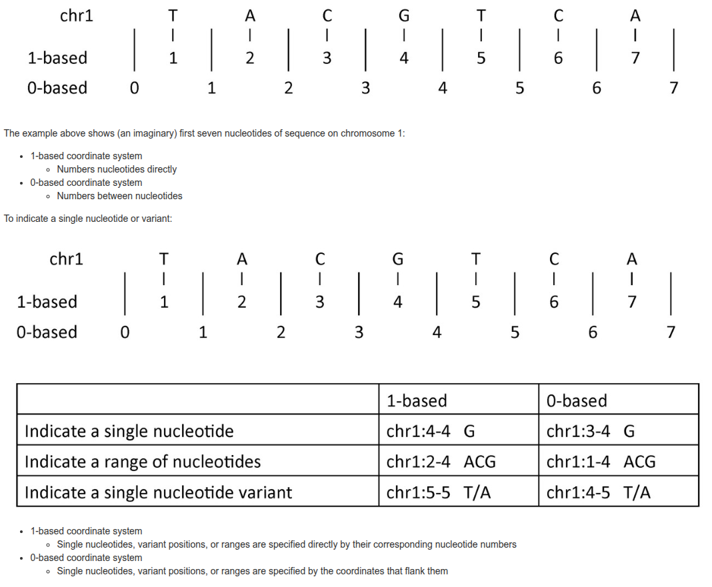
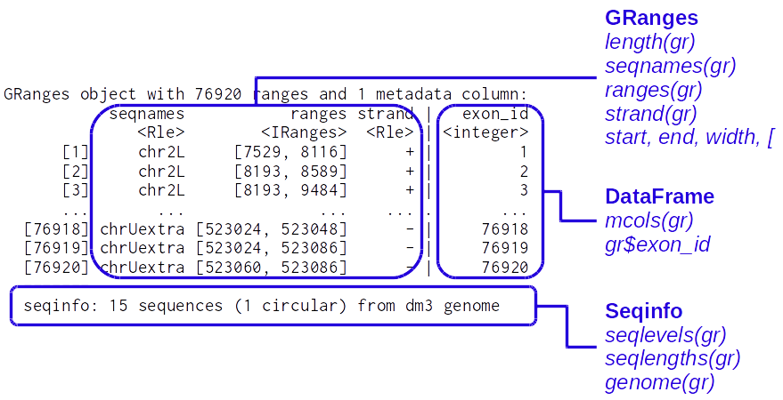
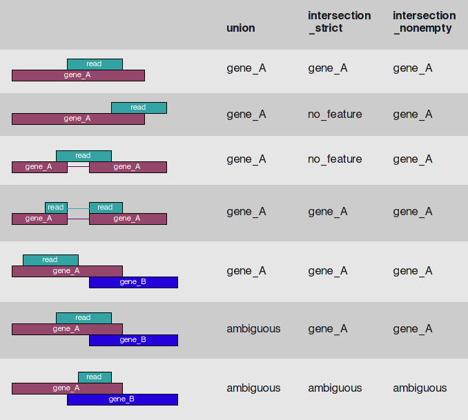
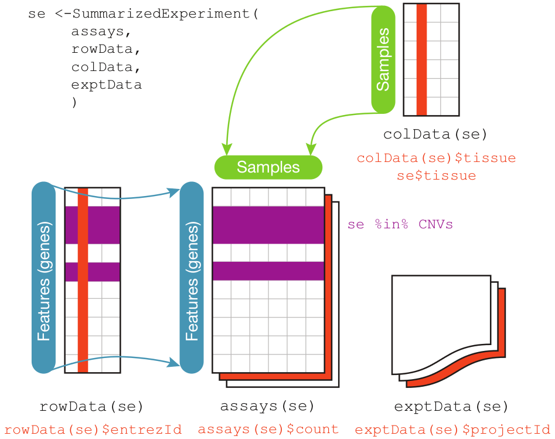
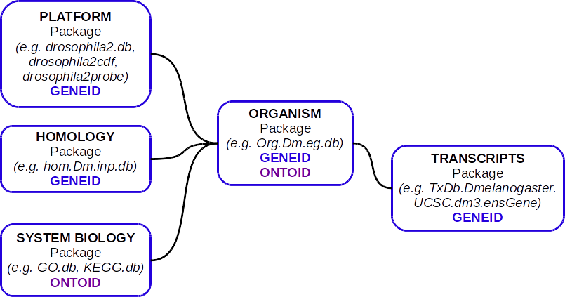

```{r setup, include=FALSE}
knitr::opts_chunk$set(echo = TRUE, root.dir="/DATA/WORK/Enseignement/2025_EBAII_ChIPseq/EBIII_N2/chip-seq/")
```

```{r, echo=FALSE, warning=FALSE, message=FALSE}
library(GenomicRanges)
```


# Introduction  

It is important to recognize that a large fraction of the data that we manipulate in genomics consists of genomic intervals.  
A genomic interval is defined by:  

  - a **chromosome** or contig  
  - a **strand** (`+`, `-` or `*` for undefined)  
  - a **start** position  
  - an **end** position  
  
  
In addition, the genomic interval can have **metadata** attached to it, such as a score, a GC% or any number of quantitative or qualitative data.
  
Thus:

  1) Ranges allow to represent a wide array of genomic data and annotations  
  2) Several biological questions reflect range-based queries  

ChIP-seq peaks, gene/exons/enhancer or any other annotations, localization of a motif or a particular sequence are obvious examples of genomic intervals.  
But a read aligned to the genome, or a coverage along the genome can also be represented by genomic intervals.  
  
Indeed, many file formats directly contain genomic intervals:  

  - `gtf/gff` files for annotations  
  - `bed/bigBed` or `narrowPeak` and other ENCODE files for intervals  
  - `bam/sam` files or `paf` files for aligned sequences  
  - `vcf` files for variants  
  
Additionally, file formats containing coverages such as `bedgraph`, `wig` or `bigwig` files can also be represented as genomic intervals associated with a specific score.  

Here are some questions that typically correspond to range-based queries:

  - *Which peaks are unique to one condition and not present in the other (comparison of 2 ChIP-seq datasets)?*  
      => `setdiff(peaks_condition1, peaks_condition2)` (Set operations)  

  - *Which genes overlap with my ChIP-seq peaks?*  
      => `findOverlaps(peaks, genes)` (Overlap query)  

  - *What are the distances between my SNPs and the nearest transcription start site (TSS)?*  
      => `nearest(snps, tss)` (Nearest-neighbor query)  

  - *Which exons are fully contained with a given genomic region?*  
      => `subsetByOverlaps(exons, region, type = "within")` (Containment query)  

  - *Are their any enhancers with 5kb upstream of gene TSS?*  
      => `findOverlaps(enhancer, promoters(gene, upstream=5000, downstream=0))` (Proximity-based overlap)  

  - *What are the regions not covered by my ChIP-seq peaks?*  
      => `gaps(peaks)` (Gap calculation)  

  - *Which genetic variants intersect with coding regions?*  
      => `intersect(variants, coding_regions)` (Set operations)

  - *What are the sequences located within 250bp of my ChIP-seq peak summits?*  
      => `getSeq(myBSgenome, resize(peaks, width=500, fix = "center"))` (Window normalization)  


When manipulating genomic intervals, one of the most confusing aspect
(together with dealing with poorly formatted gtf/gff files `r emo::ji("wink")`)
is linked to the existence of two coordinate systems: **0-based** or **1-based**.  
The figure below, extracted from this [post](https://www.biostars.org/p/84686/) summarizes the two systems:  


To summarize:  

  - **0-based**: start counting from 0, end is exclusive  
  - **1-based**: start counting from 1, end is inclusive  
  
In [Bioconductor](https://www.bioconductor.org/), the **1-based** system is always used.  
However:

  - `bed` files use the 0-based system    
  - `gtf/gff`, `sam/bam` or `vcf` files use the 1-based system  
  
Thus it is important, when you import/export your data to/from R/Bioconductor, that you use functions that are aware of these different standards.  
We will see in paragraph \@ref(IO-genomic) that the [rtracklayer](https://www.bioconductor.org/packages/release/bioc/html/rtracklayer.html) package provides an interface to import/export most genomic file formats.  

Bioconductor implements a number of tools to manipulate and analyze ranges and specifically genomic ranges [@pmid23950696]

# IRanges and accessors {#IRanges}
Let's start with the simpler objects defined in the [IRanges](https://www.bioconductor.org/packages/release/bioc/html/IRanges.html) package.  
An *IRanges* object is defined as follow: 

  - defined by 2 vectors out of start, end, width (SEW ; $end = start + width - 1$)  
  - closed intervals (i.e.\ include end points)  
  - zero-width convention: $width \geq 0$ ; $end=start-1 \Leftrightarrow width=0$  
  - can be named  
  
  
A simple *IRanges*:
```{r simple_IRanges, cache=TRUE}
eg = IRanges(start = c(1, 10, 20),
              end = c(4, 10, 19),
              names = c("A", "B", "C"))
eg
```
  
  
A bigger *IRanges*:
```{r bigger_IRanges, cache=TRUE}
set.seed(123) #For reproducibility
start = floor(runif(10000, 1, 1000))
end = start + floor(runif(10000, 0, 100))
ir = IRanges(start, end)
ir
```
  
  
*IRanges* accessors:
```{r IRanges_accessors, cache=TRUE, collapse = TRUE}
length(ir)
ir[1:4]
start(ir[1:4])
width(ir[1:4])
names(eg)
```
  
Other useful methods for *IRanges*:
```{r IRanges_otherMethods, cache=TRUE, collapse = TRUE}
c(ir[1:2],ir[5:6]) #combining
sort(ir[1:4])
rank(ir[1:4],ties="first")
mid(ir[1:4]) # midpoints
tile(ir[1:2],n=2) #returns an IRangesList (see below)
rep(ir[1:2],each=2)
isNormal(ir[1:4])
isNormal(sort(ir[1:4])) #see ?'Ranges-class' for Normality definition
isDisjoint(ir[1:4])
match(ir[1:4],ir[4:1]) #see ?'Ranges-comparison' for Ranges comparison methods
ir[1:4]>ir[4:1] # compares ranges a) first by start and b) then by width 
```
  
Other methods creating *IRanges*:
```{r otherIRanges_functions, cache=TRUE, collapse=TRUE}
as(c(2:10,8,90:100),"IRanges") #from a vector of integers
successiveIRanges(width=rep(10,5),gap=10)
whichAsIRanges(c(19, 5, 0, 8, 5)>=5) #transforms a logical vector in IRanges
```

It can be convenient to group ranges in a list (e.g. exons grouped by genes). *IRangesList*
objects serve this purpose.  
Accessors and functions for *IRanges* generally work on *IRangesList* objects.  
```{r IRangesList, cache=TRUE}
irl=split(ir,width(ir)) # an IRangesList
irl[[1]]
start(irl)
head(elementNROWS(irl)) # head(lengths(irl)) also works (with an "S" at the end of lengthS)
```


# intra- and inter-range operations  

## Intra-range operations {#IRanges-intraops}  
  
These operations apply on each range of an *IRanges* object:  
```{r intra-range_ops, cache=TRUE, collapse=TRUE}
ir[1:2]
shift(ir[1:2],shift=10)
resize(ir[1:2],width=100,fix="start")
flank(ir[1:2],width=100,start=T)
narrow(ir[1:2],start=1,width=30) #here 'start' is relative
ir[1:2]+10
ir[1:2]-10
ir[1:2]+c(0,10)
ir[1:4]*-10 ; ir[1:4]*10 # acts like a centered zoom
ir[1:2]*c(1,2) #zoom second range by 2X
```
  
See `help('intra-range-methods',package="IRanges")` for more.  
  
## Inter-range operations {#IRanges-interops}  
To illustrate these operations, we first build a function to plot ranges (from the [IRanges](https://www.bioconductor.org/packages/release/bioc/html/IRanges.html) vignette):
```{r plotRanges_function, cache=TRUE}
plotRanges <- function(x,
                       xlim = x,
                       main = deparse(substitute(x)),
                       col = "black", sep = 0.5,
                       cextitle=1, cexaxis=1, xaxis=T,...)
{
  height <- 1
  if (is(xlim, "Ranges"))
    xlim <- c(min(start(xlim)), max(end(xlim)))
    bins <- disjointBins(IRanges(start(x), end(x) + 1))
    plot.new()
    plot.window(xlim, c(0, max(bins)*(height + sep)))
    ybottom <- bins * (sep + height) - height
    rect(start(x)-0.5, ybottom, end(x)+0.5, ybottom + height, col = col, ...)
  if (xaxis)
    (axis(1,cex.axis=cexaxis,padj=1))
  title(main,cex.main=cextitle)
}
```
  
These inter-range operations, called *endomorphisms*, apply on a set of ranges and return a
set of ranges:
```{r inter-ranges_ops, cache=TRUE, collapse=TRUE}
#select some ranges in [1:100]:
irs=ir[which(start(ir)<=100 & 
               end(ir)<=100)[c(3:4,8,14,17:18)]] 
irs
reduce(irs)
disjoin(irs)
gaps(irs)
coverage(irs)
```
See `help('inter-range-methods',package="IRanges")` for other methods.  
  
We can illustrate these methods with:
```{r fig_inter-range_ops, include=TRUE, fig.align = 'center', fig.cap='Inter-range operations.'}
par(mfrow=c(5,1), mar=rep(3,4))
plotRanges(irs,xlim=c(0,100),xaxis=T, cextitle=2, cexaxis=1.5)
plotRanges(reduce(irs),xlim=c(0,100),xaxis=T, cextitle=2, cexaxis=1.5)
plotRanges(disjoin(irs),xlim=c(0,100),xaxis=T, cextitle=2, cexaxis=1.5)
plotRanges(gaps(irs),xlim=c(0,100),xaxis=T, cextitle=2, cexaxis=1.5)
plot(1:100,c(coverage(irs),rep(0,4)),type="l",axes=F,xlab="",ylab="",lwd=3)
title(main="coverage",cex.main=2)
axis(side=2,lwd=2,cex.axis=2,at=0:3,labels=0:3)
axis(1,lwd=2,cex.axis=2,padj=1)
```

## Set operations {#IRanges-setops}  
See `help(’setops-methods’,package="IRanges")` for details.  
The `union` and `intersect` functions for *IRanges*:  
```{r setops_IRanges_unionintersect, cache=TRUE, collapse=TRUE}
union(irs[1:3],irs[4:6])
intersect(irs[1:3],irs[4:6])
```

```{r fig_IRanges_setops_unionintersect, include=TRUE, fig.align = 'center', fig.cap='Inter-range operations.'}
par(mfrow=c(4,1))
 plotRanges(irs[1:3], xlim=c(0,100), xaxis=T, 
            cextitle=2, cexaxis=1.5)
 plotRanges(irs[4:6], xlim=c(0,100), xaxis=T, 
            cextitle=2, cexaxis=1.5)
 plotRanges(union(irs[1:3], irs[4:6]), xlim=c(0,100), xaxis=T, 
            cextitle=2, cexaxis=1.5)
 plotRanges(intersect(irs[1:3], irs[4:6]), xlim=c(0,100), xaxis=T, 
            cextitle=2, cexaxis=1.5)
```

The `setdiff` function for asymmetric differences:  
```{r setops_IRanges_setdiff, cache=TRUE, collapse=TRUE}
setdiff(irs[1:3],irs[4:6])
setdiff(irs[4:6],irs[1:3])
```

```{r fig_IRanges_setops_setdiff,fig.align="center", fig.cap='Asymetric differences with setdiff on IRanges.'}
par(mfrow=c(4,1))
 plotRanges(irs[1:3],xlim=c(0,100),xaxis=T, cextitle=2, cexaxis=1.5)
 plotRanges(irs[4:6],xlim=c(0,100),xaxis=T, cextitle=2, cexaxis=1.5)
 plotRanges(setdiff(irs[1:3],irs[4:6]),xlim=c(0,100),xaxis=T, 
            cextitle=2, cexaxis=1.5)
 plotRanges(setdiff(irs[4:6],irs[1:3]),xlim=c(0,100),xaxis=T, 
            cextitle=2, cexaxis=1.5)
```

The same functions can be applied in a parallel fashion (i.e. on the first elements of the
provided *IRanges*, then on the second elements, etc.)
```{r setops_IRanges_paralell, cache=TRUE, collapse=TRUE}
punion(irs[1:2],irs[4:5]) #element-wise (aka "parallel") union
pintersect(irs[1:2],irs[4:5])
psetdiff(irs[1:3],irs[4:6]) # asymmetric! difference
pgap(irs[1:3],irs[4:6])
```

## Nearest methods {#IRanges-nearest}  

See `help(’nearest-methods’,package="IRanges")` for details and examples:  
```{r nearest_IRanges, cache=TRUE, collapse=TRUE}
nearest(irs[4:6],irs[1:3])
distance(irs[4:6],irs[1:3])
```
We will se other examples on *GRanges* objects in paragraph \@ref(GRanges-methods)
  
  
## Between ranges operations
These are mainly methods to find overlaps between ranges.  
Examples of using these functions on *GRanges* objects are provided in paragraph \@ref(GRanges-overlap)    
See also `help(’findOverlaps-methods’,package="IRanges")` for details.  
  
  
# Run-length encoding (Rle)
[Run-length encoding](http://en.wikipedia.org/wiki/Run-length_encoding) is a data compression method
highly adapted to long vectors containing repeated values (e.g. coverage on a whole chromosome).  
For example, the sequence $\{1,1,1,1,1,1,2,3,3\}$ can be represented as:  

  - $values=\{1,2,3\}$  
and the paired   
  - $run lengths=\{6,1,2\}$.  
  
In [IRanges](https://www.bioconductor.org/packages/release/bioc/html/IRanges.html), the `Rle` class is used to represent run-length encoded (compressed) atomic vectors.

*Rle* objects:
```{r Rle_objects, cache=TRUE, collapse=TRUE}
set.seed(123) #for reproducibility
lambda = c(rep(0.001, 3500), #From IRanges vignette
           seq(0.001, 10, length = 500), 
            seq(10, 0.001, length = 500))
xRle=Rle(rpois(1e4, lambda))
yRle=Rle(rpois(1e4, lambda[c(251:length(lambda), 1:250)]))

xRle
yRle

as.vector(object.size(xRle)/object.size(as.vector(xRle))) #Gain of memory

head(runValue(xRle))
head(runLength(xRle))

head(start(xRle)) #starts of the runs
head(end(xRle)) #ends of the runs

nrun(xRle) #number of runs
findRun(as.integer(c(100,200,300,1200)),xRle)
coverage(irs)
```

These objects support the basic methods associated with R atomic vectors:  
```{r Rle_operations, cache=TRUE, collapse=TRUE}
xRle + yRle
xRle > 0
xRle > yRle
max(xRle)
summary(xRle)
sqrt(xRle)
rev(xRle)
table(xRle)
union(xRle, yRle)
cor(xRle, yRle)
```
See `?’Rle-class’` and `?’Rle-utils’` for other methods.  
  
There are useful functions to perform fixed-width running window summaries:
```{r Rle_runningWindow, cache=TRUE, collapse=TRUE}
runmean(xRle, k=100) # See ?'Rle-runstat' for other examples
#same result, more flexible but much slower:
Rle(aggregate(xRle, start = 1:(length(xRle)-99), width = 100, FUN = mean))
runq(xRle, k=100, i=10) #10th smallest value in windows of 100
```

One typical application of *Rle* objects is to store the coverage of NGS reads along a chromosome.  
The coverage for all chromosomes can be stored in an `RleList` object (see `?AtomicList` for details)
in which each chromosome will be an *Rle* element of the list.  
Most functions defined for *Rle* objects also work on *RleList* objects.  
  
Practically, any variable defined along a genome can be represented as  

  - an `RleList` with one `Rle` for each chromosome
or
  - the `mcols` (metadata columns) of a `GRanges` object (see below)  

Sometimes, it is desirable to manipulate several of these variables in the same object (e.g.
for plotting with [Gviz](https://www.bioconductor.org/packages/release/bioc/html/Gviz.html)).  
The `?genomicvars` help page provides useful functions such as
`bindAsGRanges` and `mcolAsRleList` to switch from one representation to the other.  


# Views
As we mentioned when looking at the [Biostrings](https://www.bioconductor.org/packages/release/bioc/html/Biostrings.html) package, `Views` objects are used
to store a sequence (a Vector object called the "subject") together with a set
of ranges which define views onto the sequence.  
Specific subclasses exist for different classes of "subject" Vectors, such as `RleViews` from the [IRanges](https://www.bioconductor.org/packages/release/bioc/html/IRanges.html)
package and `XStringViews` from the [Biostrings](https://www.bioconductor.org/packages/release/bioc/html/Biostrings.html) package.  
  
An `RleViews` object stores an `Rle` subject and its views:
```{r RleViews_create, cache=TRUE, collapse=TRUE}
coverage(irs)

irs_views=Views(coverage(irs),start=c(-5,10,20,90),end=c(10,30,50,100))
irs_views #Views can be out of bound
try(irs_views[[1]]) #but can't be extracted

irs_views[[2]]

start(irs_views)
```
See `?’RleViews-class’` for details.
  
Other ways to create Views:  
```{r RleViews_create2, cache=TRUE, collapse=TRUE}
Views(coverage(irs),irs[c(1,2,6)]) #use an IRanges to extract Views
Views(coverage(irs),coverage(irs)>=1) #or a logical Rle
slice(coverage(irs), 3) #use slice
successiveViews(coverage(irs),width=rep(20,4)) #get successive Views
```

Furthermore there is a `ViewsList` virtual class. Its specialized subclass `RleViewsList` is useful
to store coverage vectors along with their specific views over a set of chromosomes.
```{r RleViewsList, cache=TRUE, collapse=TRUE}
xyRleList=RleList(xRle,yRle)
xyRleList_views=Views(xyRleList,
                      IRangesList(IRanges(start=c(3700,4000),width=20),
                                  IRanges(yRle>17)+2))
xyRleList_views[[1]]
xyRleList_views[[2]]
width(xyRleList_views)
```
  
Specific functions are provided for fast looping over `Views` and `ViewsList` objects:  
```{r Views_looping, cache=TRUE, collapse=TRUE}
viewMins(irs_views) #same as min(irs_views)
viewSums(irs_views) #same as sum(irs_views)
viewWhichMaxs(irs_views) #get the (first) coordinate of viewMaxs 
# (which.max also works)
viewRangeMins(irs_views) #get the (first) range of viewMins
viewApply(irs_views,sd)
viewMeans(xyRleList_views)
```
Note that the `min` , `max` , `sum` , `mean` , `which.min` and `which.max` functions
also work on `Views` (but not on `RleViewsList` yet).  
The corresponding *view\** functions might be deprecated in the future.  
See `?'view-summarization-methods'` for details.


# GenomicRanges {#GRanges}  

```{r GenomicRanges_lib, eval=TRUE, echo=FALSE, warning=FALSE,message=FALSE}
require(GenomicRanges, warn.conflicts = FALSE, quietly = TRUE)
```

## GRanges objects

Here, we will present some of the classes and functions defined in the [GenomicRanges](https://www.bioconductor.org/packages/release/bioc/html/GenomicRanges.html) package.  
This package is central to [Bioconductor](https://www.bioconductor.org/) users who analyze NGS data, so you should consider reading thoroughly the excellent vignettes associated with this package.  
    
The main class defined in [GenomicRanges](https://www.bioconductor.org/packages/release/bioc/html/GenomicRanges.html) is the `GRanges` class which acts as a container for genomic locations and their associated annotations (see `?GRanges`).  


*GRanges* (and *GRangesList*) build on *IRanges* (and *IRangesList* respectively) with the following specificities:

  - The informations on `seqnames` (typically chromosomes) and `strand` is stored along with the information on ranges (SEW)  
  - An optional (but recommended) `seqinfo` slot contains information on the sequences: names, length (`seqlengths`), circularity and genome  
  - Optional **metadata** columns (`mcols`) containing additional information on each range (e.g.\ score, GC content, etc.) which are stored as a `DataFrame`  


By convention, in [Bioconductor](https://www.bioconductor.org/) genomic coordinates:  

  - are [**1-based**](https://www.biostars.org/p/84686/)  
  - are **left-most**, i.e. 'start' of ranges on the minus strand are the left-most coordinate, rather than the 5' coordinate
  - represent **closed intervals**, i.e. the intervals contain start and end coordinates

Here is the general structure of a `GRanges` object:


It contains:  

  - *seqnames* are the chromosome/contigs on which the intervals are defined. Stored as an *Rle*  
  - *ranges* are the intervals themselves. Stored as an *IRanges* object  
  - *strand* the strand on which the intervals are located ("+", "-" or "\*" for undefined strand). Stored as an *Rle*  
  - Optional metadata columns. Stored as a *DataFrame* object (defined in the [S4Vectors](https://www.bioconductor.org/packages/release/bioc/html/S4Vectors.html) package)  
  - Optional (recommended) *seqinfo* which contains the following information: name, length, circularity and genome on the *seqnames*. Stored as a *Seqinfo* obect (defined in the [GenomeInfoDb](https://www.bioconductor.org/packages/release/bioc/html/GenomeInfoDb.html) package)  
  
It is important to understand that, despite looking like a table, *GRanges* object are vector-like, or rather list-like objects.  
They have a `length` (the number of intervals) but do not have a `dim` (or `nrow` / `ncol`).  
  

The `GRanges` function can be used to create a *GRanges* object:
```{r GRanges_create,cache=TRUE, collapse=TRUE}
genes = GRanges(seqnames   = c("chr2L", "chrX"),
                ranges     = IRanges(start = c(7529, 18962306),
                                     end = c(9484, 18962925),
                                     names = c("FBgn0031208", "FBgn0085359")),
                strand     = c("+", "-"),
                seqlengths = c(chr2L=23011544L, chrX=22422827L))

slotNames(genes)

mcols(genes) = DataFrame(EntrezId = c("33155", "2768869"),
                         Symbol = c("CG11023", "CG34330"))
genome(genes)="dm3" #see ?seqinfo for details
genes
```

Note that there are different ways to define a *GRanges* object.  
For example, you can also use a genome browser-style syntax to provide the genomic intervals:  
```{r GRanges_gbstyle}
GRanges(c("Chr1:1-100:+", 
          "Chr2:150..200:-"))
```


The *GRanges* accessors include *IRanges* accessors and others:
```{r GRanges_accessors, cache=TRUE, collapse=TRUE}
width(genes)
names(genes)
seqnames(genes)
strand(genes)
ranges(genes)
genes$Symbol
mcols(genes)
seqinfo(genes)
seqlevels(genes)
```


## GRangesList
As for `IRangesList`, there is a `GRangesList` class which allows to store `GRanges` in a list-type object.  
This is typically used to store e.g. *GRanges* defining exons arranged by transcripts or genes or *GRanges* defining transcripts arranged by genes.  
The vignette of the [GenomicRanges](https://www.bioconductor.org/packages/release/bioc/html/GenomicRanges.html) package provides a good example of 2 transcripts, one of which has 2 exons:  
```{r GRangesList_objects, cache=TRUE, collapse=TRUE}
gr1 = GRanges(seqnames = "chr2", ranges = IRanges(3, 6),
              strand = "+", score = 5L, GC = 0.45)
gr2 = GRanges(seqnames = c("chr1", "chr1"),
              ranges = IRanges(c(7, 13), width = 3),
              strand = c("+", "-"), score = 3:4, GC = c(0.3, 0.5))
grl = GRangesList("txA" = gr1, "txB" = gr2)
grl
length(grl)
elementNROWS(grl) #or lengths(grl)
grl["txB","GC"]
unlist(grl)
```

Please refer to the [introductory vignette](https://www.bioconductor.org/packages/release/bioc/vignettes/GenomicRanges/inst/doc/GenomicRangesIntroduction.html) for further examples.  
Most accessors and functions defined for *GRanges* also work on *GRangesList*.  
However, note that `mcols(grl)` now refers to metadata at the list level rather than at level of the individual `GRanges` objects.  
  
  
## Annotations as GenomicRanges: TxDb\* packages
```{r GenomicFeatures_lib, eval=TRUE, echo=FALSE, warning=FALSE, message=FALSE}
require(GenomicFeatures, quietly = TRUE)
```

```{r txdb_dm3, eval=TRUE, echo=FALSE, warning=FALSE, message=FALSE}
require(TxDb.Dmelanogaster.UCSC.dm3.ensGene, quietly = TRUE)
require(BSgenome.Dmelanogaster.UCSC.dm3, quietly = TRUE)
```

Here, we will briefly present the [Bioconductor](https://www.bioconductor.org/) annotation packages which can provide genome-wide annotations directly as *GRanges* and *GRangesList* objects.  
These packages, called *TxDb\** are databases that contain the annotation from a given organism (i.e. intervals representing genes, transcripts, exons, CDS, etc.).  
They can be built using the [txdbmaker](https://bioconductor.org/packages/release/bioc/html/txdbmaker.html) package, 
but *TxDb* packages are already available for many organisms and genome versions (see the corresponding [BioCViews](https://bioconductor.org/packages/3.21/BiocViews.html#___TxDb))  
The functions to query these objects are defined in the [GenomicFeatures](https://bioconductor.org/packages/release/bioc/html/GenomicFeatures.html) package.  
Here, we illustrate how to extract information from the [TxDb.Dmelanogaster.UCSC.dm3.ensGene](https://bioconductor.org/packages/release/data/annotation/html/TxDb.Dmelanogaster.UCSC.dm3.ensGene.html) package. 
Let's load the package
```{r loadTxDbGfeat, eval=FALSE}
library(TxDb.Dmelanogaster.UCSC.dm3.ensGene)
```
Loading the package creates/loads the object/database *TxDb.Dmelanogaster.UCSC.dm3.ensGene*  

A *GRanges* object with the genomic coordinates for the genes can be obtained using:  
```{r TxDb_GRanges_extract, cache=TRUE}
Dmg=genes(TxDb.Dmelanogaster.UCSC.dm3.ensGene, single.strand.genes.only=T)
Dmg
```

Other functions, such as `transcripts`, `exons`, `cds`, `promoters`, `terminators`, `microRNAs` and `tRNAs` defined in the [GenomiFeatures](https://bioconductor.org/packages/release/bioc/html/GenomicFeatures.html) package allow to extract the corresponding genomic features.  

A *GRangesList* object with the coordinates of the transcripts arranged by genes can be obtained using:
```{r TxDb_GRangesList_extract, cache=TRUE}
Dmt=transcriptsBy(TxDb.Dmelanogaster.UCSC.dm3.ensGene, by="gene")
Dmt
```
The functions `exonsBy`, `cdsBy`, `intronsByTranscript`, `fiveUTRsByTranscript`, `threeUTRsByTranscript` allow to extract the corresponding genomic features arranged in a *GRangesList* object.  

Other functions such as `transcriptsByOverlaps` and `exonsByOverlaps` allow to extract genomic features for genomic locations specified by a *GRanges* object:
```{r TxDb_extractByOverlap, cache=TRUE}
exonsByOverlaps(TxDb.Dmelanogaster.UCSC.dm3.ensGene,genes)
```


When a *TxDb* package is paired with an appropriate *BSgenome* object, it is relatively straightforward to extract DNA sequences providing a *GRanges* or a *GRangesList*
```{r TxDb_convert2Seq, cache=TRUE, collapse=TRUE}
getSeq(BSgenome.Dmelanogaster.UCSC.dm3, Dmg[1:2])
Dmc = cdsBy(TxDb.Dmelanogaster.UCSC.dm3.ensGene, by="tx")
cds_seq = extractTranscriptSeqs(BSgenome.Dmelanogaster.UCSC.dm3, Dmc[1:2])
cds_seq
translate(cds_seq)
```

There are several other useful functions defined in the [GenomiFeatures](https://bioconductor.org/packages/release/bioc/html/GenomicFeatures.html) package, such as:

  - `transcriptLengths` to extract different metrics on the transcripts (length, number of exons, length of 5' and 3' UTRs)
  - `exonicParts` and `intronicParts` to extract non-overlapping exonic/intronic parts
  - `extendExonsIntoIntrons` to extend exons into their adjacent introns  
  - `coverageByTranscript` to get the coverage by transcript (or CDS) of a set of ranges

The `select` function also works to extract specific info from a *TxDb* objects.  
See `help("select-methods", package = "GenomicFeatures")` and the paragraph \@ref(BioC-annotations) on Annotation packages.


## GRanges methods {#GRanges-methods}  
Most if not all functions defined for *IRanges* objects are also defined for *GRanges* and *GRangesList* objects and they are generally *seqnames-* and *strand-aware*.  
These include:

  - intra-range operations (`shift`, etc. ; see paragraph \@ref(IRanges-intraops) and `help('intra-range-methods',"GenomicRanges")`
  - inter-range operations (`reduce`, etc. ; see paragraph \@ref(IRanges-interops) and `help('inter-range-methods',"GenomicRanges")`
  - set operations (see paragraph \@ref(IRanges-setops) and `help('setops-methods',"GenomicRanges")`
  - nearest methods (`nearest`, etc. ; see paragraph \@ref(IRanges-nearest) and `help('nearest-methods',"GenomicRanges")`
  - between ranges ("overlaps") operations presented below in paragraph \@ref(GRanges-overlap)

Here, we briefly illustrate some of these functions:
```{r GRanges_methods, cache=TRUE, collapse=TRUE}
genes
genes2=Dmg[c(1:2,21:22,36:37)]
genes2
sort(genes2)
c(genes,genes2,ignore.mcols=T) #combine
intersect(genes,c(genes2,Dmg['FBgn0031208'])) #set operations
nearest(genes,genes2) #nearest-methods
nearest(genes,genes2,ignore.strand=T) #strand-aware by default
precede(genes,genes2,ignore.strand=T)
promoters(genes,upstream=200,downstream=1) #intra-range operations
reduce(Dmt[[2]]) #inter-range operations
```

See also `help('GenomicRanges-comparison',"GenomicRanges")` for other functions for comparing *GenomicRanges*.


## Overlaps between ranges {#GRanges-overlap}  
A very common task on genomic ranges is to search for overlaps between sets of genomic ranges which corresponds to an operation between ranges.  
These functions are defined for several classes of objects, including *IRanges*, *GRanges* and their list-type counterparts *IRangesList* and *GRangesList* but also *Views* and *ViewsList* among others.  
Details on function definitions can be found using `?'findOverlaps-methods'`.

As first example, let's count how many of the transcription start sites (TSS) in the Drosophila melanogaster genome are located at more than 500bp from another gene:
```{r countOverlaps_example, message=FALSE, cache=TRUE, warning=FALSE, collapse=TRUE}
Dm_tss = unlist(reduce(promoters(Dmt, upstream = 0, downstream = 1))) #get all TSS
cov_tss_g500 = countOverlaps(Dm_tss, Dmg+500) #strand-aware!
table(cov_tss_g500)
sum(cov_tss_g500>1)
cov_tss_g500_bs = countOverlaps(Dm_tss, Dmg+500, ignore.strand=TRUE) #both strands
sum(cov_tss_g500_bs>1)
```

Getting the corresponding overlaps with `findOverlaps`:
```{r findOverlaps_example, message=FALSE, cache=TRUE, warning=FALSE}
fov_tss_g500_bs=findOverlaps(Dm_tss,Dmg+500,ignore.strand=T)
Dmg[c(1,1383)]
```


Now, imagine we have a set of 10K NGS reads:
```{r randomreads2L, cache=TRUE}
set.seed(0)
randomreads2L=GRanges(seqnames="chr2L",
                    ranges=IRanges(start=floor(runif(10000,5000,50000)),
                                   width=100),
                    strand="*")
```


And we want to select only the reads overlapping with these two genes:
```{r Dmg_2genes, cache=TRUE}
sort(Dmg)[1:2]
```

We could use:
```{r subsetByOverlaps_example, cache=TRUE}
subsetByOverlaps(randomreads2L, sort(Dmg)[1:2])
```

or:
```{r overlapsAny_example, cache=TRUE}
randomreads2L[overlapsAny(randomreads2L, sort(Dmg)[1:2])]
```

To count the number of reads overlapping with these 2 genes we use the [GenomicAlignments](https://www.bioconductor.org/packages/release/bioc/html/GenomicAlignments.html) and the [SummarizedExperiment](https://www.bioconductor.org/packages/release/bioc/html/SummarizedExperiment.html) packages that are further detailed in the paragraph \@ref(CountingReads) below:
```{r counting reads_example, cache=TRUE, message = FALSE, warning=FALSE, echo=3}
require(SummarizedExperiment, quietly = TRUE)
require(GenomicAlignments, quietly = TRUE)
assays(summarizeOverlaps(sort(Dmg)[1:2], randomreads2L, mode="Union"))$counts
```

# GenomicAlignments {#GAlignments}
Once NGS reads have been aligned to a reference genome, we obtain a sam/bam file containing the results of the alignment.  
A [SAM](http://samtools.github.io/hts-specs/SAMv1.pdf) file contains the same information as the corresponding BAM file but BAM is a binary format and thus its size is reduced and its content is not human-readable.  
Outside of R, these files are often manipulated with [samtools](http://www.htslib.org/) or [Picard tools](http://broadinstitute.github.io/picard/) for example.  
A nice explanation of what SAM/BAM files contain can be found [here](http://genome.sph.umich.edu/wiki/SAM).  
  
Here, we will mainly illustrate the following libraries:  

  - [Rsamtools](https://bioconductor.org/packages/release/bioc/html/Rsamtools.html) which provides an interface to samtools, bcftools and tabix (see [htslib](http://www.htslib.org/))
  - [GenomicAlignments](https://bioconductor.org/packages/release/bioc/html/GenomicAlignments.html) which provides efficient tools to manipulate short genomic alignments

Examples of BAM files from single- and paired-read sequencing are provided in the [pasillaBamSubset](https://bioconductor.org/packages/release/data/experiment/html/pasillaBamSubset.html).  

We load the libraries if necessary:
```{r loadGAlignmentPckg, eval=TRUE, message=FALSE, warning=FALSE}
require(SummarizedExperiment, quietly = TRUE)
require(GenomicAlignments, quietly = TRUE)
require(Rsamtools, quietly = TRUE)
require(pasillaBamSubset, quietly = TRUE)
```


## Importing alignments from a BAM file

We will see a first example of import using the [Rsamtools](https://bioconductor.org/packages/release/bioc/html/Rsamtools.html) package for info but most of the time you will want to use the [GenomicAlignment](https://bioconductor.org/packages/release/bioc/html/GenomicAlignments.html) package instead because it generates objects very similar to *GRanges*.

### Single-end reads
The path for the BAM file is obtained with:
```{r sr_bamfile_path, cache=TRUE}
sr_bamFile=untreated1_chr4() # from passilaBamSubset package
```

If the BAM file was not indexed yet (i.e. a *.bai* file present in the same directory and named as the .bam file), we could build such an index using:
```{r build_BAM_index, eval=FALSE, echo=TRUE}
indexBam(sr_bamFile) #do not run, the file is actually already indexed
```

Note that a number of other functions are available to manipulate SAM/BAM files, such as `asSam`/`asBam`, `sortBam` or `mergeBam` (See `?scanBam` for details) but these manipulations are often done directly with [samtools](http://www.htslib.org/), outside of R.

Now, we could define:  

  - which regions of the genome we would like to import ('*which*'} (note that here only chr4 is available in the BAM file but for the example we try to extract data from chr2L also)
  - which columns of the BAM file we would like to import ('*what*')
  - and possibly filters for unwanted reads ('*flag*').
These informations are stored in a `ScanBamParam` object:
```{r ScamBamParam_define, cache=TRUE, collapse = TRUE}
#which is an IRangesList so there is not strand information:
which = IRangesList("chr2L"=IRanges(7000,10000),
                    "chr4"=IRanges(c(75000,1190000),c(85000,1203000)))

scanBamWhat() #available fields
what = c("rname","strand","pos","qwidth","seq")
flag=scanBamFlag(isDuplicate=FALSE)
param=ScanBamParam(which=which,what=what,flag=flag)
```
See `?ScanBamParam` for other options and examples.  
As briefly illustrated, it is easy to define filters, e.g. based on [SAM flags](http://broadinstitute.github.io/picard/explain-flags.html) using `scanBamFlag` or on tags present in the SAM/BAM files, when importing your BAM files.

Now, we use `scanBam` function from [Rsamtools](https://bioconductor.org/packages/release/bioc/html/Rsamtools.html) to import the data in R:
```{r srBAM_import_scanBam, cache=TRUE, collapse = TRUE}
mysrbam=scanBam(sr_bamFile,param=param)
class(mysrbam)
names(mysrbam)
sapply(mysrbam, lengths)["rname",] #number of imported reads
```
The resulting object is a list which is not always easy to manipulate for downstream applications so below we will rather illustrate the use of the [GenomicAlignments](https://bioconductor.org/packages/release/bioc/html/GenomicAlignments.html) package.  
Nevertheless, [Rsamtools](https://bioconductor.org/packages/release/bioc/html/Rsamtools.html) may be useful if you want e.g. to work on a specific genomic region across several BAM files (see `help(BamViews, package = Rsamtools)`) or work on a very large BAM file in chunks (see `help(BamFile, package = "Rsamtools"`)  
   
So let's see how to import our BAM file using the `readGAlignments` from the [GenomicAlignments](https://bioconductor.org/packages/release/bioc/html/GenomicAlignments.html) package:
```{r srBAM_import_readGAlignments, cache=TRUE}
mysrbam2=readGAlignments(sr_bamFile,
                         param=ScanBamParam(which=which,
                                            what="seq",
                                            flag=flag))
mysrbam2[1:2]
```
Note that we have redefined the *ScanBamParam*. This is because `readGAlignments` comes with predefined fields to import and we just need to add those extra fields we want to import in the `ScanBamParam` parameter object.  
Here we imported the sequences to show that they are imported as a `DNAStringSet` but it is generally not necessary to keep these sequences once the reads have been mapped.

So we don't keep them for the next steps:
```{r}
mysrbam2=readGAlignments(sr_bamFile,
                         param=ScanBamParam(which=which))
mysrbam2[1:2]
```
The object returned is a `GAlignments` (see `?'GAlignments-class'` for details and accessors).  

These objects are highly similar to `GRanges`. They can be accessed with similar functions:
```{r GAlignments_accessors, cache=TRUE, collapse=TRUE}
head(start(mysrbam2))
head(width(mysrbam2))
seqnames(mysrbam2)
cigar(mysrbam2)[1:3]
head(njunc(mysrbam2))
```

They can be converted to GRanges:
```{r GAlignments_to_GRanges, cache=TRUE}
granges(mysrbam2)[1:2]
```

And one can easily access the details of each read alignment as `GRanges` organized in a `GRangesList` object using:
```{r GAlignments_getJunctions, cache=TRUE, collapse=TRUE}
grglist(mysrbam2)[[1]] #only first read shown element here

junctions(mysrbam2)[[1]] #and the corresponding junctions
```

See below and in `help('junctions-methods',"GenomicAlignments")`, `help('findOverlaps-methods',"GenomicAlignments")` and `help('coverage-methods',"GenomicAlignments")` for other methods defined on `GAlignments` objects.  

### Paired-end reads
An example of paired-end data is available in the [pasillaBamSubset](https://bioconductor.org/packages/release/data/experiment/html/pasillaBamSubset.html) package:  
```{r pr_bamfile_path, cache=TRUE}
pr_bamFile=untreated3_chr4() # from passilaBamSubset package
```

We can import this data in R using:
```{r readGAlignmentsPairs, cache=TRUE}
myprbam=readGAlignmentPairs(pr_bamFile,
                              param=ScanBamParam(which=which))
myprbam[1:2]
```
The `GAlignmentPairs` class holds only read pairs (reads with no mate or with ambiguous pairing are discarded).  
The `readGalignmentPairs` function has a *strandMode* argument to specify how to report the strand of a pair.  
For stranded protocols, depending how the libraries were generated, *strandMode* should be set to **1** (the default for e.g. directional Illumina protocol by ligation) or **2** (e.g. for dUTP or Illumina stranded TruSeq PE protocol).  
  
  
The individual reads can be accessed as `GAlignments` objects using:
```{r readGAlignmentsPairs_access, cache=TRUE, collapse=TRUE}
myprbam[1] #first record
first(myprbam[1]) #first sequenced fragment
last(myprbam[1]) #last sequenced fragment
```
We could also use the `readGAlignmentsList` function which returns both mate-pairs and non-mates in a more classical "list-like" structure (see `help('readGAlignmentsList', package="GenomicAlignments")` for examples).
  
  
## Typical operations on GAlignments objects

### Coverage
Computing a coverage (number of reads aligning at a given position on the genome) on a `GAlignments` is straightforward:  
```{r Coverage_calc, cache=TRUE}
cvg_sr = coverage(mysrbam2)
cvg_sr$chr4
```
The result is an `RleList` organized by chromosomes.  

We can extract specific regions from this object using a *GRanges* object.  
For example, let's get the 1kb promoters of genes located within the region that we have defined earlier on Chr4:
```{r getTSS_chr4, cache=TRUE, warning=FALSE}
#Regions of interest:
which_chr4_gr = GRanges(c("chr4:75000-85000:*",
                          "chr4:1190000-1203000:*"))
#promoters in these regions
prom_chr4 = subsetByOverlaps(
              promoters(genes(TxDb.Dmelanogaster.UCSC.dm3.ensGene), upstream =1000, downstream = 0),
              which_chr4_gr)
```

Now extract the coverage only on these promoters:
```{r covr_prom_chr4, cache=TRUE}
prom_chr4_coverage = cvg_sr[prom_chr4]
names(prom_chr4_coverage) = names(prom_chr4)
prom_chr4_coverage
```
We could also use *Views* to do the same operation but that will only work for a single chromosome:
```{r Views_tss_chr4, cache=TRUE}
Views(cvg_sr$chr4, ranges(prom_chr4))
```

Note that the `coverage` function is not strand specific.  
If we want the coverage for the minus strand only, we could use:
```{r coverage_By_strand, cache=TRUE}
coverage(mysrbam2[strand(mysrbam2)=="-"])$chr4
```

Often, we need to resize or shift the reads when computing the coverage.  
This can be done on the `GAlignment` object using e.g. `resize` or `shift`.  
For example with `resize` (which by default is strand-aware):
```{r}
coverage(resize(granges(mysrbam2), width = 300, fix = "start"))$chr4 
```

The `shift` option also exist in the `coverage` function for `GAlignments`:
```{r coverage_shift_reduce, cache=TRUE, collapse=TRUE}
#shift directly in coverage !not strand-aware!:
coverage(mysrbam2, shift=150)$chr4 
#shift is not strand-aware but we can make it strand-aware like this:
coverage(mysrbam2, shift=150*as.numeric(paste0(strand(mysrbam2), 1)))$chr4 
```

### Find regions of high/low signal
In ChIP-seq experiments, one often look for "peaks" (or broad regions in e.g. ChIP of some chromatin marks or PolII) in the read coverage. This task, often called "peak calling" or "peak finding" can be performed outside of R with one of the numerous "peak callers" available such as [MACS](https://github.com/taoliu/MACS/), [SPP](http://compbio.med.harvard.edu/Supplements/ChIP-seq/) or [SICER](https://github.com/zanglab/SICER2) (for broad regions).  
  
A number of specific and advanced tools also exist in R to perform peak calling such as: [chipseq](https://www.bioconductor.org/packages/release/bioc/html/chipseq.html), [bumphunter](https://www.bioconductor.org/packages/release/bioc/html/bumphunter.html), [CSAR](https://www.bioconductor.org/packages/release/bioc/html/CSAR.html), \Biocpkg{jmosaics} or [PICS](https://www.bioconductor.org/packages/release/bioc/html/PICS.html).  
  
Here, we only illustrate a naive approach to get a list of peaks by applying a single threshold on the coverage object using the `slice` function:
```{r slice_example, cache=TRUE}
slice(cvg_sr, lower=60)$chr4
```
  
  
## Counting reads / read summarization {#CountingReads}
Another common task is to count how many reads align to a set of genomic features.  
This counting operation is sometimes called read summarization or data reduction.  
It is typically done in RNA-seq experiments to produce a count matrix for subsequent analysis.  
The counts can be obtained on e.g. genes, transcripts or exons depending on the aim of the study.  
Some packages such as [Rsubread](https://www.bioconductor.org/packages/release/bioc/html/Rsubread.html), [QuasR](https://www.bioconductor.org/packages/release/bioc/html/QuasR.html) or [easyRNAseq](https://www.bioconductor.org/packages/release/bioc/html/easyRNASeq.html) provide specific functions to perform the counting step.  
Here we only present the general function `summarizeOverlaps` from [GenomicAlignments](https://www.bioconductor.org/packages/release/bioc/html/GenomicAlignments.html).  
We want to count the reads aligning on the exons. So we first get the exons, organized by genes, which are located in our regions of interest on chr4:
```{r GetExonsByGene_chr4, cache=TRUE}
exbygn_chr4 = subsetByOverlaps(exonsBy(TxDb.Dmelanogaster.UCSC.dm3.ensGene,
                                     by="gene"), 
                               which_chr4_gr)
```
  
  
Then we use the `summarizeOverlaps` function to obtain the counts (*Note that the counting is strand-aware by default!*):
```{r summarizeOverlaps_ex1, cache=TRUE, collapse=TRUE}
count_res = summarizeOverlaps(exbygn_chr4, mysrbam2, mode="Union")
count_res
assays(count_res)$counts
```
  
To count reads from multiple BAM files we just need to enter the path to the BAM files as a character vector:
```{r summarizeOverlaps_ex2, cache=TRUE}
count_res2=summarizeOverlaps(exbygn_chr4,
                             c(sr_bamFile,pr_bamFile),
                             mode="Union")

assays(count_res2)$counts
```
  
  
When counting reads over regions of interest there are different choices to make.
Different count modes are available, as illustrated in the documentation of [HTSeq](https://github.com/htseq/htseq)




The result of `summarizeOverlaps` (here `count_res`) is a `SummarizedExperiment` object defined in the [SummarizedExperiment](https://bioconductor.org/packages/release/bioc/html/SummarizedExperiment.html) package and introduced in [@pmid25633503].  
In a`SummarizedExperiment` object, the features (i.e. rows) are *ranges* of interest and the columns are *samples*. One or more `assays` represented by matrix-like objects can be stored for these ranges x samples, along with metadata for the rows (`rowData`), columns (`colData`) and the experiments (`exptData`), as illustrated below.  


  
There are several options available to perform read counting with `summarizeOverlaps`, such as to preprocess the reads before counting.  
See `?summarizeOverlaps`}` for details and examples.  
The count matrix could then be used for normalization and differential analysis with the [DESeq2](https://bioconductor.org/packages/release/bioc/html/DESeq2.html), [edgeR](https://bioconductor.org/packages/release/bioc/html/edgeR.html), [limma](https://bioconductor.org/packages/release/bioc/html/limma.html), [DEXseq](https://bioconductor.org/packages/release/bioc/html/DEXSeq.html) packages for example.


# Annotation packages in Bioconductor {#BioC-annotations}  

```{r loadLibs_Annot, echo=FALSE, eval=TRUE, message=FALSE, warning=FALSE}
require(org.Dm.eg.db, quietly = TRUE)
require(GO.db, quietly=TRUE)
```


## Types of annotation packages
There are a number of annotation packages in Bioconductor which can be browsed in the corresponding [BioC View](https://bioconductor.org/packages/release/BiocViews.html#___AnnotationData).  
Annotations are provided as `AnnotationDb` objects and the [AnnotationDbi](https://bioconductor.org/packages/release/bioc/html/AnnotationDbi.html) package provides a common interface to these objects.  
The vignette of the [AnnotationDbi](https://bioconductor.org/packages/release/bioc/html/AnnotationDbi.html) provides a good introduction to the different types of package available, illustrated below. 


  
There are gene-centric packages:

  - Organism packages (`OrgDb` class ; e.g. [org.Dm.eg.db](https://bioconductor.org/packages/release/data/annotation/html/org.Dm.eg.db.html))
  - Platform-level (essentially microarrays) packages (`ChipDb` class: e.g. [drosophila2.db(https://bioconductor.org/packages/release/data/annotation/html/drosophila2.db.html) and the corresponding *probe* ([drosophila2probe](https://bioconductor.org/packages/release/data/annotation/html/drosophila2probe.html)) and *cdf* packages ([drosophila2cdf](https://bioconductor.org/packages/release/data/annotation/html/drosophila2cdf.html))
  - Homology packages (`OrthologyDb` class ; e.g. [Orthology.eg.db](https://bioconductor.org/packages/release/data/annotation/html/Orthology.eg.db.html)) which replaced the `InparanoidDb` packages. 
  - Functional Annotation packages (e.g. [GO.db](https://bioconductor.org/packages/release/data/annotation/html/GO.db.html), [KEGG.db](https://bioconductor.org/packages/3.6/data/annotation/html/KEGG.db.html), [reactome.db](https://bioconductor.org/packages/release/data/annotation/html/reactome.db.html))
  
  
And genome-centric packages:

  - Transcriptome-oriented packages (`TxDb` class ; e.g. [TxDb.Dmelanogaster.UCSC.dm3.ensGene](https://bioconductor.org/packages/release/data/annotation/html/TxDb.Dmelanogaster.UCSC.dm3.ensGene.html))
  - Generic Genome feature packages (`FeatureDb` class, e.g. [FDb.UCSC.tRNAs](https://bioconductor.org/packages/release/data/annotation/html/FDb.UCSC.tRNAs.html)) that can be created with the [GenomicFeatures](https://bioconductor.org/packages/release/bioc/html/GenomicFeatures.html) package
  
  
In addition, `OrganismDb` packages were added based on the [OrganismDbi](https://bioconductor.org/packages/release/bioc/html/OrganismDbi.html) package.   These packages basically combine all the above packages in a single package. These are available for [Homo.sapiens](https://bioconductor.org/packages/release/data/annotation/html/Homo.sapiens.html), [Mus.musculus](https://bioconductor.org/packages/release/data/annotation/html/Mus.musculus.html) and [Rattus.norvegicus](https://bioconductor.org/packages/release/data/annotation/html/Rattus.norvegicus.html).
  
Packages are available in Bioconductor to build your own annotation packages. These include [AnnotationForge](https://bioconductor.org/packages/release/bioc/html/AnnotationForge.html) and [GenomicFeatures](https://bioconductor.org/packages/release/bioc/html/GenomicFeatures.html) and [txdbmaker](https://bioconductor.org/packages/release/bioc/html/txdbmaker.html)
 
Finally, the [AnnotationHub](https://bioconductor.org/packages/release/bioc/html/AnnotationHub.html) package provides an interface to access a large resource of genomic files, which can be used as extra "annotations".  
  
## Accessing annotations 
There are 4 basic functions to access nearly all annotations:  

  - The `column` function shows the fields from which annotations can be extracted
  - The `keytypes` function shows the field from which annotations can be extracted AND which can be used as keys to access these annotations
  - The `keys` function retrieves the keys themselves (i.e. values from a 'keytype' field used to access the annotation of the corresponding feature)
  - The `select` function extracts the data from the `AnnotationDb` object from the *columns* specified and providing a set of *keys* of a given *keytype*.
  
We illustrate these functions on some annotation packages.  

First, we explore the `OrgDb` package which contains gene-level annotations:
```{r Annotation_OrgDb_access,eval=-c(1,3,4),echo=TRUE,cache=TRUE, warning=FALSE, message=FALSE}
library(org.Dm.eg.db)
columns(org.Dm.eg.db)
help("PATH")
keytypes(org.Dm.eg.db) #same as columns(org.Dm.eg.db) in this case
uniKeys = keys(org.Dm.eg.db, keytype="UNIPROT")[c(13286, 13288)]

cols = c("SYMBOL","GO")
select(org.Dm.eg.db,
       keys=uniKeys,
       columns=cols,
       keytype="UNIPROT")
```
  
  
The [GO.db](https://bioconductor.org/packages/release/data/annotation/html/GO.db.html) package can be used to retrieve information on the identified [Gene Ontology](http://geneontology.org/) categories (chosen also based on [Evidence codes](http://geneontology.org/page/guide-go-evidence-codes)):
```{r Annotation_GOdb,eval=-1,echo=TRUE,cache=TRUE}
library(GO.db)
mygos=c("GO:0006325","GO:0006357", "GO:0048477")
select(GO.db,
       columns=columns(GO.db)[2:4],
       keys=mygos,
       keytype="GOID")
```

We can also extract a whole table as a `data.frame`:
```{r Annotation_GOdb_toTable,eval=-1,echo=TRUE,cache=TRUE}
ls("package:GO.db")
toTable(GOTERM)[1:3,2:4]
```

We can also search for a specific pattern in the keys:
```{r Annotation_OrgDb_keySearch,cache=TRUE}
keys(org.Dm.eg.db, 
     keytype="SYMBOL", 
     pattern="EcR")

select(org.Dm.eg.db,
       keys=c("EcR","DopEcR"),
       columns=c("ENTREZID","FLYBASE","GENENAME"),
       keytype="SYMBOL")
```


Finally, `TxDb` packages can also be interrogated using the same methods:
```{r Annotation_TxDb,cache=TRUE}
select(TxDb.Dmelanogaster.UCSC.dm3.ensGene,
       columns = c("TXID", "TXCHROM", "TXSTRAND", "TXSTART", "TXEND"),
       keys = c("FBgn0039183", "FBgn0264342", "FBgn0030583"),
       keytype = 'GENEID')
```


# Import/export of genomic data {#IO-genomic}

```{r load_IO_pkg, eval=TRUE, echo=FALSE, message=FALSE, warning=FALSE}
require(rtracklayer, quietly = TRUE)
```

## The rtracklayer package
The main functionality of the [rtracklayer](https://bioconductor.org/packages/release/bioc/html/rtracklayer.html) package [@pmid19468054] is to import/export genomic files in a number of different standard formats.  
These include [GFF](http://www.ensembl.org/info/website/upload/gff.html), [BED](http://www.ensembl.org/info/website/upload/bed.html), [wig](http://www.ensembl.org/info/website/upload/wig.html), [bigWig](http://genome.ucsc.edu/goldenpath/help/bigWig.html) and [bedGraph](http://genome.ucsc.edu/goldenpath/help/bedgraph.html).  
Additionally, [rtracklayer](https://bioconductor.org/packages/release/bioc/html/rtracklayer.html) also provides functions to interact with genome browsers and in particular the [UCSC genome browser](http://genome.ucsc.edu/) (not illustrated here).  

rtracklayer has an `import` and an `export` function which will work on most files with their standard file extension.  
In addition, depending on the file type, other options will be available, for example to import data only from specific genomic regions or to import the object as an `RleList` or a `GRanges` object.

## The AnnotationHub package
The [AnnotationHub](https://bioconductor.org/packages/release/bioc/html/AnnotationHub.html) allows to easily retrieve a number of public datasets and annotation tracks as standard Bioconductor objects such as `GRanges` and `GRangesList`.  
Note however that many datasets have been pre-processed so the user relies on others for these steps. The datasets available come from e.g. [ENSEMBL](http://www.ensembl.org/), [NCBI](http://www.ncbi.nlm.nih.gov/), [UCSC](http://genome.ucsc.edu/), [ENCODE](https://www.encodeproject.org/) or [Inparanoid](https://inparanoidb.sbc.su.se/).  
We will not illustrate the usage of this package but if you're looking for a specific dataset or instead to collect many datasets on your favorite model/tissue/etc. then it is worth exploring the vignettes of the [AnnotationHub](https://bioconductor.org/packages/release/bioc/html/AnnotationHub.html) package.


# References

