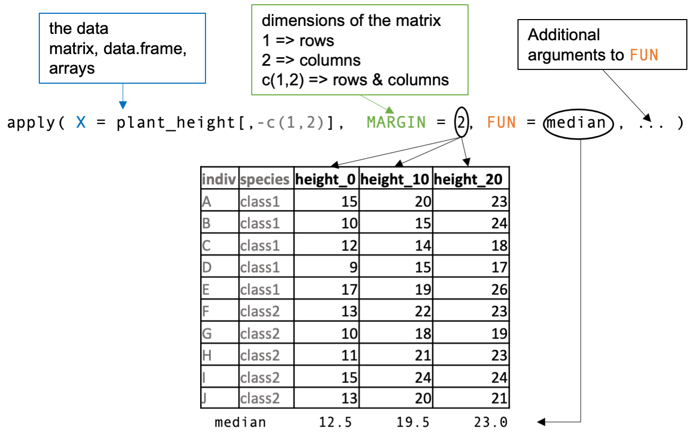

```{r setup, include=FALSE}
knitr::opts_knit$set(echo = TRUE,  root.dir="/Users/elodiedarbo/Documents/enseignement/EBAII/EBAII_2025n2/EBIII_N2/chip-seq/")
```

# Introduction

# The `apply` family

In this section, we will learn how to use the `apply` family of functions in R. These functions help you perform repetitive operations (e.g., `sum()`, `mean()`) on rows, columns, or elements of data structures like vectors, matrices, or data frames.

We will start with simple built-in functions like `colSums()` and gradually explore more flexible tools like `apply`, `lapply`, `sapply`, and `tapply.` Finally, we'll compare these base R tools with functions from the tidyverse, such as `group_by()` and `summarise()`.


First, we’ll create an example data set named `plant_height.` This data set describes the heights of ten individuals in centimeters at three different time points (0, 10, and 20 days). The first column contains the IDs for each individual, the second its species, and each successive column describes their heights at time points 0, 10, and 20 in that order.

```{r}
plant_height <- data.frame(indiv = LETTERS[1:10],
                      species = rep(c("class1","class2"),each=5),
                      height_0 = c(15, 10, 12, 9, 17, 13, 10, 11, 15, 13),
                      height_10 = c(20, 15, 14, 15, 19, 22, 18, 21, 24, 20),
                      height_20 = c(23, 24, 18, 17, 26, 23, 19, 23, 24, 21))
```


## Functions from base

Imagine you want to know the average height at each time point. How would you do?

- You could compute the average value of each column sequentially using `mean()`

```{r}
average_0 <- mean(plant_height$height_0)
average_10 <- mean(plant_height$height_10)
average_20 <- mean(plant_height$height_20)

```
  This is quite OK if you have three columns but we can imagine how fastidious it will be with 100 features.
  
- R base package comes with few simple built-in functions: `colMeans()`, `rowMeans()`,`colSums()` and `rowSums()` that allow to compute mean and sum of values for all rows or columns at once.

```{r}
# We need to select for numeric columns
average_tp <- colMeans(plant_height[,-c(1:2)])
average_tp
```


Now your turn, compute the average height of each individual.

<details>
  <summary>Solution</summary>
  
```{r}
# We need to select for numeric columns
average_ind <- rowMeans(plant_height[,-c(1:2)])
average_ind
```

 </details>

These functions are fast and convenient, but they work only in specific situations. What if we want to apply a different function, or calculate values by group?

## The `apply()` function

The `apply` command allows  to apply any function across an array, matrix or data frame.



## The `sapply()` function


## The `lapply()` function


## The `tapply()` function


## The tidyverse solution


# Save and load R objects 


