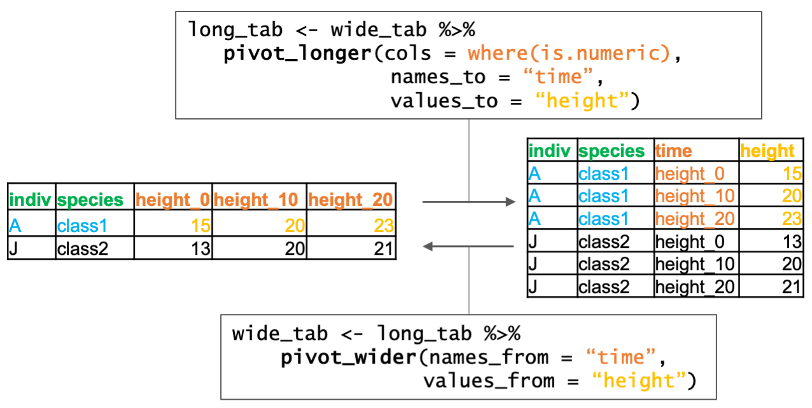
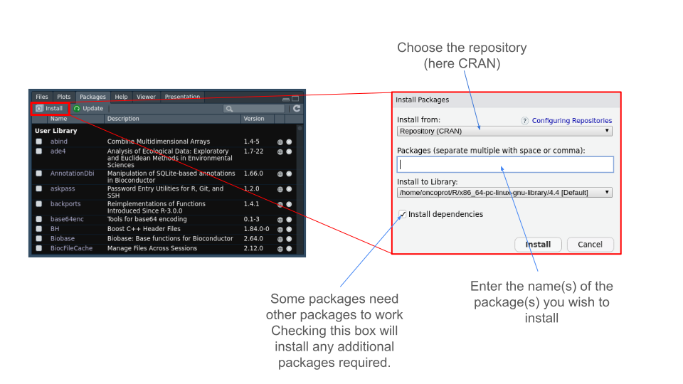
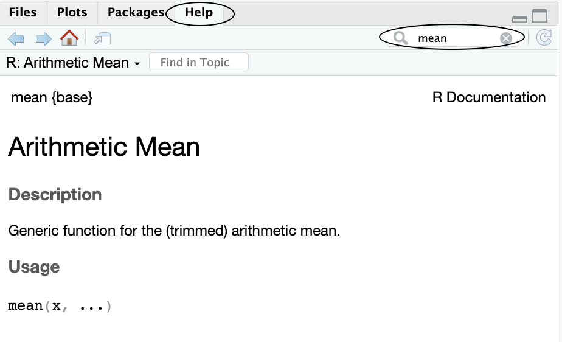
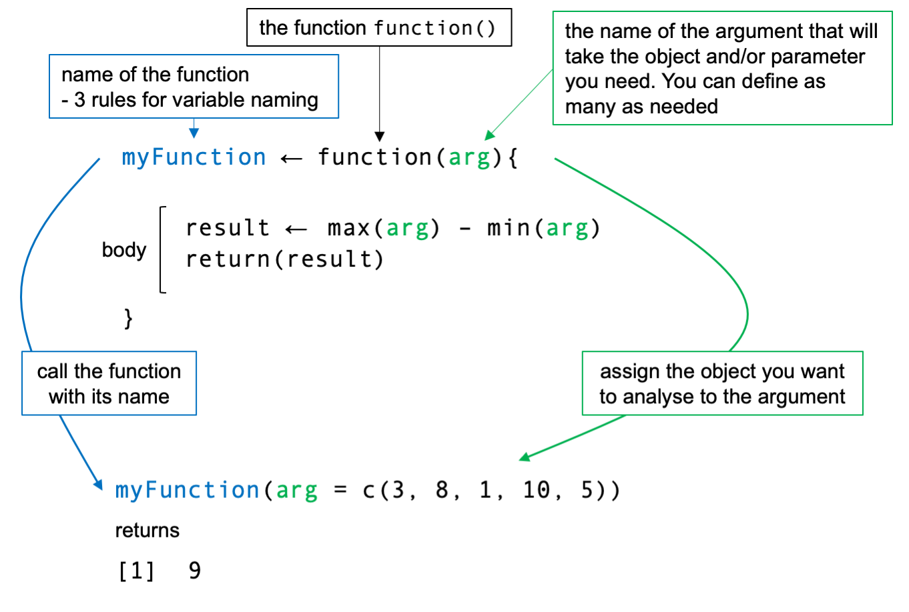

<style>
details {
  background-color: #CDC5BF;
}
</style>

<script>
  // Move TOC to the Table of Contents heading (with id "table-of-contents")
  $(function() {
    $( "#TOC" ).insertAfter( $( "#table-of-contents" ) );
  });
</script>


```{r setup, include=FALSE}
knitr::opts_knit$set(echo = TRUE,  root.dir="/Users/elodiedarbo/Documents/enseignement/EBAII/EBAII_2025n2/EBIII_N2/chip-seq/")
```

In this file, you will find some general tips that are very useful when starting programming with R.

#### Table of content {#table-of-contents}


## Variable types

#### primitive data type

| Type Name / Value | R Function to Check | Description                                                   |
|-------------------|---------------------|---------------------------------------------------------------|
| Numeric           | is.numeric()        | Numbers with decimals (e.g., `3.14`)                          |
| Integer           | is.integer()        | Whole numbers (e.g., `5L`)                                    |
| Character         | is.character()      | Text or string data (single or double quoted)                 |
| Logical           | is.logical()        | Boolean values: `TRUE` or `FALSE`                             |
| NA                | is.na()             | Missing value; used to represent absence of data              |
| NULL              | is.null()           | Empty object; represents "no object"/undefined                |
| NaN               | is.nan()            | "Not a Number"; result of undefined mathematical operations   |
| Inf / -Inf        | is.infinite()       | Positive or negative infinity (e.g., 1/0 or -1/0)             |

**Missing and undifined values**:

`NA` is used for missing data and is type-aware (e.g., NA_integer_, NA_character_).

`NULL` is different from NA: it represents no value at all, often used in lists or empty objects.

`NaN` is a specific type of NA (i.e., `is.na(NaN)` is `TRUE`).

`Inf` arises in operations like 1/0; it's a valid numeric value.

##### Character ordering {#ordChar}

When comparing or sorting character strings in R, the comparison is done **lexicographically**, meaning alphabetically based on Unicode (ASCII for common characters). This ordering can sometimes lead to **surprising results**, especially when comparing letters, numbers, and accented characters.

Here's a simplified table showing the position of some common characters based on their Unicode code points:

| Character | Type               | Unicode Code | Explanation                                      |
|-----------|--------------------|---------------|--------------------------------------------------|
| `0`       | Digit               | 48            | Digits come **before** letters                  |
| `1`       | Digit               | 49            |                                                  |
| `9`       | Digit               | 57            |                                                  |
| `A`       | Uppercase letter    | 65            | Uppercase come **before** lowercase letters     |
| `B`       | Uppercase letter    | 66            |                                                  |
| `Z`       | Uppercase letter    | 90            |                                                  |
| `a`       | Lowercase letter    | 97            | Lowercase letters come **after** uppercase ones |
| `b`       | Lowercase letter    | 98            |                                                  |
| `z`       | Lowercase letter    | 122           |                                                  |

_Example_:

```{r}
# Create a vector (see section bellow)
chars <- c("a", "Z", 1, 9, 10, "A", "z")
sort(chars)
```
If you compare characters: Digits > uppercase letters > lowercase letters

You can inspect the Unicode code points of characters with `utf8ToInt()`:

```{r}
utf8ToInt("A")   
utf8ToInt("a")   
utf8ToInt("10")  # (only the first element is taken into account)
```
- R compares characters based on their **Unicode codes**, not their numeric meaning.
- Be careful when comparing **letters to numbers**, or **strings containing digits**.
- Always check types and use `sort()`, `utf8ToInt()` and `class()` to explore behavior.


#### Homogeneous data structures (Combine same type elements)

| Structure | R Function to Check | Description                                                                 |
|-----------|---------------------|-----------------------------------------------------------------------------|
| Vector    | is.vector()         | A one-dimensional array of elements of the same basic type                 |
| Factor    | is.factor()         | A special type of vector used to represent categorical data                |
| Matrix    | is.matrix()         | A 2D structure with rows and columns, all elements must be of same type    |
| Array     | is.array()          | A multi-dimensional (n ≥ 1) generalization of a matrix with same type data |


<details>
  <summary>**Examples**</summary>

_vector_:
```{r}
# build vectors
x <- c(3,2,0,5)
y <- c("85",8,9)
a <- seq(1,6,1)
rep(y,3) # all elements were changed to character
c <- 1:6
# Extract elements
x[2:3]
# Manipulate
a^2
a + c # add values of elements at the same index
```

_factor_:
```{r}
# limited number of different values, encoded in integer
data <- factor(c(3,2,0,5,3,2,0,5,3))
as.integer(data)
data==5
data=="5"
# sum(data) # Brings an error: 'sum' not meaningful for factors
levels(data) <- c("bleu","jaune","rouge","gris")
```

_matrix_ and _array_:
```{r, eval=FALSE}
#In a general manner, to access the data:
x2[indexes.dim1,indexes.dim2]
x3[indexes.dim1,indexes.dim2,indexes.dim3]
xN[indexes.dim1,indexes.dim2,indexes.dim3,...,indexes.DimN]
```

```{r}
# create a matrix
x2 <- matrix(1:12,nrow=4,ncol=3,byrow=TRUE)
# check dimensions
dim(x2) 
row.names(x2)
# Extract elements
x2[3,2]
x2[,2]
# Manipulate
x2 + x2

# the vector contains 3 elements and will be added by element by row, it will be recycled
x2 + c(3,2,5) 
# x2[,1] <- c(3,2,5) # Error: ! number of items to replace is not a multiple of replacement length

# create a 3 dimensional array
x3 <- array(1:12,dim=c(2,2,3))
# Extract elements
x3[1,2,2]
x3[1,2,] 
```

</details>


#### Heterogeneous data structures (Can combine different type elements)

| Structure   | R Function to Check | Description                                                                   |
|-------------|---------------------|-------------------------------------------------------------------------------|
| Data Frame  | is.data.frame()     | Like a table; each column is a vector of the same length, but types can vary |
| List        | is.list()           | A generic container that can hold elements of different types and sizes       |

<details>
  <summary>**Examples**</summary>

_data.frame_:
```{r}
# collection of vectors and/or factors constrained by column
# create a data.frame
firstNames <- c("Remy", "Lol", "Pierre", "Domi", "Ben")
IMC <- data.frame(sex=c("H", "F", "H", "F", "H"),
                  height=c(1.83,1.76,1.82,1.60,1.90),
                  weight=c(67,58,66,48,75),
                  row.names=firstNames)

# check dimensions
dim(IMC)
colnames(IMC)

# Extract elements
IMC$height
IMC[,"sex"]
IMC["Remy",]
IMC[3,2]

```

_list_:
```{r}
# very flexible, store everything
# create a list
list.ex <- list(one_vec=1:12,
                one_name="Boo",
                one_tab=matrix(1:4,nrow=2))

# Extract elements
list.ex$one_tab
list.ex[[1]]
# add new elements
list.ex$new <- list(a="a",b="b")
list.ex$new$a
```

</details>

#### Naming a variable {#NameVar}

Choosing a variable name is important. It is recommended to make it **explicit**, **short**, and **unique**.

It's best to maintain a consistent naming style throughout the script: variableName, variable_name, or variable.name (note that in some other languages, the dot is not allowed as it is used to call functions).

**Rule 1**: A variable name cannot start with a number.

**Rule 2**: It cannot contain special characters such as: `& " ' / \ @ $ () [] {}`, any mathematical operators, or punctuation marks.

**Rule 3**: Variable names are case-sensitive: name ≠ Name.

This is applicable for abjects and functions

[Go to index](#table-of-contents)

<br>
<br>

<br>
<br>

---

## Data frame formats {#longWide} 

When working with data, you'll often hear about **"long"** and **"wide"** data formats. These are two common ways to organize tabular data, and understanding the difference is important for analysis and visualization.

#### Wide format

_Example_:

| indiv | species | height_0 | height_10 | height_20 |
|-------|---------|----------|-----------|-----------|
| A     | class1  | 15       | 20        | 23        |
| B     | class1  | 10       | 15        | 24        |

Here, each time point (`height_0`, `height_10`, `height_20`) has its own column.

This format is often easier to read for humans and is common in spreadsheets.

#### Long format

In **long format**, each row is one measurement, and repeated variables (like time) are stored in a **single column**, with another column to indicate the context (e.g., time). 

_Same data in long format_:

| indiv | species | time | height |
|-------|---------|------|--------|
| A     | class1  | height_0    | 15     |
| A     | class1  | height_10   | 20     |
| A     | class1  | height_20   | 23     |
| B     | class1  | height_0    | 10     |
| B     | class1  | height_10   | 15     |
| B     | class1  | height_20   | 24     |

This format is especially useful for plotting and for many R functions that work better with tidy, long-form data.

#### Summary

| Format | Description                                      | Use Case                          |
|--------|--------------------------------------------------|-----------------------------------|
| Wide   | One row per observation, variables in columns    | Easy to read, spreadsheet-style   |
| Long   | One row per measurement, with key-value columns  | Ideal for plots, grouped analysis |


#### The tidyverse solution
You can use the `pivot_longer()` and `pivot_wider()` functions (from the `tidyr` package) to switch between formats.

`pivot_longer()` function enables to convert multiple columns into key-value pairs, where column names become variable names, and their corresponding values are stacked. `pivot_wider()` function allows to spread key-value pairs across multiple columns. We say that `pivot_longer()` reshapes **wide format to long** format and `pivot_wider()` do the invert.

_Basic syntax_

{width=60%}
```{r, eval=F}
# load the library
library(tidyr)
# Convert from wide to long format
long_tab <- wide_tab %>% 
  pivot_longer(
    cols,        # The columns to gather into key-value pairs (e.g., height_0, height_10)
    names_to,    # The name of the new column that will store the former column names (e.g., "time")
    values_to    # The name of the new column that will store the values (e.g., "height")
  )

# Convert from long back to wide format
wide_tab <- long_tab %>% 
  pivot_wider(
    names_from,   # The column whose values will become new column names (e.g., "time")
    values_from   # The column whose values will fill the new wide-format table (e.g., "height")
  )
```


[Go to index](#table-of-contents)


<br>
<br>

<br>
<br>


---

## How to install packages? 

#### What is a package?

In R, packages are collections of functions, data sets, and documentation that extend the functionality of `base` R. They are like add-ons or plugins that provide additional tools for performing specific tasks (data analysis, visualization, machine learning...).

Think of them as libraries or modules that you can install to get extra tools for your work. Some packages come pre-installed with R, while others can be installed from repositories.

#### What is a repository?

In the context of R, a repository is a centralized location where software, code, data, or packages are stored, managed, and distributed.

A repository is essentially a storage space (either local or online) where software packages, source code, or project files are organized, tracked, and shared. It helps developers and users access the software they need, often with version control and documentation included.
It exists several repositories.

- **CRAN (Comprehensive R Archive Network)**

CRAN is the primary repository for R packages. It is a collection of thousands of R packages that are contributed by developers around the world. Packages stored on CRAN go through a review process to ensure quality and compatibility. CRAN allows users to install packages directly in R either via the “Packages” panel or directly using a command line.

{width=60%}
```{r install package CRAN, eval=F}
install.packages("package_name")
```

After installing a package, you need to activate it. \
Each time you close R/RStudio, any installed packages will be preserved, but will not be active when you switch R/RStudio back on. You need to activate it either by checking the box next to the package name (see image above) or by using a simple command line.

```{r activate packages, eval=F}
library(package_name)
```
Note that for the library function, you must enter the package name without quotation marks.

---

- **Bioconductor**

Bioconductor is a repository specifically for bioinformatics and computational biology packages. It focuses on tools for analyzing omics data.

To use and fetch packages from this directory, you need to download... a package! And this package, named “BiocManager”, installs normally because it's available in CRAN.

In short, you need to download a package available in CRAN to access other packages that may be available in a directory other than CRAN.

In some cases, if you want to perform certain types of analysis and you can't find the package you need in CRAN, there's a good chance you'll find it in Bioconductor (if it involves biology-related methods or analyses).

```{r install Bioconductor, eval=F}
install.packages("BiocManager")
```

After installing the “BiocManager” package, you can download the packages available in the directory.

```{r install package with Bioconductor, eval=F}
BiocManager::install("package1")

BiocManager::install(c("package1","package2","package3"))
```

**Don't forget to activate the installed package(s) with `library()`.**

Please check the Bioconductor website for more information about installation and the list of available packages.

Link : [Bioconductor](https://www.bioconductor.org/install/)

---

- **GitHub**

GitHub is a platform for hosting code repositories, and it is widely used by R developers to share and collaborate on R packages and projects.

Developers can use GitHub to publish the latest versions of their R packages, even before they are available on CRAN. It also allows for collaboration, version control, and contribution from the open-source community.

Like Bioconductor, you'll need to install a package to download packages from GitHub.

```{r install devtools, eval=F}
install.packages("devtools")
```

Once `devtools` is installed, you can download packages from the GitHub community.

```{r install package with devtools, eval=F}
devtools::install_github("name_of_github_repository/package_name")
```

Note that here we don't use `install_packages()` but `install_github()` to fetch the package we're interested in.

**Don't forget to activate the installed package(s) with `library()`.**

Link : [GitHub](https://github.com/dashboard)

[Go to index](#table-of-contents)


<br>
<br>

<br>
<br>


---

## How to save and load R objects? 

`saveRDS()` and `readRDS()` are functions in R used to save and load single R objects. They are often used when you want to store an object (like a data frame, list, or function) to a file and retrieve it later — even under a different name.

`saveRDS()` writes a single R object to a file.

`readRDS()` reads that object back into R.

They use the .rds file format and they work with one unnamed object at a time.

_Basic Syntax_

```{r, eval=FALSE}
saveRDS(object, file = "file.rds", compress = TRUE)
readRDS("file.rds")
```


_Key Arguments_:

`object`: The R object you want to save.

`file`: File path or connection to write the object.

`compress`: Whether to compress the file (TRUE, "gzip", "bzip2", etc.).

`ascii`: Save in ASCII format (mainly for readability or portability).

`refhook`: Advanced; handles reference objects.

**Notes**

`saveRDS()` is ideal when you want to save one object at a time.

Use `readRDS()` when you want to load the object into any variable name.

.rds files are not designed for sharing across systems or languages — use .csv or .rds with caution if interoperability is needed.

Other functions are classically used: `save()` and `load()`

```{r, eval=FALSE}
save(object, tab, otherthing, file = "file.RData")
load("file.RData") 
ls()
[1] "object"  "tab" "otherthing" # all saved objects are loaded with names they wer given
```


| Function     | Saves Multiple Objects | Retains Object Names | File Type |
|--------------|------------------------|-----------------------|-----------|
| `save()`     | Yes                    | Yes                   | `.RData`  |
| `saveRDS()`  | No                     | No                    | `.rds`    |

[Go to index](#table-of-contents)

<br>
<br>

<br>
<br>


---

## How to find help? 


#### In RStudio

1. `?`: Search R documentation for a specific term.

(You can also do this with the `help()` function.)

To find more about it from R’s documentation, simply search for the term with a single question mark placed ahead of it.

```{r, eval=F}
# the question mark before the function name
?mean
# help(function_name) function
help(mean)
```

2. Through the interface

{width=60%}

#### On line

1. Browsers

You can use your favorite web browser. Start any prompt with "R" and request in English. You will often find forums([Stack Overflow](https://stackoverflow.com/questions), [Biostars](https://www.biostars.org/)) and blogs ([Data Geek](https://datageek.blog/en/), [bioinfo-fr](https://bioinfo-fr.net/)) that are plenty of "already asked questions". Keywords are important and experience will help you to optimize your search.

A browser dedicated to R programming is also available: [https://rseek.org/](https://rseek.org/).

2. Large Language Model

You can use your favorite Large Language Model (LLM) to help with programming. These tools are very good at basic coding tasks like writing simple functions, explaining code, or helping you debug.

CAUTION: LLMs are not perfect. The way you ask your question can strongly influence the answer you get. Also, LLMs are designed to always give you a response — even when they’re unsure — so they won’t say “I don’t know” or “That doesn’t make sense.”

That means **it’s your job to read the answer critically** and test the code yourself. For complex or very specific questions, the LLM might make mistakes or give you code that looks correct but doesn’t actually work.

Think of LLMs as **helpful assistants - not experts**. They’re great for learning, but you should always verify their answers and ask for help when something doesn’t seem right.

#### Reused Functions Across Packages

In R, many functions are implemented in one package and then **reused or re-exported** in other packages. This allows developers to build on existing tools without rewriting the same code. However, it also means that:

- The **same function name** can appear in **multiple packages**.
- The **help page** you see may depend on **which package is currently loaded**.
- Some help pages are **more detailed than others**, even if the function is essentially the same.


_Example_: `resize()` in IRanges vs. GenomicRanges packages

The function `resize()` is defined in the **IRanges** package, but it is also used in **GenomicRanges**. Both packages make use of it, but the help pages differ in level of detail or examples.

To check where the function is coming from:

```{r, eval=F}
find("resize")
```

To access documentation from a specific package:

```{r, eval=F}
?IRanges::resize
?GenomicRanges::resize
```

_Why This Matters_

- You may get **different documentation** depending on your loaded packages.
- Understanding **which package defines or reuses a function** helps avoid confusion.
- This is especially important when working in complex environments (e.g., bioinformatics, tidyverse).


**Tip**: You can also use `getAnywhere(resize)` to explore all versions of a function if it's defined in multiple places.

#### Common Function Names and Conflicts Between Packages

Some function names in R are **very common**, like `select()` or `merge()`. These names are used in **multiple packages**, and sometimes they have different behavior depending on which package they come from.


_Example_: `merge()`

- `merge()` exists in **base R**, and is used to combine data frames by common columns or row names.
- `merge()` also exists in **data.table**, with enhanced performance and slightly different syntax.
- Other packages may define their own `merge()` methods (especially for S4 or S3 classes).

When you load `data.table`, its version of `merge()` **overrides** the one from base (or masks similar names from other packages).

You can check which version is currently active with:

```r
merge
# or
find("merge")
```

And you can **explicitly call** the version you want like this:

```r
?base::merge
?data.table::merge
```

_Summary_

| Function Name | Common Packages         | How to Disambiguate                   |
|---------------|-------------------------|---------------------------------------|
| `select()`    | `dplyr`, `MASS`, others | Use `dplyr::select()` explicitly      |
| `merge()`     | `base`, `data.table`    | Use `base::merge()` or `data.table::merge()` |
| `filter()`    | `dplyr`, `stats`        | Use `dplyr::filter()` or `stats::filter()`   |


**Tip**: Use `conflicts()` to see which functions are masked (overridden) when you load packages:

```r
conflicts()
```

This will help you understand why a function might behave differently than expected.


[Go to index](#table-of-contents)

<br>
<br>

<br>
<br>


---

## How to build a function? {#fncbuild} 

Functions are essential components of the R programming language. They allow you to encapsulate code into reusable blocks, making your scripts more modular, readable, and easier to maintain.

*Defining Functions*:

A function in R has three main parts: the function name, arguments, and the function body.

**Function name**: A label that identifies the function and is used to call it. [see rules](#NameVar)

**Arguments**: The inputs passed to the function, defined within parentheses.

**Function body**: The block of code that executes when the function is called, enclosed in curly braces {}.

_Basic Syntax_:

{width=60%}


```{r}
myFunction <- function(arg) {
  # Function body
  result <- max(arg) - min(arg)
  return(result)
}
```

_Example_:

Here's a simple example of how to define and use a function in R that adds two numbers:

```{r}
# Define the function
add_numbers <- function(num1, num2) {
  result <- num1 + num2
  return(result)
}

# Call the function
sum_result <- add_numbers(num1 = 5, num2 = 10)

# Display the result
sum_result
```

_Your turn_: Define a function that allows to return the average of two values and display a text: "The result of this treament is 49".

**Tips**: Look at the help of the function `paste()` and its arguments. To display a text from within a function, you can use the function `print()` or `message()`.

<details>
  <summary>Solution</summary>
  
```{r}
# Define the function
av_numbers <- function(val1, val2){
  res <- (val1 + val2)/2
  print(paste("The result of this treament is",res))
  message("The result of this treament is ",res)
  return(res)
}
# Call the function
mean_result <- av_numbers(val1 = 10, val2 = 20)

# Display the result
mean_result

```

The argument `x` takes each line (MARGIN=1) of `plant_height[,-c(1,2)]` and computes the difference between the maximum and minimum values.

 </details>


To go further you can check this [blog](https://www.geeksforgeeks.org/build-a-function-in-r/).

[Go to index](#table-of-contents)

<br>
<br>

<br>
<br>


---

## How to compare elements? 

In data manipulation, comparisons help you filter and select specific data based on conditions. Some common comparison operators include: `==` (equal to), `!=` (not equal to), `>` (greater than), `<` (less than), `>=` (greater than or equal to), and `<=` (less than or equal to). Additionally, `%in%` is useful for checking if a value belongs to a set of values. These comparisons allow you to create logical statements that you can use to filter the elements that meet your criteria.

Here is a table summarizing the most common operators:

| Operator    | Description                   | Example                             |
|----------------|-------------------------|------------------------------|
| `==`        | Equal to                      | `x == "yes"` , `x == 6`             |
| `!=`        | Not equal to                  | `x != "no"` , `x != 5`              |
| `>` , `<`   | Greater than, Less than       | `x > 5` , `x < 5`                   |
| `>=` , `<=` | Greater/Less than or equal to | `x >= 5` , `x <= 5`                 |
| `%in%`      | Checks if value is in a set   | `x %in% c("A", "C")`  |
| `&`         | logical **AND**               | `x < 6 & x > 3`                     |
| `|`         | logical **OR**                | `x > 6 | x < 3`                     |
| `!`         | logical **NO**                | `!x %in% c("A", "C")` |

[Go to index](#table-of-contents)

<br>
<br>

<br>
<br>


---

## The `apply` family 

In this section, we will learn how to use the `apply` family of functions in R. These functions help you perform repetitive operations (e.g., `sum()`, `mean()`) on rows, columns, or elements of data structures like vectors, matrices, or data frames.

We will start with simple built-in functions like `colSums()` and gradually explore more flexible tools like `apply`, `lapply`, `sapply`, and `tapply.` Finally, we'll compare these base R tools with functions from the tidyverse, such as `group_by()` and `summarise()`.


First, we’ll create an example data set named `plant_height.` This data set describes the heights of ten individuals in centimeters at three different time points (0, 10, and 20 days). The first column contains the IDs for each individual, the second its species, and each successive column describes their heights at time points 0, 10, and 20 in that order.

```{r}
plant_height <- data.frame(indiv = LETTERS[1:10],
                      species = rep(c("class1","class2"),each=5),
                      height_0 = c(15, 10, 12, 9, 17, 13, 10, 11, 15, 13),
                      height_10 = c(20, 15, 14, 15, 19, 22, 18, 21, 24, 20),
                      height_20 = c(23, 24, 18, 17, 26, 23, 19, 23, 24, 21))
```


#### Functions from base

Imagine you want to know the average height at each time point. How would you do?

- You could compute the average value of each column sequentially using `mean()`

```{r}
average_0 <- mean(plant_height$height_0)
average_10 <- mean(plant_height$height_10)
average_20 <- mean(plant_height$height_20)

```
  This is quite OK if you have three columns but we can imagine how fastidious it will be with 100 features.
  
- R base package comes with few simple built-in functions: `colMeans()`, `rowMeans()`,`colSums()` and `rowSums()` that allow to compute mean and sum of values for all rows or columns at once.

```{r}
# We need to select for numeric columns
average_tp <- colMeans(plant_height[,-c(1:2)])
average_tp
```


Now your turn, compute the average height of each individual.

<details>
  <summary>Solution</summary>
  
```{r}
# We need to select for numeric columns
average_ind <- rowMeans(plant_height[,-c(1:2)])
average_ind
```

 </details>

These functions are fast and convenient, but they work only in specific situations. What if we want to apply a different function, or calculate values by group?

#### The `apply()` function

The `apply` command allows  to apply any function across an array, matrix or data frame.

_Basic Syntax_:

{width=60%}


```{r, eval=FALSE}
apply(X,       # Array, matrix or data frame
      MARGIN,  # 1: rows, 2: columns, c(1, 2): rows and columns
      FUN,     # Function to be applied
      ...)     # Additional arguments to FUN
```

_Example_:

Compute the maximum height reached at each time point.

```{r}
# We need to select for numeric columns
max_height_tp <- apply(X=plant_height[,-c(1,2)], MARGIN=2, FUN=max)

# Display the result
max_height_tp
```


_Your turn_: How much plants have grown between 0 and 20h ? 

**Tips**: You may need to build a function, see section [How to build a function?](#fncbuild).

<details>
  <summary>Solution</summary>
  
```{r}
# build the function
height_amplitude <- function(x){
  growth <- max(x) - min(x)
  return(growth)
}

# We need to select for numeric columns
growth_height <- apply(X=plant_height[,-c(1,2)], MARGIN=1, FUN=height_amplitude)

# Display the result
growth_height
```

The argument `x` takes each line (MARGIN=1) of `plant_height[,-c(1,2)]` and computes the difference between the maximum and minimum values.

 </details>

##### Important: What if the function needs additional arguments? {#moreArgs}

What if the function you want to apply requires more than one argument ? 

For example, the `mean()` function has multiple arguments:  
- `x`: the data to calculate the mean (this is what `apply()` will pass)  
- `trim`: to remove a fraction of extreme values  
- `na.rm`: to ignore `NA` values when computing the mean  

You can check the full list using `?mean`.

Let’s modify our data to include some `NA` values:

```{r}
# Add NA values to simulate missing data
plant_height <- data.frame(
  indiv = LETTERS[1:10],
  species = rep(c("class1", "class2"), each = 5),
  height_0 = c(15, NA, 12, 9, 17, NA, 10, 11, 15, 13),
  height_10 = c(20, 15, 14, NA, 19, 22, 18, 21, 24, 20),
  height_20 = c(23, 24, 18, 17, 26, 23, 19, 23, 24, 21)
)
```

Now, if we want to calculate the mean for each time point while ignoring the `NA`s, we need to pass the `na.rm = TRUE` argument to the `mean()` function. Here's how to do that with `apply()`:

```{r}
# Apply mean to each column, skipping NA values
mean_height_tp <- apply(
  X = plant_height[, -c(1, 2)],  # select only numeric columns
  MARGIN = 2,                    # apply function to each column
  FUN = mean,                    # function to apply
  na.rm = TRUE                   # extra argument passed to mean()
)
```

The first argument of the function you're applying (e.g., `x` in `mean(x, ...)`) receives the content of `X` in `apply()`. Any additional arguments must be named and explicitly provided after the `FUN` parameter.

This rule applies to **all functions in the apply family** (`apply()`, `lapply()`, `sapply()`, `tapply()`, etc.).

> If you're using [your own custom function](#fncbuild) , make sure its first argument matches what `apply()` or similar functions will provide. You can always add other named arguments afterward.

#### The `lapply()` function

`lapply()` is a function in R used to apply another function to each element of a list. It returns a list of the same length, with the results of applying the function to each element.

_Basic Syntax_:

```{r, eval=FALSE}
lapply(X,   # a list or a vector
       FUN  # the function you want to apply to each element
       )
```

_Example_:

Calculate the means of list elements. Here we use `runif()` to produce 10 random values that follow a uniform distribution within a defined range (`min` and `max` arguments) and `sample()` that randomly pick 10 values within a vector (`1:10`).

```{r}
# Create a reproducible random list
set.seed(123) # set the seed from where to start the random operation
plants <- list(
  height = runif(10, min = 10, max = 20), 
  mass = runif(10, min = 5, max = 10),
  flowers = sample(1:10, 10)
)

# Display the list
plants

# Use lapply to calculate the mean of each list element
lapply(plants, mean)
```

> As you can see, `lapply()` returns a list where each value is the mean of a corresponding element in the original list.

_Your turn_: What is the variable type (the `class`) of elements of the list ?

Create a list called my_list containing:

- A vector containing integer values from 1 to 10

- A vector containing the letters A, B and C

- A vector containing the boolean values TRUE, FALSE, TRUE, FALSE

<details>
  <summary>Solution</summary>
  
```{r}
# Create the list with proposed elements
my_list <- list(
  numbers = 1:10, # numeric vector
  letters = c("A", "B", "C"), # character vector
  flags = c(TRUE, FALSE, TRUE, FALSE) # logical vector
)

# Use lapply to find the length of each element
element_classes <- lapply(X=my_list, FUN=class)

# Display the result
element_classes
```


 </details>

#### The `sapply()` function

`sapply()` is a simplified version of `lapply()`. Like `lapply()`, it applies a function to each element of a list (or list-like object). But instead of always returning a list, `sapply()` tries to return the simplest possible result: a vector, matrix, or list—depending on what makes the most sense.

_Basic Syntax_:

```{r, eval=FALSE}
sapply(X,   # a list, a data frame or a vector
       FUN  # the function you want to apply to each element
       )
```

_Example_:

Calculate the means of list elements. Here we use `runif()` to produce 10 random values that follow a uniform distribution within a defined range (`min` and `max` arguments) and `sample()` that randomly pick 10 values within a vector (`1:10`). If you have already built the list from the above section, you can see that computing the code agoin will return the same object. `set.seed()` make the generation of random element reproducible.

```{r}
# Create a reproducible random list
set.seed(123) # set the seed from where to start the random operation
plants <- list(
  height = runif(10, min = 10, max = 20), 
  mass = runif(10, min = 5, max = 10),
  flowers = sample(1:10, 10)
)

# Use lapply to calculate the mean of each list element
sapply(plants, mean)
```

Compared to `lapply()`, this is easier to work with because it returns a named numeric vector instead of a list.

**Note**: It works with `data.frame`!

`sapply()` can also be used on data frames, since data frames are essentially lists of columns.

```{r}
sapply(plant_height,class)
```

```{r}
sapply(plant_height,mean)
```

You can observe a warning message, it is not an error so the code runs. It tells you that for 2 elements, it can not compute the mean as elements are not numeric or logical. Indeed, `TRUE` and `FALSE` are encoded by 1 and 0 respectively.

_Your turn_: How many plants reach at least 15 cm at each time point ?

**Tips**: You may need to build a function, see section [How to build a function?](#fncbuild).

<details>
  <summary>Solution</summary>
  
```{r}
# build the function
at_least_15 <- function(x){
  res <- sum(x>=15)
  return(res)
}

# We need to select for numeric columns
nb_15 <- sapply(X=plant_height, FUN=at_least_15)

# Display the result
nb_15
```

> In R, when you compare character values (like `"A"` or `"class1"`) to a number using `>=`, R doesn't give an error. Instead, it quietly converts the number into a character and compares the two as text, not as numbers. For example, `"A" >= 15` is actually treated as `"A" >= "15"`, which compares the two strings alphabetically. Since `"A"` comes after `"1"` in alphabetical order, the result is `TRUE`. So when you apply a function like `sum(x >= 15)` to a character column, R may return unexpected values — like `10` if all comparisons return `TRUE`. That’s why it's important to check that you're only applying numeric operations to numeric columns ([more details](#ordChar)).

 </details>


#### The `tapply()` function

`tapply()` is a function used to apply a function to subsets of a vector, based on one or more grouping variables. It’s especially useful when you want to compute summary statistics (like the mean, sum, or count) within groups, such as calculating the average height per time point or species.

_Basic Syntax_:
```{r, eval=FALSE}
tapply(X,     # the numeric vector you want to analyze
       INDEX, # a factor or vector that defines the groups
       FUN.   # the function to apply to each group
       )
```

_Example_:

Compute the average height of plants at 0 min by species.

```{r}
# The data frame
plant_height <- data.frame(
  indiv = LETTERS[1:10],
  species = rep(c("class1", "class2"), each = 5),
  height_0 = c(15, 10, 12, 9, 17, 13, 10, 11, 15, 13),
  height_10 = c(20, 15, 14, 15, 19, 22, 18, 21, 24, 20),
  height_20 = c(23, 24, 18, 17, 26, 23, 19, 23, 24, 21)
)

# Average height at t = 0 by species
tapply(X = plant_height$height_0, 
       INDEX = plant_height$species, 
       FUN = mean)
```

**Note**:

The `tapply()` function in R is designed to apply a function to **a single vector**, grouped by one or more **categorical variables** (`INDEX`). It **only works with one variable at a time**.

```{r}
tapply(plant_height[, 3:5], plant_height$species, mean)
```

Here, `plant_height[, 3:5]` is a data frame, not a vector. `tapply()` expects `X` to be a **single vector** with the **same length** as the grouping variable.

_How could you do?_

Looking at the other `apply` family functions, we have seen the `sapply()` function that apply functions on columns of data frames. 

1. Combine `sapply()` and `tapply()`

You can combine `sapply()` and `tapply()` to apply a function (like `mean()`) across multiple numeric columns, grouped by a categorical variable.

```{r}
# build a function 

myFun <- function(col,myData) {
  tapply(col, myData$species, mean)
}

sapply(plant_height,myFun, myData=plant_height) 
# it may be cleaner to select for numerical values :)

```

In our case, we built a function that takes two arguments, `col` and `myData` ([More details](#moreAgrs)). The result is a `matrix` keeping the columns from the original data and a line by group in the `species` column.

2. Use the long format

Let’s reshape [using `pivot_longer()`](#longWide) our plant height data into long format, where each row represents one observation (one individual at one time point), and then use `tapply()` to calculate the average height at each time step.

```{r}
# load library
library(tidyr)
# from wide to long format
plant_height_long <- plant_height %>% pivot_longer(where(is.numeric),
                                                  names_to="time",
                                                  values_to="height")
```

Now you can easily use `tapply()` with the new generated columns to compute the height average **in function of** the time.

```{r}
tapply(X = plant_height_long$height,
       INDEX = plant_height_long$time,
       FUN = mean)
```


#### Group and summarize the information with `group_by()` and `summarise()` from dplyr package

`group_by()` is used to group data based on one or more variables (columns). This function is often used in conjunction with other `tidyverse` functions.

```{r}
?dplyr::group_by
```

One function that works perfectly with `group_by()` is `summarise()`.

```{r}
?dplyr::summarise
```

We can, for example, know the age mean of all patients. Indeed, `summarise()` can take in account basic functions like `mean()`, `median()`, `max()`...


```{r}
# load library
library(tidyverse)

# The data frame
plant_height <- data.frame(
  indiv = LETTERS[1:10],
  species = rep(c("class1", "class2"), each = 5),
  height_0 = c(15, 10, 12, 9, 17, 13, 10, 11, 15, 13),
  height_10 = c(20, 15, 14, 15, 19, 22, 18, 21, 24, 20),
  height_20 = c(23, 24, 18, 17, 26, 23, 19, 23, 24, 21)
)

# from wide to long format
plant_height_long <- plant_height %>% pivot_longer(where(is.numeric),
                                                  names_to="time",
                                                  values_to="height")

# summarize plant height
plant_height_long %>%
  summarise(mean_height = mean(height))
```

But combined with `group_by()`, we can be more precise and obtain the average `height` by `time`.

To carry out this operation, we put two functions in a row, always using the `%>%` symbol. The `group_by()` function first groups the variable we're interested in, in this case `time`. There are only three possibilities for this variable, `height_0`, `height_10` or `height_20` Secondly, the `summarise()` function takes into account the `time` variable, calculating the average for each possibility of the `time` variable. 

```{r}
plant_height_long %>%
  group_by(time) %>%
  summarise(mean_height = mean(height))
```

[Go to index](#table-of-contents)

---


